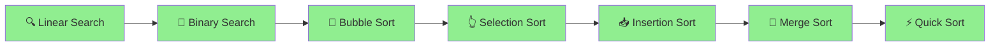

# 🐍 Python DSA – Shreyas Engineering College

<div align="center">


### 🚀 *Master Data Structures & Algorithms with Python!*

**Welcome to your comprehensive DSA learning journey!**  
Everything you need to crack coding interviews and become a problem-solving expert.

[📚 Start Learning](#-topics-covered) • [💻 Problems Solved](#-problems-covered---day-1) • [🎯 What's Next](#-whats-coming-next)

---

</div>

## 🎯 Quick Navigation

<table>
<tr>
<td width="33%" align="center">

### 🔍 **Searching**
Linear & Binary Search

[Jump to Topics →](#-searching-algorithms)

</td>
<td width="33%" align="center">

### 🔄 **Sorting**
Bubble, Selection, Insertion

[View Algorithms →](#-sorting-algorithms)

</td>
<td width="33%" align="center">

### 🏆 **Problems**
Practice Questions

[See Problems →](#-problems-covered---day-1)

</td>
</tr>
</table>

---

## 📊 Learning Progress

```
Day 1 - Searching & Sorting:
████████████████████████████████ 100%

✅ Linear Search
✅ Binary Search
✅ Bubble Sort
✅ Selection Sort
✅ Insertion Sort
✅ Practice Problems

Day 2 - Recursion & Advanced Sorting:
████████████████████████████████ 100%

✅ Recursion Basics
✅ Merge Sort
✅ Quick Sort
✅ Implementation & Practice

Day 3 - OOPs & Linked List:
████████████████████████████████ 100%

✅ Classes & Objects (In-depth)
✅ Decorators
✅ 4 Pillars of OOPs
✅ Singly Linked List - Insertion Operations

Day 4 - Linked List Completed:
████████████████████████████████ 100%

✅ Singly Linked List - All Operations
✅ Doubly Linked List - Complete Implementation
✅ Circular Linked List - Complete Implementation

Day 5 - Stacks:
████████████████████████████████ 100%

✅ Stack - LIFO Principle
✅ Stack Operations (push, pop, peek, isEmpty)
✅ Implementation using Array
✅ Implementation using Linked List
✅ Valid Parentheses Problem

Day 6 - Queues & More Stack Problems:
░░░░░░░░░░░░░░░░░░░░░░░░░░░░░░░░ 0%

🟡 Queue - FIFO Principle
🟡 Queue Implementation
🟡 More Stack Applications
```

---

## 🗺️ Learning Path



---

## 📚 Topics Covered

<details open>
<summary><h3>🔍 Searching Algorithms</h3></summary>

> **Finding elements efficiently in data structures**

### **1. Linear Search**
- **Time Complexity:** O(n)
- **Space Complexity:** O(1)
- Sequentially checks each element until a match is found

```python
def linear_search(arr, target):
    for i in range(len(arr)):
        if arr[i] == target:
            return i
    return -1

# Example
arr = [10, 25, 30, 45, 50]
print(linear_search(arr, 30))  # Output: 2
```

**💡 When to use:** Unsorted arrays, small datasets, finding all occurrences

---

### **2. Binary Search**
- **Time Complexity:** O(log n)
- **Space Complexity:** O(1) iterative, O(log n) recursive
- Works on **sorted arrays** only
- Divides search space in half each iteration

```python
def binary_search(arr, target):
    left, right = 0, len(arr) - 1
    
    while left <= right:
        mid = (left + right) // 2
        
        if arr[mid] == target:
            return mid
        elif arr[mid] < target:
            left = mid + 1
        else:
            right = mid - 1
    
    return -1

# Example
arr = [10, 20, 30, 40, 50]
print(binary_search(arr, 30))  # Output: 2
```

**💡 Key Concept:** Each step eliminates half of the remaining elements!

```
Array: [10, 20, 30, 40, 50]  Target: 40

Step 1: left=0, right=4, mid=2 → arr[2]=30 < 40 → left=3
Step 2: left=3, right=4, mid=3 → arr[3]=40 = 40 → Found!
```

</details>

<details open>
<summary><h3>🔄 Sorting Algorithms</h3></summary>

> **Arranging elements in a specific order**

### **1. Bubble Sort**
- **Time Complexity:** O(n²)
- **Space Complexity:** O(1)
- Repeatedly swaps adjacent elements if they are in wrong order

```python
def bubble_sort(arr):
    n = len(arr)
    for i in range(n):
        # Flag to optimize - if no swaps, array is sorted
        swapped = False
        for j in range(0, n-i-1):
            if arr[j] > arr[j+1]:
                arr[j], arr[j+1] = arr[j+1], arr[j]
                swapped = True
        if not swapped:
            break
    return arr

# Example
arr = [64, 34, 25, 12, 22]
print(bubble_sort(arr))  # Output: [12, 22, 25, 34, 64]
```

**💡 Visualization:**
```
Pass 1: [64, 34, 25, 12, 22] → [34, 25, 12, 22, 64]
Pass 2: [34, 25, 12, 22, 64] → [25, 12, 22, 34, 64]
Pass 3: [25, 12, 22, 34, 64] → [12, 22, 25, 34, 64]
```

---

### **2. Selection Sort**
- **Time Complexity:** O(n²)
- **Space Complexity:** O(1)
- Selects minimum element and places it at the beginning

```python
def selection_sort(arr):
    n = len(arr)
    for i in range(n):
        # Find minimum element in remaining array
        min_idx = i
        for j in range(i+1, n):
            if arr[j] < arr[min_idx]:
                min_idx = j
        # Swap minimum with current position
        arr[i], arr[min_idx] = arr[min_idx], arr[i]
    return arr

# Example
arr = [64, 25, 12, 22, 11]
print(selection_sort(arr))  # Output: [11, 12, 22, 25, 64]
```

**💡 Key Concept:** Find the smallest, put it first. Repeat!

---

### **3. Insertion Sort**
- **Time Complexity:** O(n²)
- **Space Complexity:** O(1)
- Builds sorted array one element at a time

```python
def insertion_sort(arr):
    for i in range(1, len(arr)):
        key = arr[i]
        j = i - 1
        # Move elements greater than key one position ahead
        while j >= 0 and arr[j] > key:
            arr[j+1] = arr[j]
            j -= 1
        arr[j+1] = key
    return arr

# Example
arr = [12, 11, 13, 5, 6]
print(insertion_sort(arr))  # Output: [5, 6, 11, 12, 13]
```

**💡 Think of it like:** Sorting playing cards in your hand!

</details>

---

## ✅ Problems Covered - Day 1

### 🔍 **Searching Problems**

| # | Problem | Difficulty | Concept |
|:-:|:--------|:----------:|:--------|
| 1 | Find element in sorted array | 🟢 Easy | Binary Search |
| 2 | Find first and last position of element | 🟡 Medium | Binary Search |
| 3 | Search in rotated sorted array | 🟡 Medium | Modified Binary Search |
| 4 | Find minimum in rotated sorted array | 🟡 Medium | Binary Search |
| 5 | Square root using binary search | 🟢 Easy | Binary Search on Answer |

### 🔄 **Sorting Problems**

| # | Problem | Difficulty | Concept |
|:-:|:--------|:----------:|:--------|
| 1 | Sort array using Bubble Sort | 🟢 Easy | Bubble Sort |
| 2 | Sort array using Selection Sort | 🟢 Easy | Selection Sort |
| 3 | Sort array using Insertion Sort | 🟢 Easy | Insertion Sort |
| 4 | Sort Colors (Dutch National Flag) | 🟡 Medium | Three-way Partitioning |

---

## 📅 Day 2: Recursion & Advanced Sorting ✅ Completed

### 🔄 **Recursion Basics**

> **Recursion:** A function that calls itself to solve smaller subproblems.

<table>
<tr>
<td width="50%">

#### Print 1 to N
```python
def print_1_to_n(n):
    if n == 0:
        return
    print_1_to_n(n - 1)
    print(n)
```

</td>
<td width="50%">

#### Print N to 1
```python
def print_n_to_1(n):
    if n == 0:
        return
    print(n)
    print_n_to_1(n - 1)
```

</td>
</tr>
<tr>
<td width="50%">

#### Sum of N Natural Numbers
```python
def sum_n(n):
    if n == 0:
        return 0
    return n + sum_n(n - 1)
```

</td>
<td width="50%">

#### Factorial
```python
def factorial(n):
    if n == 0 or n == 1:
        return 1
    return n * factorial(n - 1)
```

</td>
</tr>
</table>

### 🔀 **Merge Sort**

<table>
<tr>
<td width="50%">

### 🔀 **Merge Sort**
- Divide and Conquer approach
- Time Complexity: O(n log n)
- Space Complexity: O(n)
- Stable sorting algorithm

```python
def merge_sort(arr):
    if len(arr) <= 1:
        return arr
    mid = len(arr) // 2
    left = merge_sort(arr[:mid])
    right = merge_sort(arr[mid:])
    return merge(left, right)
```

</td>
<td width="50%">

### ⚡ **Quick Sort**
- Partition-based sorting
- Time Complexity: O(n log n) average
- Space Complexity: O(log n)
- In-place sorting

```python
def quick_sort(arr, low, high):
    if low < high:
        pi = partition(arr, low, high)
        quick_sort(arr, low, pi - 1)
        quick_sort(arr, pi + 1, high)
```

</td>
</tr>
</table>

### 📝 Problems Solved - Day 2

| # | Problem | Difficulty | Concept |
|:-:|:--------|:----------:|:--------|
| 1 | Implement Merge Sort | 🟢 Easy | Divide & Conquer |
| 2 | Implement Quick Sort | 🟢 Easy | Partitioning |
| 3 | Kth Smallest Element | 🟡 Medium | Quick Select |
| 4 | Minimum Swaps to Sort | 🟡 Medium | Cycle Detection |
| 5 | Sort by Frequency | 🟡 Medium | Custom Sorting |
| 6 | Count Inversions | 🟡 Medium | Merge Sort |

---

## 📅 Day 3: OOPs & Linked List ✅ Completed

---

### 🎓 **Object-Oriented Programming (OOPs) - Complete Guide**

<details open>
<summary><h3>📦 Classes & Objects</h3></summary>

> **Class:** A blueprint for creating objects (defines properties and behaviors)  
> **Object:** An instance of a class (actual entity in memory)

```python
class Student:
    # Class attributes (shared by all instances)
    college_name = "Shreyas Engineering College"
    branch = "CSE"
    
    # Constructor (initializer)
    def __init__(self, name, roll_no, marks):
        # Instance attributes (unique to each object)
        self.name = name
        self.roll_no = roll_no
        self.marks = marks
    
    # Instance method
    def display_info(self):
        print(f"Name: {self.name}, Roll No: {self.roll_no}, Marks: {self.marks}")
    
    # Instance method
    def get_percentage(self):
        return (self.marks / 500) * 100

# Creating objects
student1 = Student("Rahul", 101, 450)
student2 = Student("Priya", 102, 480)

# Accessing attributes and methods
print(student1.name)           # Output: Rahul
print(Student.college_name)    # Output: Shreyas Engineering College
student1.display_info()        # Output: Name: Rahul, Roll No: 101, Marks: 450
```

#### 🔑 Key Concepts:

| Concept | Description |
|:--------|:------------|
| `__init__` | Constructor - called automatically when object is created |
| `self` | Reference to the current instance of the class |
| Class Attributes | Shared by all instances (defined outside `__init__`) |
| Instance Attributes | Unique to each object (defined inside `__init__` with `self.`) |

</details>

<details open>
<summary><h3>🎨 Decorators in Python</h3></summary>

> **Decorators** are functions that modify the behavior of other functions or methods.

#### 1️⃣ **@staticmethod**
- Does NOT access instance (`self`) or class (`cls`) attributes
- Utility function that belongs to the class namespace
- Can be called without creating an object

```python
class MathOperations:
    @staticmethod
    def add(a, b):
        return a + b
    
    @staticmethod
    def multiply(a, b):
        return a * b

# Call without creating object
print(MathOperations.add(5, 3))       # Output: 8
print(MathOperations.multiply(4, 2))  # Output: 8
```

#### 2️⃣ **@classmethod**
- Receives class (`cls`) as first argument instead of instance (`self`)
- Can access and modify class state
- Often used as factory methods or alternative constructors

```python
class Employee:
    company = "TechCorp"
    employee_count = 0
    
    def __init__(self, name, salary):
        self.name = name
        self.salary = salary
        Employee.employee_count += 1
    
    @classmethod
    def change_company(cls, new_name):
        cls.company = new_name
    
    @classmethod
    def from_string(cls, emp_string):
        # Factory method - alternative constructor
        name, salary = emp_string.split('-')
        return cls(name, int(salary))
    
    @classmethod
    def get_employee_count(cls):
        return cls.employee_count

# Using class methods
Employee.change_company("NewTech Inc.")
emp1 = Employee.from_string("John-50000")  # Alternative way to create object
print(Employee.get_employee_count())        # Output: 1
```

#### 3️⃣ **@property**
- Makes a method accessible like an attribute (getter)
- Used for computed/derived attributes
- Enables data encapsulation with getter/setter

```python
class Circle:
    def __init__(self, radius):
        self._radius = radius  # Protected attribute
    
    @property
    def radius(self):
        """Getter for radius"""
        return self._radius
    
    @radius.setter
    def radius(self, value):
        """Setter with validation"""
        if value < 0:
            raise ValueError("Radius cannot be negative")
        self._radius = value
    
    @property
    def area(self):
        """Computed property"""
        return 3.14159 * self._radius ** 2
    
    @property
    def circumference(self):
        return 2 * 3.14159 * self._radius

circle = Circle(5)
print(circle.radius)        # Output: 5 (accessed like attribute, not method)
print(circle.area)          # Output: 78.53975
circle.radius = 10          # Using setter
print(circle.area)          # Output: 314.159
```

#### 📊 Decorator Comparison:

| Decorator | First Argument | Access to | Use Case |
|:----------|:---------------|:----------|:---------|
| Regular Method | `self` | Instance + Class | Object-specific operations |
| `@staticmethod` | None | Neither | Utility functions |
| `@classmethod` | `cls` | Class only | Factory methods, class-level operations |
| `@property` | `self` | Instance + Class | Getters, computed attributes |

</details>

<details open>
<summary><h3>🏛️ Four Pillars of OOPs</h3></summary>

#### 1️⃣ **Encapsulation** 🔒
> Bundling data (attributes) and methods that operate on data within a single unit (class), and restricting direct access.

```python
class BankAccount:
    def __init__(self, account_no, balance):
        self.account_no = account_no      # Public
        self._balance = balance           # Protected (convention)
        self.__pin = 1234                 # Private (name mangling)
    
    def deposit(self, amount):
        if amount > 0:
            self._balance += amount
            return True
        return False
    
    def withdraw(self, amount, pin):
        if pin == self.__pin and amount <= self._balance:
            self._balance -= amount
            return amount
        return 0
    
    def get_balance(self):
        return self._balance

account = BankAccount("ACC001", 1000)
account.deposit(500)
print(account.get_balance())  # Output: 1500
# print(account.__pin)        # Error! Private attribute
```

**Access Modifiers in Python:**
| Prefix | Access Level | Example |
|:-------|:-------------|:--------|
| None | Public | `self.name` |
| `_` | Protected (convention) | `self._balance` |
| `__` | Private (name mangling) | `self.__pin` |

---

#### 2️⃣ **Abstraction** 🎭
> Hiding complex implementation details and showing only essential features.

```python
from abc import ABC, abstractmethod

class Shape(ABC):  # Abstract Base Class
    @abstractmethod
    def area(self):
        pass
    
    @abstractmethod
    def perimeter(self):
        pass

class Rectangle(Shape):
    def __init__(self, length, width):
        self.length = length
        self.width = width
    
    def area(self):
        return self.length * self.width
    
    def perimeter(self):
        return 2 * (self.length + self.width)

class Circle(Shape):
    def __init__(self, radius):
        self.radius = radius
    
    def area(self):
        return 3.14159 * self.radius ** 2
    
    def perimeter(self):
        return 2 * 3.14159 * self.radius

# shape = Shape()  # Error! Cannot instantiate abstract class
rect = Rectangle(10, 5)
print(rect.area())  # Output: 50
```

---

#### 3️⃣ **Inheritance** 👨‍👩‍👧
> Creating new classes from existing classes, inheriting their properties and behaviors.

```python
# Parent/Base class
class Animal:
    def __init__(self, name):
        self.name = name
    
    def speak(self):
        pass
    
    def eat(self):
        print(f"{self.name} is eating")

# Child/Derived classes
class Dog(Animal):
    def __init__(self, name, breed):
        super().__init__(name)  # Call parent constructor
        self.breed = breed
    
    def speak(self):
        return f"{self.name} says Woof!"

class Cat(Animal):
    def speak(self):
        return f"{self.name} says Meow!"

# Multiple Inheritance
class Pet:
    def __init__(self, owner):
        self.owner = owner

class DomesticDog(Dog, Pet):  # Multiple inheritance
    def __init__(self, name, breed, owner):
        Dog.__init__(self, name, breed)
        Pet.__init__(self, owner)

dog = Dog("Buddy", "Labrador")
print(dog.speak())  # Output: Buddy says Woof!
dog.eat()           # Output: Buddy is eating (inherited)
```

**Types of Inheritance:**
| Type | Description |
|:-----|:------------|
| Single | One child inherits from one parent |
| Multiple | One child inherits from multiple parents |
| Multilevel | Chain of inheritance (A → B → C) |
| Hierarchical | Multiple children from one parent |
| Hybrid | Combination of above types |

---

#### 4️⃣ **Polymorphism** 🎭
> Same method name behaves differently for different classes ("many forms").

```python
class Bird:
    def fly(self):
        print("Some birds can fly")

class Sparrow(Bird):
    def fly(self):
        print("Sparrow flies high")

class Penguin(Bird):
    def fly(self):
        print("Penguin cannot fly, but swims!")

# Polymorphism in action
def make_bird_fly(bird):
    bird.fly()

sparrow = Sparrow()
penguin = Penguin()

make_bird_fly(sparrow)  # Output: Sparrow flies high
make_bird_fly(penguin)  # Output: Penguin cannot fly, but swims!

# Method Overloading (using default arguments)
class Calculator:
    def add(self, a, b=0, c=0):
        return a + b + c

calc = Calculator()
print(calc.add(5))        # Output: 5
print(calc.add(5, 3))     # Output: 8
print(calc.add(5, 3, 2))  # Output: 10
```

</details>

---

### 🔗 **Singly Linked List - Complete Guide**

<details open>
<summary><h3>📚 Linked List Theory</h3></summary>

> A **Linked List** is a linear data structure where elements are stored in nodes, and each node points to the next node.

#### 🆚 Array vs Linked List

| Feature | Array | Linked List |
|:--------|:------|:------------|
| Memory | Contiguous | Non-contiguous |
| Size | Fixed | Dynamic |
| Access | O(1) Random access | O(n) Sequential |
| Insertion/Deletion | O(n) | O(1) at known position |
| Memory Overhead | No extra | Extra pointer per node |

#### 📦 Node Structure

```
┌──────────┬──────────┐
│   Data   │   Next   │ ──────►  Next Node
└──────────┴──────────┘
```

```python
class Node:
    def __init__(self, data):
        self.data = data  # Store the value
        self.next = None  # Pointer to next node
```

#### 🔗 Linked List Visualization

```
 Head                                          Tail
  │                                              │
  ▼                                              ▼
┌────┬────┐    ┌────┬────┐    ┌────┬────┐    ┌────┬────┐
│ 10 │  ──┼───►│ 20 │  ──┼───►│ 30 │  ──┼───►│ 40 │None│
└────┴────┘    └────┴────┘    └────┴────┘    └────┴────┘
```

</details>

<details open>
<summary><h3>⚡ Linked List Implementation - Insertion Operations</h3></summary>

```python
class Node:
    def __init__(self, data):
        self.data = data
        self.next = None


class LinkedList:
    def __init__(self):
        self.head = None
        self.tail = None
        self.length = 0

    # ==========================================
    # INSERT AT END (Append)
    # ==========================================
    def append(self, data):
        """
        Add element at the end of the list
        Time Complexity: O(1) with tail pointer
        """
        new_node = Node(data)
        
        if self.head is None:
            # List is empty
            self.head = new_node
            self.tail = new_node
        else:
            # Add after tail and update tail
            self.tail.next = new_node
            self.tail = new_node
        
        self.length += 1

    # ==========================================
    # INSERT AT START (Prepend)
    # ==========================================
    def prepend(self, data):
        """
        Add element at the beginning of the list
        Time Complexity: O(1)
        """
        new_node = Node(data)
        
        if self.head is None:
            # List is empty
            self.head = new_node
            self.tail = new_node
        else:
            # Point new node to current head
            new_node.next = self.head
            # Update head to new node
            self.head = new_node
        
        self.length += 1

    # ==========================================
    # INSERT AT ANY POSITION
    # ==========================================
    def insert_at(self, data, position):
        """
        Insert element at specific position (0-indexed)
        Time Complexity: O(n)
        """
        # Validate position
        if position < 0 or position > self.length:
            print(f"Invalid position: {position}. Valid range: 0 to {self.length}")
            return False
        
        # Insert at beginning
        if position == 0:
            self.prepend(data)
            return True
        
        # Insert at end
        if position == self.length:
            self.append(data)
            return True
        
        # Insert at middle position
        new_node = Node(data)
        current = self.head
        
        # Traverse to node before the position
        for _ in range(position - 1):
            current = current.next
        
        # Insert new node
        new_node.next = current.next
        current.next = new_node
        self.length += 1
        return True

    # ==========================================
    # TRAVERSAL - Print List
    # ==========================================
    def print_list(self):
        """Display all elements in the list"""
        if self.head is None:
            print("List is empty")
            return
        
        current = self.head
        elements = []
        while current:
            elements.append(str(current.data))
            current = current.next
        
        print(" -> ".join(elements) + " -> None")

    def get_length(self):
        return self.length


# ==========================================
# USAGE EXAMPLE
# ==========================================
ll = LinkedList()

# Insert at end
ll.append(10)
ll.append(20)
ll.append(30)
ll.print_list()  # Output: 10 -> 20 -> 30 -> None

# Insert at start
ll.prepend(5)
ll.print_list()  # Output: 5 -> 10 -> 20 -> 30 -> None

# Insert at position
ll.insert_at(15, 2)  # Insert 15 at index 2
ll.print_list()  # Output: 5 -> 10 -> 15 -> 20 -> 30 -> None

print(f"Length: {ll.get_length()}")  # Output: Length: 5
```

#### 🎯 Insertion Visual Guide:

**Insert at End (append):**
```
Before: 10 -> 20 -> 30 -> None
                     ▲
                    tail

After:  10 -> 20 -> 30 -> 40 -> None
                          ▲
                         tail
```

**Insert at Start (prepend):**
```
Before:      10 -> 20 -> 30 -> None
             ▲
            head

After:  5 -> 10 -> 20 -> 30 -> None
        ▲
       head
```

**Insert at Position 2:**
```
Before: 10 -> 20 -> 30 -> None
              ▲
         position 1
         
After:  10 -> 20 -> 25 -> 30 -> None
                    ▲
               new node
```

</details>

### 📝 Problems Covered - Day 3

| # | Problem | Difficulty | Concept |
|:-:|:--------|:----------:|:--------|
| 1 | Create a Student class and add data to it and print it | 🟢 Easy | Classes & Objects |
| 2 | Implement Singly Linked List | 🟢 Easy | Linked List Basics |
| 3 | Insert at beginning of Linked List | 🟢 Easy | Linked List Insertion |
| 4 | Insert at end of Linked List | 🟢 Easy | Linked List Insertion |
| 5 | Insert at any position in Linked List | 🟡 Medium | Linked List Insertion |

---

## 📅 Day 4: Linked List Completed ✅

### Topics Covered:

<table>
<tr>
<td width="33%">

### 🔗 **Singly Linked List**
✅ Insertion (start, end, position)
✅ Deletion (start, end, position)
✅ Traversal
✅ Search

</td>
<td width="33%">

### 🔗 **Doubly Linked List**
✅ Two-way traversal
✅ Insertion operations
✅ Deletion operations
✅ Forward & Backward navigation

</td>
<td width="33%">

### 🔄 **Circular Linked List**
✅ Circular connections
✅ Singly Circular
✅ Doubly Circular
✅ All operations

</td>
</tr>
</table>

---

### 🔗 **Doubly Linked List**

<details>
<summary><h4>📚 Theory & Implementation</h4></summary>

> A **Doubly Linked List** is a linked list where each node has pointers to both the **next** and **previous** nodes.

#### 📦 Node Structure

```
         ┌──────────┬──────────┬──────────┐
◄────────│   Prev   │   Data   │   Next   │────────►
         └──────────┴──────────┴──────────┘
```

```python
class Node:
    def __init__(self, data):
        self.data = data
        self.prev = None  # Pointer to previous node
        self.next = None  # Pointer to next node
```

#### 🔗 Visualization

```
       Head                                              Tail
        │                                                  │
        ▼                                                  ▼
     ┌────┐    ┌────┐    ┌────┐    ┌────┐
None◄│ 10 │◄──►│ 20 │◄──►│ 30 │◄──►│ 40 │►None
     └────┘    └────┘    └────┘    └────┘
```

#### ⚡ Complete Implementation

```python
class DoublyLinkedList:
    def __init__(self):
        self.head = None
        self.tail = None
        self.length = 0

    # Insert at end
    def append(self, data):
        new_node = Node(data)
        if self.head is None:
            self.head = new_node
            self.tail = new_node
        else:
            new_node.prev = self.tail
            self.tail.next = new_node
            self.tail = new_node
        self.length += 1

    # Insert at beginning
    def prepend(self, data):
        new_node = Node(data)
        if self.head is None:
            self.head = new_node
            self.tail = new_node
        else:
            new_node.next = self.head
            self.head.prev = new_node
            self.head = new_node
        self.length += 1

    # Delete from beginning
    def delete_first(self):
        if self.head is None:
            return None
        data = self.head.data
        if self.head == self.tail:
            self.head = None
            self.tail = None
        else:
            self.head = self.head.next
            self.head.prev = None
        self.length -= 1
        return data

    # Delete from end
    def delete_last(self):
        if self.tail is None:
            return None
        data = self.tail.data
        if self.head == self.tail:
            self.head = None
            self.tail = None
        else:
            self.tail = self.tail.prev
            self.tail.next = None
        self.length -= 1
        return data

    # Print forward
    def print_forward(self):
        current = self.head
        elements = []
        while current:
            elements.append(str(current.data))
            current = current.next
        print("None <-> " + " <-> ".join(elements) + " <-> None")

    # Print backward
    def print_backward(self):
        current = self.tail
        elements = []
        while current:
            elements.append(str(current.data))
            current = current.prev
        print("None <-> " + " <-> ".join(elements) + " <-> None")
```

</details>

---

### 🔄 **Circular Linked List**

<details>
<summary><h4>📚 Theory & Implementation</h4></summary>

> A **Circular Linked List** is a linked list where the last node points back to the first node, forming a circle.

#### 🔗 Singly Circular Visualization

```
       Head
        │
        ▼
     ┌────┐    ┌────┐    ┌────┐    ┌────┐
 ┌──►│ 10 │───►│ 20 │───►│ 30 │───►│ 40 │──┐
 │   └────┘    └────┘    └────┘    └────┘  │
 │                                          │
 └──────────────────────────────────────────┘
```

#### ⚡ Singly Circular Implementation

```python
class CircularLinkedList:
    def __init__(self):
        self.head = None
        self.tail = None
        self.length = 0

    # Insert at end
    def append(self, data):
        new_node = Node(data)
        if self.head is None:
            self.head = new_node
            self.tail = new_node
            new_node.next = self.head  # Point to itself
        else:
            new_node.next = self.head  # New node points to head
            self.tail.next = new_node  # Old tail points to new node
            self.tail = new_node       # Update tail
        self.length += 1

    # Insert at beginning
    def prepend(self, data):
        new_node = Node(data)
        if self.head is None:
            self.head = new_node
            self.tail = new_node
            new_node.next = self.head
        else:
            new_node.next = self.head
            self.tail.next = new_node
            self.head = new_node
        self.length += 1

    # Delete from beginning
    def delete_first(self):
        if self.head is None:
            return None
        data = self.head.data
        if self.head == self.tail:
            self.head = None
            self.tail = None
        else:
            self.head = self.head.next
            self.tail.next = self.head
        self.length -= 1
        return data

    # Traverse (print all elements)
    def print_list(self):
        if self.head is None:
            print("List is empty")
            return
        current = self.head
        elements = []
        while True:
            elements.append(str(current.data))
            current = current.next
            if current == self.head:
                break
        print(" -> ".join(elements) + " -> (back to head)")
```

#### 🔗 Doubly Circular Visualization

```
          ┌─────────────────────────────────────────────┐
          │                                             │
          ▼                                             │
       ┌────┐    ┌────┐    ┌────┐    ┌────┐            │
   ┌──►│ 10 │◄──►│ 20 │◄──►│ 30 │◄──►│ 40 │◄───────────┘
   │   └────┘    └────┘    └────┘    └────┘
   │      ▲                            │
   │      └────────────────────────────┘
   │                                   
   └───────────────────────────────────────────────────────┐
                                                           │
          (tail.next = head, head.prev = tail)             │
```

</details>

---

### 🆚 Linked List Comparison

| Feature | Singly | Doubly | Circular |
|:--------|:------:|:------:|:--------:|
| Memory per node | 1 pointer | 2 pointers | 1-2 pointers |
| Traverse backward | ❌ | ✅ | ❌/✅ |
| Delete node (given pointer) | O(n) | O(1) | O(n)/O(1) |
| Insert before node | O(n) | O(1) | O(n) |
| Circular traversal | ❌ | ❌ | ✅ |
| Use case | Simple lists | Browser history, undo | Round-robin, playlists |

---

### 📝 Problems Covered - Day 4

| # | Problem | Difficulty | Concept |
|:-:|:--------|:----------:|:--------|
| 1 | Delete from beginning of SLL | 🟢 Easy | Singly Linked List |
| 2 | Delete from end of SLL | 🟢 Easy | Singly Linked List |
| 3 | Delete at any position in SLL | 🟡 Medium | Singly Linked List |
| 4 | Implement Doubly Linked List | 🟢 Easy | Doubly Linked List |
| 5 | Forward & Backward Traversal | 🟢 Easy | Doubly Linked List |
| 6 | Implement Circular Linked List | 🟡 Medium | Circular Linked List |
| 7 | Circular Traversal | 🟡 Medium | Circular Linked List |

---

## 📅 Day 5: Stacks ✅ Completed

---

### 📚 **Stack - Complete Guide**

<details open>
<summary><h3>📦 What is a Stack?</h3></summary>

> A **Stack** is a linear data structure that follows the **LIFO (Last In, First Out)** principle. The last element added is the first one to be removed.

#### 🍽️ Real-World Examples:
- Stack of plates 🍽️
- Stack of books 📚
- Undo operation in text editors ↩️
- Browser back button 🔙
- Function call stack in programming 📞

#### 📊 Stack Visualization

```
        ┌─────────┐
        │    5    │  ← Top (Last In, First Out)
        ├─────────┤
        │    4    │
        ├─────────┤
        │    3    │
        ├─────────┤
        │    2    │
        ├─────────┤
        │    1    │  ← Bottom (First In)
        └─────────┘
        
   Push: Add to top
   Pop: Remove from top
```

</details>

<details open>
<summary><h3>⚙️ Stack Operations</h3></summary>

| Operation | Description | Time Complexity |
|:----------|:------------|:---------------:|
| `push(item)` | Add item to top of stack | O(1) |
| `pop()` | Remove and return top item | O(1) |
| `peek()` / `top()` | Return top item without removing | O(1) |
| `isEmpty()` | Check if stack is empty | O(1) |
| `size()` | Return number of items | O(1) |

</details>

<details open>
<summary><h3>🔧 Implementation using Array (List)</h3></summary>

```python
class Stack:
    def __init__(self):
        self.items = []
    
    def push(self, item):
        """Add item to top of stack - O(1)"""
        self.items.append(item)
    
    def pop(self):
        """Remove and return top item - O(1)"""
        if self.isEmpty():
            return "Stack is empty!"
        return self.items.pop()
    
    def peek(self):
        """Return top item without removing - O(1)"""
        if self.isEmpty():
            return "Stack is empty!"
        return self.items[-1]
    
    def isEmpty(self):
        """Check if stack is empty - O(1)"""
        return len(self.items) == 0
    
    def size(self):
        """Return size of stack - O(1)"""
        return len(self.items)
    
    def display(self):
        """Display stack contents"""
        print(f"Stack: {self.items}")
        if not self.isEmpty():
            print(f"Top: {self.items[-1]}")


# Usage Example
stack = Stack()
stack.push(10)
stack.push(20)
stack.push(30)
stack.display()        # Stack: [10, 20, 30], Top: 30
print(stack.pop())     # 30
print(stack.peek())    # 20
print(stack.isEmpty()) # False
```

</details>

<details open>
<summary><h3>🔗 Implementation using Linked List</h3></summary>

```python
class Node:
    def __init__(self, data):
        self.data = data
        self.next = None


class StackLinkedList:
    def __init__(self):
        self.top = None
        self.length = 0
    
    def push(self, item):
        """Add item to top - O(1)"""
        new_node = Node(item)
        new_node.next = self.top
        self.top = new_node
        self.length += 1
    
    def pop(self):
        """Remove and return top item - O(1)"""
        if self.isEmpty():
            return "Stack is empty!"
        data = self.top.data
        self.top = self.top.next
        self.length -= 1
        return data
    
    def peek(self):
        """Return top item without removing - O(1)"""
        if self.isEmpty():
            return "Stack is empty!"
        return self.top.data
    
    def isEmpty(self):
        """Check if stack is empty - O(1)"""
        return self.top is None
    
    def size(self):
        """Return size of stack - O(1)"""
        return self.length
    
    def display(self):
        """Display stack contents"""
        if self.isEmpty():
            print("Stack is empty")
            return
        current = self.top
        print("Top -> ", end="")
        while current:
            print(f"{current.data}", end="")
            if current.next:
                print(" -> ", end="")
            current = current.next
        print(" -> Bottom")


# Usage Example
stack = StackLinkedList()
stack.push(10)
stack.push(20)
stack.push(30)
stack.display()  # Top -> 30 -> 20 -> 10 -> Bottom
```

</details>

<details open>
<summary><h3>✅ Valid Parentheses Problem (LeetCode #20)</h3></summary>

> **Problem:** Given a string containing just the characters `'('`, `')'`, `'{'`, `'}'`, `'['` and `']'`, determine if the input string is valid.
>
> An input string is valid if:
> 1. Open brackets must be closed by the same type of brackets.
> 2. Open brackets must be closed in the correct order.

#### 💡 Approach:
1. Use a stack to track opening brackets
2. When we see a closing bracket, check if it matches the top of stack
3. If it matches, pop the stack; otherwise, return False
4. At the end, stack should be empty for a valid string

```python
def isValid(s):
    """
    Check if parentheses are balanced
    Time Complexity: O(n)
    Space Complexity: O(n)
    """
    stack = []
    # Mapping of closing to opening brackets
    bracket_map = {
        ')': '(',
        '}': '{',
        ']': '['
    }
    
    for char in s:
        if char in bracket_map:
            # It's a closing bracket
            if stack and stack[-1] == bracket_map[char]:
                stack.pop()
            else:
                return False
        else:
            # It's an opening bracket
            stack.append(char)
    
    # Stack should be empty if all brackets matched
    return len(stack) == 0


# Test Cases
print(isValid("()"))        # True
print(isValid("()[]{}"))    # True
print(isValid("(]"))        # False
print(isValid("([)]"))      # False
print(isValid("{[]}"))      # True
print(isValid("((()))"))    # True
```

#### 🎯 Dry Run Example: `"{[]}"`

```
Step 1: char = '{'  → Push to stack     → Stack: ['{']
Step 2: char = '['  → Push to stack     → Stack: ['{', '[']
Step 3: char = ']'  → Matches '[', pop  → Stack: ['{']
Step 4: char = '}'  → Matches '{', pop  → Stack: []

Stack is empty → Return True ✅
```

</details>

<details>
<summary><h3>🎯 Stack Applications</h3></summary>

| Application | Description |
|:------------|:------------|
| **Balanced Parentheses** | Check if brackets are properly matched |
| **Undo/Redo** | Store previous states for undo operations |
| **Browser History** | Back button functionality |
| **Function Calls** | Call stack manages function execution |
| **Expression Evaluation** | Infix to Postfix conversion, evaluate postfix |
| **Syntax Parsing** | Compilers use stacks for parsing |
| **Backtracking** | DFS, maze solving, recursion |

</details>

---

### 🆚 Array vs Linked List Implementation

| Feature | Array Implementation | Linked List Implementation |
|:--------|:--------------------:|:--------------------------:|
| Memory | Contiguous | Non-contiguous |
| Push | O(1) amortized | O(1) |
| Pop | O(1) | O(1) |
| Peek | O(1) | O(1) |
| Memory Usage | May waste space | Extra pointer per node |
| Size Limit | Dynamic (Python list) | Unlimited |
| Cache Performance | Better | Worse |

---

### 📝 Problems Covered - Day 5

| # | Problem | Difficulty | Concept |
|:-:|:--------|:----------:|:--------|
| 1 | Implement Stack using Array | 🟢 Easy | Stack Basics |
| 2 | Valid Parentheses | 🟢 Easy | Stack Application |
| 3 | Duplicate Parentheses Detection | 🟡 Medium | Stack Application |
---

## 🚀 Future Learning Roadmap

| Topic | Description | Priority | Status |
|:------|:------------|:--------:|:------:|
| 📬 **Queues** | FIFO operations, priority queues | 🔴 High | 🔜 Next |
| 👆 **Two Pointer** | Sliding window, fast-slow pointer | 🔴 High | ⏳ Upcoming |
| 💻 **Bit Manipulation** | Bitwise operations, tricks | 🟡 Medium | ⏳ Upcoming |
| 🌳 **Trees** | Binary trees, BST, traversals | 🔴 High | ⏳ Upcoming |
| 🕸️ **Graphs** | BFS, DFS, shortest paths (if time permits) | 🟡 Medium | ⏳ Upcoming |

---


## 💡 Tips for Students

<table>
<tr>
<td>

### 📖 Learning Tips
1. **Understand the concept first** before memorizing code
2. **Dry run** algorithms on paper with small examples
3. **Practice regularly** - Solve at least 2-3 problems daily

</td>
<td>

### 💪 Problem Solving Tips
4. **Time and Space complexity** - Always analyze before coding
5. Use **visualization tools** like [VisuAlgo](https://visualgo.net/)
6. **Debug step-by-step** using print statements

</td>
</tr>
</table>

---

## 📖 Useful Resources

<table>
<tr>
<td>

### 💻 Practice Platforms
- [LeetCode](https://leetcode.com/) - Practice problems
- [GeeksforGeeks](https://www.geeksforgeeks.org/) - Concepts & explanations
- [HackerRank](https://www.hackerrank.com/) - Coding challenges

</td>
<td>

### 📚 Documentation & Tools
- [Python Documentation](https://docs.python.org/3/)
- [VisuAlgo](https://visualgo.net/) - Algorithm visualizations
- [PythonTutor](https://pythontutor.com/) - Code visualization

</td>
</tr>
</table>

---

## 🎯 What's Coming Next

### 🏆 **Day 6: Queues & More Stack Applications**
Continue mastering linear data structures!

<table>
<tr>
<td width="50%">

### 📬 **Queue (FIFO)**
- What is Queue & FIFO principle
- Queue operations: `enqueue()`, `dequeue()`, `front()`, `isEmpty()`
- Implementation using Array
- Implementation using Linked List
- Circular Queue
- Double-ended Queue (Deque)

</td>
<td width="50%">

### 📚 **More Applications**
- Infix to Postfix Conversion
- Postfix Expression Evaluation
- Next Greater Element
- Stock Span Problem
- BFS using Queue

</td>
</tr>
</table>

**Practice Problems:**
| # | Problem | Difficulty |
|:-:|:--------|:----------:|
| 1 | Implement Queue using Array | 🟢 Easy |
| 2 | Implement Queue using Linked List | 🟢 Easy |
| 3 | Implement Circular Queue | 🟡 Medium |
| 4 | Infix to Postfix Conversion | 🟡 Medium |
| 5 | Evaluate Postfix Expression | 🟡 Medium |
| 6 | Next Greater Element | 🟡 Medium |

---

## 🤝 Need Help?

<div align="center">

### Got stuck? Don't worry!

**💬 Ask Questions** | **🐛 Report Issues** | **💡 Share Ideas**

Remember: *Every expert was once a beginner!*

---

### 🌟 **Keep Coding, Keep Growing!** 🌟

<br>

<div align="center">

### ✨ Created By ✨

## <a href="https://whatsapp.com/channel/0029Vb74kBaL2ATzZBnRka19" target="_blank">✨ **Shine_Beyond_Syntax** ✨</a>

<br>

[](https://whatsapp.com/channel/0029Vb74kBaL2ATzZBnRka19)

<br>

</div>

<br>

---


</div>

