# 🐍 Python DSA – Shreyas Engineering College

<div align="center">


### 🚀 *Master Data Structures & Algorithms with Python!*

**Welcome to your comprehensive DSA learning journey!**  
Everything you need to crack coding interviews and become a problem-solving expert.

[📚 Start Learning](#-topics-covered) • [💻 Problems Solved](#-problems-covered---day-1) • [🎯 What's Next](#-whats-coming-next)

---

</div>

## 🎯 Quick Navigation

<table>
<tr>
<td width="33%" align="center">

### 🔍 **Searching**
Linear & Binary Search

[Jump to Topics →](#-searching-algorithms)

</td>
<td width="33%" align="center">

### 🔄 **Sorting**
Bubble, Selection, Insertion

[View Algorithms →](#-sorting-algorithms)

</td>
<td width="33%" align="center">

### 🏆 **Problems**
Practice Questions

[See Problems →](#-problems-covered---day-1)

</td>
</tr>
</table>

---

## 📊 Learning Progress

```
Day 1 - Searching & Sorting:
████████████████████████████████ 100%

✅ Linear Search
✅ Binary Search
✅ Bubble Sort
✅ Selection Sort
✅ Insertion Sort
✅ Practice Problems

Day 2 - Recursion & Advanced Sorting:
████████████████████████████████ 100%

✅ Recursion Basics
✅ Merge Sort
✅ Quick Sort
✅ Implementation & Practice

Day 3 - OOPs & Linked List:
░░░░░░░░░░░░░░░░░░░░░░░░░░░░░░░░ 0%

🟡 Revision of Classes
🟡 4 Principles of OOPs
🟡 Singly Linked List
🟡 Doubly Linked List
```

---

## 🗺️ Learning Path

```mermaid
graph LR
    A[🔍 Linear Search] --> B[🎯 Binary Search]
    B --> C[🫧 Bubble Sort]
    C --> D[👆 Selection Sort]
    D --> E[📥 Insertion Sort]
    E --> F[🔀 Merge Sort]
    F --> G[⚡ Quick Sort]
    
    style A fill:#90EE90
    style B fill:#90EE90
    style C fill:#90EE90
    style D fill:#90EE90
    style E fill:#90EE90
    style F fill:#90EE90
    style G fill:#90EE90
```



---

## 📚 Topics Covered

<details open>
<summary><h3>🔍 Searching Algorithms</h3></summary>

> **Finding elements efficiently in data structures**

### **1. Linear Search**
- **Time Complexity:** O(n)
- **Space Complexity:** O(1)
- Sequentially checks each element until a match is found

```python
def linear_search(arr, target):
    for i in range(len(arr)):
        if arr[i] == target:
            return i
    return -1

# Example
arr = [10, 25, 30, 45, 50]
print(linear_search(arr, 30))  # Output: 2
```

**💡 When to use:** Unsorted arrays, small datasets, finding all occurrences

---

### **2. Binary Search**
- **Time Complexity:** O(log n)
- **Space Complexity:** O(1) iterative, O(log n) recursive
- Works on **sorted arrays** only
- Divides search space in half each iteration

```python
def binary_search(arr, target):
    left, right = 0, len(arr) - 1
    
    while left <= right:
        mid = (left + right) // 2
        
        if arr[mid] == target:
            return mid
        elif arr[mid] < target:
            left = mid + 1
        else:
            right = mid - 1
    
    return -1

# Example
arr = [10, 20, 30, 40, 50]
print(binary_search(arr, 30))  # Output: 2
```

**💡 Key Concept:** Each step eliminates half of the remaining elements!

```
Array: [10, 20, 30, 40, 50]  Target: 40

Step 1: left=0, right=4, mid=2 → arr[2]=30 < 40 → left=3
Step 2: left=3, right=4, mid=3 → arr[3]=40 = 40 → Found!
```

</details>

<details open>
<summary><h3>🔄 Sorting Algorithms</h3></summary>

> **Arranging elements in a specific order**

### **1. Bubble Sort**
- **Time Complexity:** O(n²)
- **Space Complexity:** O(1)
- Repeatedly swaps adjacent elements if they are in wrong order

```python
def bubble_sort(arr):
    n = len(arr)
    for i in range(n):
        # Flag to optimize - if no swaps, array is sorted
        swapped = False
        for j in range(0, n-i-1):
            if arr[j] > arr[j+1]:
                arr[j], arr[j+1] = arr[j+1], arr[j]
                swapped = True
        if not swapped:
            break
    return arr

# Example
arr = [64, 34, 25, 12, 22]
print(bubble_sort(arr))  # Output: [12, 22, 25, 34, 64]
```

**💡 Visualization:**
```
Pass 1: [64, 34, 25, 12, 22] → [34, 25, 12, 22, 64]
Pass 2: [34, 25, 12, 22, 64] → [25, 12, 22, 34, 64]
Pass 3: [25, 12, 22, 34, 64] → [12, 22, 25, 34, 64]
```

---

### **2. Selection Sort**
- **Time Complexity:** O(n²)
- **Space Complexity:** O(1)
- Selects minimum element and places it at the beginning

```python
def selection_sort(arr):
    n = len(arr)
    for i in range(n):
        # Find minimum element in remaining array
        min_idx = i
        for j in range(i+1, n):
            if arr[j] < arr[min_idx]:
                min_idx = j
        # Swap minimum with current position
        arr[i], arr[min_idx] = arr[min_idx], arr[i]
    return arr

# Example
arr = [64, 25, 12, 22, 11]
print(selection_sort(arr))  # Output: [11, 12, 22, 25, 64]
```

**💡 Key Concept:** Find the smallest, put it first. Repeat!

---

### **3. Insertion Sort**
- **Time Complexity:** O(n²)
- **Space Complexity:** O(1)
- Builds sorted array one element at a time

```python
def insertion_sort(arr):
    for i in range(1, len(arr)):
        key = arr[i]
        j = i - 1
        # Move elements greater than key one position ahead
        while j >= 0 and arr[j] > key:
            arr[j+1] = arr[j]
            j -= 1
        arr[j+1] = key
    return arr

# Example
arr = [12, 11, 13, 5, 6]
print(insertion_sort(arr))  # Output: [5, 6, 11, 12, 13]
```

**💡 Think of it like:** Sorting playing cards in your hand!

</details>

---

## ✅ Problems Covered - Day 1

### 🔍 **Searching Problems**

| # | Problem | Difficulty | Concept |
|:-:|:--------|:----------:|:--------|
| 1 | Find element in sorted array | 🟢 Easy | Binary Search |
| 2 | Find first and last position of element | 🟡 Medium | Binary Search |
| 3 | Search in rotated sorted array | 🟡 Medium | Modified Binary Search |
| 4 | Find minimum in rotated sorted array | 🟡 Medium | Binary Search |
| 5 | Square root using binary search | 🟢 Easy | Binary Search on Answer |

### 🔄 **Sorting Problems**

| # | Problem | Difficulty | Concept |
|:-:|:--------|:----------:|:--------|
| 1 | Sort array using Bubble Sort | 🟢 Easy | Bubble Sort |
| 2 | Sort array using Selection Sort | 🟢 Easy | Selection Sort |
| 3 | Sort array using Insertion Sort | 🟢 Easy | Insertion Sort |
| 4 | Sort Colors (Dutch National Flag) | 🟡 Medium | Three-way Partitioning |

---

## 📅 Day 2: Recursion & Advanced Sorting ✅ Completed

### 🔄 **Recursion Basics**

> **Recursion:** A function that calls itself to solve smaller subproblems.

<table>
<tr>
<td width="50%">

#### Print 1 to N
```python
def print_1_to_n(n):
    if n == 0:
        return
    print_1_to_n(n - 1)
    print(n)
```

</td>
<td width="50%">

#### Print N to 1
```python
def print_n_to_1(n):
    if n == 0:
        return
    print(n)
    print_n_to_1(n - 1)
```

</td>
</tr>
<tr>
<td width="50%">

#### Sum of N Natural Numbers
```python
def sum_n(n):
    if n == 0:
        return 0
    return n + sum_n(n - 1)
```

</td>
<td width="50%">

#### Factorial
```python
def factorial(n):
    if n == 0 or n == 1:
        return 1
    return n * factorial(n - 1)
```

</td>
</tr>
</table>

### 🔀 **Merge Sort**

<table>
<tr>
<td width="50%">

### 🔀 **Merge Sort**
- Divide and Conquer approach
- Time Complexity: O(n log n)
- Space Complexity: O(n)
- Stable sorting algorithm

```python
def merge_sort(arr):
    if len(arr) <= 1:
        return arr
    mid = len(arr) // 2
    left = merge_sort(arr[:mid])
    right = merge_sort(arr[mid:])
    return merge(left, right)
```

</td>
<td width="50%">

### ⚡ **Quick Sort**
- Partition-based sorting
- Time Complexity: O(n log n) average
- Space Complexity: O(log n)
- In-place sorting

```python
def quick_sort(arr, low, high):
    if low < high:
        pi = partition(arr, low, high)
        quick_sort(arr, low, pi - 1)
        quick_sort(arr, pi + 1, high)
```

</td>
</tr>
</table>

### 📝 Problems Solved - Day 2

| # | Problem | Difficulty | Concept |
|:-:|:--------|:----------:|:--------|
| 1 | Implement Merge Sort | 🟢 Easy | Divide & Conquer |
| 2 | Implement Quick Sort | 🟢 Easy | Partitioning |
| 3 | Kth Smallest Element | 🟡 Medium | Quick Select |
| 4 | Minimum Swaps to Sort | 🟡 Medium | Cycle Detection |
| 5 | Sort by Frequency | 🟡 Medium | Custom Sorting |
| 6 | Count Inversions | 🟡 Medium | Merge Sort |

---

## 📅 Day 3: OOPs & Linked List (Upcoming)

### Topics to be covered:

<table>
<tr>
<td width="50%">

### 🎓 **OOPs Revision**
- Classes and Objects
- 4 Principles of OOPs:
  - Encapsulation
  - Abstraction
  - Inheritance
  - Polymorphism

</td>
<td width="50%">

### 🔗 **Linked List**
- Singly Linked List
- Doubly Linked List
- Basic Operations:
  - Insertion
  - Deletion
  - Traversal

</td>
</tr>
</table>

---

## 🚀 Future Learning Roadmap

| Topic | Description | Priority |
|:------|:------------|:--------:|
| 🔗 **Linked List** | Singly, Doubly, Circular linked lists | 🔴 High |
| 📚 **Stacks** | LIFO operations, applications | 🔴 High |
| 📬 **Queues** | FIFO operations, priority queues | 🔴 High |
| 👆 **Two Pointer** | Sliding window, fast-slow pointer | 🔴 High |
| 💻 **Bit Manipulation** | Bitwise operations, tricks | 🟡 Medium |
| 🌳 **Trees** | Binary trees, BST, traversals | 🔴 High |
| 🕸️ **Graphs** | BFS, DFS, shortest paths (if time permits) | 🟡 Medium |

---


## 💡 Tips for Students

<table>
<tr>
<td>

### 📖 Learning Tips
1. **Understand the concept first** before memorizing code
2. **Dry run** algorithms on paper with small examples
3. **Practice regularly** - Solve at least 2-3 problems daily

</td>
<td>

### 💪 Problem Solving Tips
4. **Time and Space complexity** - Always analyze before coding
5. Use **visualization tools** like [VisuAlgo](https://visualgo.net/)
6. **Debug step-by-step** using print statements

</td>
</tr>
</table>

---

## 📖 Useful Resources

<table>
<tr>
<td>

### 💻 Practice Platforms
- [LeetCode](https://leetcode.com/) - Practice problems
- [GeeksforGeeks](https://www.geeksforgeeks.org/) - Concepts & explanations
- [HackerRank](https://www.hackerrank.com/) - Coding challenges

</td>
<td>

### 📚 Documentation & Tools
- [Python Documentation](https://docs.python.org/3/)
- [VisuAlgo](https://visualgo.net/) - Algorithm visualizations
- [PythonTutor](https://pythontutor.com/) - Code visualization

</td>
</tr>
</table>

---

## 🎯 What's Coming Next

### 🏆 **Day 2: Merge Sort & Quick Sort**
Master the divide-and-conquer sorting algorithms!

**Topics:**
- Merge Sort - Recursive division and merging
- Quick Sort - Pivot selection and partitioning
- Time & Space complexity analysis
- Practice problems

---

## 🤝 Need Help?

<div align="center">

### Got stuck? Don't worry!

**💬 Ask Questions** | **🐛 Report Issues** | **💡 Share Ideas**

Remember: *Every expert was once a beginner!*

---

### 🌟 **Keep Coding, Keep Growing!** 🌟

<br>

<div align="center">

### ✨ Created By ✨

## <a href="https://whatsapp.com/channel/0029Vb74kBaL2ATzZBnRka19" target="_blank">✨ **Shine_Beyond_Syntax** ✨</a>

<br>

[](https://whatsapp.com/channel/0029Vb74kBaL2ATzZBnRka19)

<br>

</div>

<br>

---


</div>

