# 🐍 Python DSA – Shreyas Engineering College

<div align="center">


### 🚀 *Master Data Structures & Algorithms with Python!*

**Welcome to your comprehensive DSA learning journey!**  
Everything you need to crack coding interviews and become a problem-solving expert.

[📚 Start Learning](#-topics-covered) • [💻 Problems Solved](#-problems-covered---day-1) • [🎯 What's Next](#-whats-coming-next)

---

</div>

## 🎯 Quick Navigation

<table>
<tr>
<td width="33%" align="center">

### 🔍 **Searching**
Linear & Binary Search

[Jump to Topics →](#-searching-algorithms)

</td>
<td width="33%" align="center">

### 🔄 **Sorting**
Bubble, Selection, Insertion

[View Algorithms →](#-sorting-algorithms)

</td>
<td width="33%" align="center">

### 🏆 **Problems**
Practice Questions

[See Problems →](#-problems-covered---day-1)

</td>
</tr>
</table>

---

## 📊 Learning Progress

```
Day 1 - Searching & Sorting:
████████████████████████████████ 100%

✅ Linear Search
✅ Binary Search
✅ Bubble Sort
✅ Selection Sort
✅ Insertion Sort
✅ Practice Problems

Day 2 - Recursion & Advanced Sorting:
████████████████████████████████ 100%

✅ Recursion Basics
✅ Merge Sort
✅ Quick Sort
✅ Implementation & Practice

Day 3 - OOPs & Linked List:
████████████████████████████████ 100%

✅ Classes & Objects (In-depth)
✅ Decorators
✅ 4 Pillars of OOPs
✅ Singly Linked List - Insertion Operations

Day 4 - Linked List Completed:
████████████████████████████████ 100%

✅ Singly Linked List - All Operations
✅ Doubly Linked List - Complete Implementation
✅ Circular Linked List - Complete Implementation

Day 5 - Stacks:
████████████████████████████████ 100%

✅ Stack - LIFO Principle
✅ Stack Operations (push, pop, peek, isEmpty)
✅ Implementation using Array
✅ Implementation using Linked List
✅ Valid Parentheses Problem

Day 6 - Stack Applications & Queues:
████████████████████████████████ 100%

✅ Duplicate Parentheses Detection
✅ Infix to Postfix Conversion
✅ Next Greater Element
✅ Queue - FIFO Principle
✅ Queue Implementation using Array
✅ Queue Implementation using Linked List

Day 7 - Two Pointers & Sliding Window:
████████████████████████████████ 100%

✅ Queue & Deque Complete Implementation
✅ Deque (Double-Ended Queue) - All Methods
✅ Infix, Prefix, Postfix Expressions - All Methods
✅ Postfix to Infix Conversion
✅ Two Pointers - All 3 Types
✅ Move Zeroes Problem
✅ Two Sum Problem
✅ Remove Duplicates Problem
✅ Container With Most Water

Day 8 - Sliding Window & Bit Manipulation:
████████████████████████████████ 100%

✅ Sliding Window Technique
✅ Longest Substring Without Repeating
✅ Maximum Sum Subarray (Sliding Window)
✅ Maximum Average Subarray
✅ Bit Manipulation Basics
✅ Number to Binary Conversion
✅ Binary to Number Conversion
✅ Count Set Bits
✅ Check Power of 2

Day 9 - Trees:
████████████████████████████████ 100%

✅ Bit Manipulation Leftovers
✅ Binary Trees Basics
✅ Hierarchy (Parent, Child, Siblings, etc.)
✅ Tree Traversals (Inorder, Preorder, Postorder, Level-order)
✅ Level Order Insertion using Deque

Day 10 - Binary Trees & Binary Search Trees:
████████████████████████████████ 100%

✅ Automatic Insertion using Level Order
✅ Tree Traversals (PreOrder, PostOrder, InOrder, LevelOrder)
✅ Same Tree Problem
✅ BST Insert Method
✅ BST Search Method
✅ BST Delete Method
✅ Min Value Node & Max Value Node
 
Day 11 - Graphs:
████████████████████████████████ 100%

- Graph Basics (vertices, edges, directed/undirected)
- Graph Representations (Adjacency List, Adjacency Matrix)
- Depth-First Search (DFS)
- Breadth-First Search (BFS)
- Practice Problems

Day 12 - Advanced Graph Algorithms:
████████████████████████████████ 100%

✅ BFS & DFS Revision
✅ Counting Total Nodes in Graph
✅ Finding Maximum Nodes in Connected Component
✅ Cycle Detection in Undirected Graphs
✅ Cycle Detection in Directed Graphs
✅ Topological Sorting (Kahn's Algorithm)
✅ Topological Sorting (DFS Approach)
```

---

## 🗺️ Learning Path

```mermaid
graph LR
    A[🔍 Linear Search] --> B[🎯 Binary Search]
    B --> C[🫧 Bubble Sort]
    C --> D[👆 Selection Sort]
    D --> E[📥 Insertion Sort]
    E --> F[🔀 Merge Sort]
    F --> G[⚡ Quick Sort]
    G --> H[🔗 Linked Lists]
    H --> I[📚 Stacks]
    I --> J[📬 Queues]
    J --> K[👆 Two Pointers]
    K --> L[🪟 Sliding Window]
    L --> M[🤏 Bit Manipulation]
    M --> N[🌳 Trees]
    N --> O[🕸️ Graphs]
    O --> P[🕸️ Graphs]
    P --> Q[🔄 Graph Algorithms]
    
    style A fill:#90EE90
    style B fill:#90EE90
    style C fill:#90EE90
    style D fill:#90EE90
    style E fill:#90EE90
    style F fill:#90EE90
    style G fill:#90EE90
    style H fill:#90EE90
    style I fill:#90EE90
    style J fill:#90EE90
    style K fill:#90EE90
    style L fill:#90EE90
    style M fill:#90EE90
    style N fill:#90EE90
    style O fill:#90EE90
    style P fill:#90EE90
    style Q fill:#90EE90

```



---

## 📚 Topics Covered

<details open>
<summary><h3>🔍 Searching Algorithms</h3></summary>

> **Finding elements efficiently in data structures**

### **1. Linear Search**
- **Time Complexity:** O(n)
- **Space Complexity:** O(1)
- Sequentially checks each element until a match is found

```python
def linear_search(arr, target):
    for i in range(len(arr)):
        if arr[i] == target:
            return i
    return -1

# Example
arr = [10, 25, 30, 45, 50]
print(linear_search(arr, 30))  # Output: 2
```

**💡 When to use:** Unsorted arrays, small datasets, finding all occurrences

---

### **2. Binary Search**
- **Time Complexity:** O(log n)
- **Space Complexity:** O(1) iterative, O(log n) recursive
- Works on **sorted arrays** only
- Divides search space in half each iteration

```python
def binary_search(arr, target):
    left, right = 0, len(arr) - 1
    
    while left <= right:
        mid = (left + right) // 2
        
        if arr[mid] == target:
            return mid
        elif arr[mid] < target:
            left = mid + 1
        else:
            right = mid - 1
    
    return -1

# Example
arr = [10, 20, 30, 40, 50]
print(binary_search(arr, 30))  # Output: 2
```

**💡 Key Concept:** Each step eliminates half of the remaining elements!

```
Array: [10, 20, 30, 40, 50]  Target: 40

Step 1: left=0, right=4, mid=2 → arr[2]=30 < 40 → left=3
Step 2: left=3, right=4, mid=3 → arr[3]=40 = 40 → Found!
```

</details>

<details open>
<summary><h3>🔄 Sorting Algorithms</h3></summary>

> **Arranging elements in a specific order**

### **1. Bubble Sort**
- **Time Complexity:** O(n²)
- **Space Complexity:** O(1)
- Repeatedly swaps adjacent elements if they are in wrong order

```python
def bubble_sort(arr):
    n = len(arr)
    for i in range(n):
        swapped = False
        for j in range(0, n-i-1):
            if arr[j] > arr[j+1]:
                arr[j], arr[j+1] = arr[j+1], arr[j]
                swapped = True
        if not swapped:
            break
    return arr

# Example
arr = [64, 34, 25, 12, 22]
print(bubble_sort(arr))  # Output: [12, 22, 25, 34, 64]
```

**💡 Visualization:**
```
Pass 1: [64, 34, 25, 12, 22] → [34, 25, 12, 22, 64]
Pass 2: [34, 25, 12, 22, 64] → [25, 12, 22, 34, 64]
Pass 3: [25, 12, 22, 34, 64] → [12, 22, 25, 34, 64]
```

---

### **2. Selection Sort**
- **Time Complexity:** O(n²)
- **Space Complexity:** O(1)
- Selects minimum element and places it at the beginning

```python
def selection_sort(arr):
    n = len(arr)
    for i in range(n):
        min_idx = i
        for j in range(i+1, n):
            if arr[j] < arr[min_idx]:
                min_idx = j
        arr[i], arr[min_idx] = arr[min_idx], arr[i]
    return arr

# Example
arr = [64, 25, 12, 22, 11]
print(selection_sort(arr))  # Output: [11, 12, 22, 25, 64]
```

**💡 Key Concept:** Find the smallest, put it first. Repeat!

---

### **3. Insertion Sort**
- **Time Complexity:** O(n²)
- **Space Complexity:** O(1)
- Builds sorted array one element at a time

```python
def insertion_sort(arr):
    for i in range(1, len(arr)):
        key = arr[i]
        j = i - 1
        while j >= 0 and arr[j] > key:
            arr[j+1] = arr[j]
            j -= 1
        arr[j+1] = key
    return arr

# Example
arr = [12, 11, 13, 5, 6]
print(insertion_sort(arr))  # Output: [5, 6, 11, 12, 13]
```

**💡 Think of it like:** Sorting playing cards in your hand!

</details>

---

## ✅ Problems Covered - Day 1

### 🔍 **Searching Problems**

| # | Problem | Difficulty | Concept |
|:-:|:--------|:----------:|:--------|
| 1 | Find element in sorted array | 🟢 Easy | Binary Search |
| 2 | Find first and last position of element | 🟡 Medium | Binary Search |
| 3 | Search in rotated sorted array | 🟡 Medium | Modified Binary Search |
| 4 | Find minimum in rotated sorted array | 🟡 Medium | Binary Search |
| 5 | Square root using binary search | 🟢 Easy | Binary Search on Answer |

### 🔄 **Sorting Problems**

| # | Problem | Difficulty | Concept |
|:-:|:--------|:----------:|:--------|
| 1 | Sort array using Bubble Sort | 🟢 Easy | Bubble Sort |
| 2 | Sort array using Selection Sort | 🟢 Easy | Selection Sort |
| 3 | Sort array using Insertion Sort | 🟢 Easy | Insertion Sort |
| 4 | Sort Colors (Dutch National Flag) | 🟡 Medium | Three-way Partitioning |

---

## 📅 Day 2: Recursion & Advanced Sorting ✅ Completed

### 🔄 **Recursion Basics**

> **Recursion:** A function that calls itself to solve smaller subproblems.

<table>
<tr>
<td width="50%">

#### Print 1 to N
```python
def print_1_to_n(n):
    if n == 0:
        return
    print_1_to_n(n - 1)
    print(n)
```

</td>
<td width="50%">

#### Print N to 1
```python
def print_n_to_1(n):
    if n == 0:
        return
    print(n)
    print_n_to_1(n - 1)
```

</td>
</tr>
<tr>
<td width="50%">

#### Sum of N Natural Numbers
```python
def sum_n(n):
    if n == 0:
        return 0
    return n + sum_n(n - 1)
```

</td>
<td width="50%">

#### Factorial
```python
def factorial(n):
    if n == 0 or n == 1:
        return 1
    return n * factorial(n - 1)
```

</td>
</tr>
</table>

### 🔀 **Merge Sort**

<table>
<tr>
<td width="50%">

### 🔀 **Merge Sort**
- Divide and Conquer approach
- Time Complexity: O(n log n)
- Space Complexity: O(n)
- Stable sorting algorithm

```python
def merge_sort(arr):
    if len(arr) <= 1:
        return arr
    mid = len(arr) // 2
    left = merge_sort(arr[:mid])
    right = merge_sort(arr[mid:])
    return merge(left, right)
```

</td>
<td width="50%">

### ⚡ **Quick Sort**
- Partition-based sorting
- Time Complexity: O(n log n) average
- Space Complexity: O(log n)
- In-place sorting

```python
def quick_sort(arr, low, high):
    if low < high:
        pi = partition(arr, low, high)
        quick_sort(arr, low, pi - 1)
        quick_sort(arr, pi + 1, high)
```

</td>
</tr>
</table>

### 📝 Problems Solved - Day 2

| # | Problem | Difficulty | Concept |
|:-:|:--------|:----------:|:--------|
| 1 | Implement Merge Sort | 🟢 Easy | Divide & Conquer |
| 2 | Implement Quick Sort | 🟢 Easy | Partitioning |
| 3 | Kth Smallest Element | 🟡 Medium | Quick Select |
| 4 | Minimum Swaps to Sort | 🟡 Medium | Cycle Detection |
| 5 | Sort by Frequency | 🟡 Medium | Custom Sorting |
| 6 | Count Inversions | 🟡 Medium | Merge Sort |

---

## 📅 Day 3: OOPs & Linked List ✅ Completed

---

### 🎓 **Object-Oriented Programming (OOPs) - Complete Guide**

<details open>
<summary><h3>📦 Classes & Objects</h3></summary>

> **Class:** A blueprint for creating objects (defines properties and behaviors)  
> **Object:** An instance of a class (actual entity in memory)

```python
class Student:
    # Class attributes (shared by all instances)
    college_name = "Shreyas Engineering College"
    branch = "CSE"
    
    # Constructor (initializer)
    def __init__(self, name, roll_no, marks):
        # Instance attributes (unique to each object)
        self.name = name
        self.roll_no = roll_no
        self.marks = marks
    
    # Instance method
    def display_info(self):
        print(f"Name: {self.name}, Roll No: {self.roll_no}, Marks: {self.marks}")
    
    # Instance method
    def get_percentage(self):
        return (self.marks / 500) * 100

# Creating objects
student1 = Student("Rahul", 101, 450)
student2 = Student("Priya", 102, 480)

# Accessing attributes and methods
print(student1.name)           # Output: Rahul
print(Student.college_name)    # Output: Shreyas Engineering College
student1.display_info()        # Output: Name: Rahul, Roll No: 101, Marks: 450
```

#### 🔑 Key Concepts:

| Concept | Description |
|:--------|:------------|
| `__init__` | Constructor - called automatically when object is created |
| `self` | Reference to the current instance of the class |
| Class Attributes | Shared by all instances (defined outside `__init__`) |
| Instance Attributes | Unique to each object (defined inside `__init__` with `self.`) |

</details>

<details open>
<summary><h3>🎨 Decorators in Python</h3></summary>

> **Decorators** are functions that modify the behavior of other functions or methods.

#### 1️⃣ **@staticmethod**
- Does NOT access instance (`self`) or class (`cls`) attributes
- Utility function that belongs to the class namespace
- Can be called without creating an object

```python
class MathOperations:
    @staticmethod
    def add(a, b):
        return a + b
    
    @staticmethod
    def multiply(a, b):
        return a * b

# Call without creating object
print(MathOperations.add(5, 3))       # Output: 8
print(MathOperations.multiply(4, 2))  # Output: 8
```

#### 2️⃣ **@classmethod**
- Receives class (`cls`) as first argument instead of instance (`self`)
- Can access and modify class state
- Often used as factory methods or alternative constructors

```python
class Employee:
    company = "TechCorp"
    employee_count = 0
    
    def __init__(self, name, salary):
        self.name = name
        self.salary = salary
        Employee.employee_count += 1
    
    @classmethod
    def change_company(cls, new_name):
        cls.company = new_name
    
    @classmethod
    def from_string(cls, emp_string):
        # Factory method - alternative constructor
        name, salary = emp_string.split('-')
        return cls(name, int(salary))
    
    @classmethod
    def get_employee_count(cls):
        return cls.employee_count

# Using class methods
Employee.change_company("NewTech Inc.")
emp1 = Employee.from_string("John-50000")  # Alternative way to create object
print(Employee.get_employee_count())        # Output: 1
```

#### 3️⃣ **@property**
- Makes a method accessible like an attribute (getter)
- Used for computed/derived attributes
- Enables data encapsulation with getter/setter

```python
class Circle:
    def __init__(self, radius):
        self._radius = radius  # Protected attribute
    
    @property
    def radius(self):
        """Getter for radius"""
        return self._radius
    
    @radius.setter
    def radius(self, value):
        """Setter with validation"""
        if value < 0:
            raise ValueError("Radius cannot be negative")
        self._radius = value
    
    @property
    def area(self):
        """Computed property"""
        return 3.14159 * self._radius ** 2
    
    @property
    def circumference(self):
        return 2 * 3.14159 * self._radius

circle = Circle(5)
print(circle.radius)        # Output: 5 (accessed like attribute, not method)
print(circle.area)          # Output: 78.53975
circle.radius = 10          # Using setter
print(circle.area)          # Output: 314.159
```

#### 📊 Decorator Comparison:

| Decorator | First Argument | Access to | Use Case |
|:----------|:---------------|:----------|:---------|
| Regular Method | `self` | Instance + Class | Object-specific operations |
| `@staticmethod` | None | Neither | Utility functions |
| `@classmethod` | `cls` | Class only | Factory methods, class-level operations |
| `@property` | `self` | Instance + Class | Getters, computed attributes |

</details>

<details open>
<summary><h3>🏛️ Four Pillars of OOPs</h3></summary>

#### 1️⃣ **Encapsulation** 🔒
> Bundling data (attributes) and methods that operate on data within a single unit (class), and restricting direct access.

```python
class BankAccount:
    def __init__(self, account_no, balance):
        self.account_no = account_no      # Public
        self._balance = balance           # Protected (convention)
        self.__pin = 1234                 # Private (name mangling)
    
    def deposit(self, amount):
        if amount > 0:
            self._balance += amount
            return True
        return False
    
    def withdraw(self, amount, pin):
        if pin == self.__pin and amount <= self._balance:
            self._balance -= amount
            return amount
        return 0
    
    def get_balance(self):
        return self._balance

account = BankAccount("ACC001", 1000)
account.deposit(500)
print(account.get_balance())  # Output: 1500
# print(account.__pin)        # Error! Private attribute
```

**Access Modifiers in Python:**
| Prefix | Access Level | Example |
|:-------|:-------------|:--------|
| None | Public | `self.name` |
| `_` | Protected (convention) | `self._balance` |
| `__` | Private (name mangling) | `self.__pin` |

---

#### 2️⃣ **Abstraction** 🎭
> Hiding complex implementation details and showing only essential features.

```python
from abc import ABC, abstractmethod

class Shape(ABC):  # Abstract Base Class
    @abstractmethod
    def area(self):
        pass
    
    @abstractmethod
    def perimeter(self):
        pass

class Rectangle(Shape):
    def __init__(self, length, width):
        self.length = length
        self.width = width
    
    def area(self):
        return self.length * self.width
    
    def perimeter(self):
        return 2 * (self.length + self.width)

class Circle(Shape):
    def __init__(self, radius):
        self.radius = radius
    
    def area(self):
        return 3.14159 * self.radius ** 2
    
    def perimeter(self):
        return 2 * 3.14159 * self.radius

# shape = Shape()  # Error! Cannot instantiate abstract class
rect = Rectangle(10, 5)
print(rect.area())  # Output: 50
```

---

#### 3️⃣ **Inheritance** 👨‍👩‍👧
> Creating new classes from existing classes, inheriting their properties and behaviors.

```python
# Parent/Base class
class Animal:
    def __init__(self, name):
        self.name = name
    
    def speak(self):
        pass
    
    def eat(self):
        print(f"{self.name} is eating")

# Child/Derived classes
class Dog(Animal):
    def __init__(self, name, breed):
        super().__init__(name)  # Call parent constructor
        self.breed = breed
    
    def speak(self):
        return f"{self.name} says Woof!"

class Cat(Animal):
    def speak(self):
        return f"{self.name} says Meow!"

# Multiple Inheritance
class Pet:
    def __init__(self, owner):
        self.owner = owner

class DomesticDog(Dog, Pet):  # Multiple inheritance
    def __init__(self, name, breed, owner):
        Dog.__init__(self, name, breed)
        Pet.__init__(self, owner)

dog = Dog("Buddy", "Labrador")
print(dog.speak())  # Output: Buddy says Woof!
dog.eat()           # Output: Buddy is eating (inherited)
```

**Types of Inheritance:**
| Type | Description |
|:-----|:------------|
| Single | One child inherits from one parent |
| Multiple | One child inherits from multiple parents |
| Multilevel | Chain of inheritance (A → B → C) |
| Hierarchical | Multiple children from one parent |
| Hybrid | Combination of above types |

---

#### 4️⃣ **Polymorphism** 🎭
> Same method name behaves differently for different classes ("many forms").

```python
class Bird:
    def fly(self):
        print("Some birds can fly")

class Sparrow(Bird):
    def fly(self):
        print("Sparrow flies high")

class Penguin(Bird):
    def fly(self):
        print("Penguin cannot fly, but swims!")

# Polymorphism in action
def make_bird_fly(bird):
    bird.fly()

sparrow = Sparrow()
penguin = Penguin()

make_bird_fly(sparrow)  # Output: Sparrow flies high
make_bird_fly(penguin)  # Output: Penguin cannot fly, but swims!

# Method Overloading (using default arguments)
class Calculator:
    def add(self, a, b=0, c=0):
        return a + b + c

calc = Calculator()
print(calc.add(5))        # Output: 5
print(calc.add(5, 3))     # Output: 8
print(calc.add(5, 3, 2))  # Output: 10
```

</details>

---

### 🔗 **Singly Linked List - Complete Guide**

<details open>
<summary><h3>📚 Linked List Theory</h3></summary>

> A **Linked List** is a linear data structure where elements are stored in nodes, and each node points to the next node.

#### 🆚 Array vs Linked List

| Feature | Array | Linked List |
|:--------|:------|:------------|
| Memory | Contiguous | Non-contiguous |
| Size | Fixed | Dynamic |
| Access | O(1) Random access | O(n) Sequential |
| Insertion/Deletion | O(n) | O(1) at known position |
| Memory Overhead | No extra | Extra pointer per node |

#### 📦 Node Structure

```
┌──────────┬──────────┐
│   Data   │   Next   │ ──────►  Next Node
└──────────┴──────────┘
```

```python
class Node:
    def __init__(self, data):
        self.data = data  # Store the value
        self.next = None  # Pointer to next node
```

#### 🔗 Linked List Visualization

```
 Head                                          Tail
  │                                              │
  ▼                                              ▼
┌────┬────┐    ┌────┬────┐    ┌────┬────┐    ┌────┬────┐
│ 10 │  ──┼───►│ 20 │  ──┼───►│ 30 │  ──┼───►│ 40 │None│
└────┴────┘    └────┴────┘    └────┴────┘    └────┴────┘
```

</details>

<details open>
<summary><h3>⚡ Linked List Implementation - Insertion Operations</h3></summary>

```python
class Node:
    def __init__(self, data):
        self.data = data
        self.next = None


class LinkedList:
    def __init__(self):
        self.head = None
        self.tail = None
        self.length = 0

    # ==========================================
    # INSERT AT END (Append)
    # ==========================================
    def append(self, data):
        """
        Add element at the end of the list
        Time Complexity: O(1) with tail pointer
        """
        new_node = Node(data)
        
        if self.head is None:
            # List is empty
            self.head = new_node
            self.tail = new_node
        else:
            # Add after tail and update tail
            self.tail.next = new_node
            self.tail = new_node
        
        self.length += 1

    # ==========================================
    # INSERT AT START (Prepend)
    # ==========================================
    def prepend(self, data):
        """
        Add element at the beginning of the list
        Time Complexity: O(1)
        """
        new_node = Node(data)
        
        if self.head is None:
            # List is empty
            self.head = new_node
            self.tail = new_node
        else:
            # Point new node to current head
            new_node.next = self.head
            # Update head to new node
            self.head = new_node
        
        self.length += 1

    # ==========================================
    # INSERT AT ANY POSITION
    # ==========================================
    def insert_at(self, data, position):
        """
        Insert element at specific position (0-indexed)
        Time Complexity: O(n)
        """
        # Validate position
        if position < 0 or position > self.length:
            print(f"Invalid position: {position}. Valid range: 0 to {self.length}")
            return False
        
        # Insert at beginning
        if position == 0:
            self.prepend(data)
            return True
        
        # Insert at end
        if position == self.length:
            self.append(data)
            return True
        
        # Insert at middle position
        new_node = Node(data)
        current = self.head
        
        # Traverse to node before the position
        for _ in range(position - 1):
            current = current.next
        
        # Insert new node
        new_node.next = current.next
        current.next = new_node
        self.length += 1
        return True

    # ==========================================
    # TRAVERSAL - Print List
    # ==========================================
    def print_list(self):
        """Display all elements in the list"""
        if self.head is None:
            print("List is empty")
            return
        
        current = self.head
        elements = []
        while current:
            elements.append(str(current.data))
            current = current.next
        
        print(" -> ".join(elements) + " -> None")

    def get_length(self):
        return self.length


# ==========================================
# USAGE EXAMPLE
# ==========================================
ll = LinkedList()

# Insert at end
ll.append(10)
ll.append(20)
ll.append(30)
ll.print_list()  # Output: 10 -> 20 -> 30 -> None

# Insert at start
ll.prepend(5)
ll.print_list()  # Output: 5 -> 10 -> 20 -> 30 -> None

# Insert at position
ll.insert_at(15, 2)  # Insert 15 at index 2
ll.print_list()  # Output: 5 -> 10 -> 15 -> 20 -> 30 -> None

print(f"Length: {ll.get_length()}")  # Output: Length: 5
```

#### 🎯 Insertion Visual Guide:

**Insert at End (append):**
```
Before: 10 -> 20 -> 30 -> None
                     ▲
                    tail

After:  10 -> 20 -> 30 -> 40 -> None
                          ▲
                         tail
```

**Insert at Start (prepend):**
```
Before:      10 -> 20 -> 30 -> None
             ▲
            head

After:  5 -> 10 -> 20 -> 30 -> None
        ▲
       head
```

**Insert at Position 2:**
```
Before: 10 -> 20 -> 30 -> None
              ▲
         position 1
         
After:  10 -> 20 -> 25 -> 30 -> None
                    ▲
               new node
```

</details>

### 📝 Problems Covered - Day 3

| # | Problem | Difficulty | Concept |
|:-:|:--------|:----------:|:--------|
| 1 | Create a Student class and add data to it and print it | 🟢 Easy | Classes & Objects |
| 2 | Implement Singly Linked List | 🟢 Easy | Linked List Basics |
| 3 | Insert at beginning of Linked List | 🟢 Easy | Linked List Insertion |
| 4 | Insert at end of Linked List | 🟢 Easy | Linked List Insertion |
| 5 | Insert at any position in Linked List | 🟡 Medium | Linked List Insertion |

---

## 📅 Day 4: Linked List Completed ✅

### Topics Covered:

<table>
<tr>
<td width="33%">

### 🔗 **Singly Linked List**
✅ Insertion (start, end, position)
✅ Deletion (start, end, position)
✅ Traversal
✅ Search

</td>
<td width="33%">

### 🔗 **Doubly Linked List**
✅ Two-way traversal
✅ Insertion operations
✅ Deletion operations
✅ Forward & Backward navigation

</td>
<td width="33%">

### 🔄 **Circular Linked List**
✅ Circular connections
✅ Singly Circular
✅ Doubly Circular
✅ All operations

</td>
</tr>
</table>

---

### 🔗 **Doubly Linked List**

<details>
<summary><h4>📚 Theory & Implementation</h4></summary>

> A **Doubly Linked List** is a linked list where each node has pointers to both the **next** and **previous** nodes.

#### 📦 Node Structure

```
         ┌──────────┬──────────┬──────────┐
◄────────│   Prev   │   Data   │   Next   │────────►
         └──────────┴──────────┴──────────┘
```

```python
class Node:
    def __init__(self, data):
        self.data = data
        self.prev = None  # Pointer to previous node
        self.next = None  # Pointer to next node
```

#### 🔗 Visualization

```
       Head                                              Tail
        │                                                  │
        ▼                                                  ▼
     ┌────┐    ┌────┐    ┌────┐    ┌────┐
None◄│ 10 │◄──►│ 20 │◄──►│ 30 │◄──►│ 40 │►None
     └────┘    └────┘    └────┘    └────┘
```

#### ⚡ Complete Implementation

```python
class DoublyLinkedList:
    def __init__(self):
        self.head = None
        self.tail = None
        self.length = 0

    # Insert at end
    def append(self, data):
        new_node = Node(data)
        if self.head is None:
            self.head = new_node
            self.tail = new_node
        else:
            new_node.prev = self.tail
            self.tail.next = new_node
            self.tail = new_node
        self.length += 1

    # Insert at beginning
    def prepend(self, data):
        new_node = Node(data)
        if self.head is None:
            self.head = new_node
            self.tail = new_node
        else:
            new_node.next = self.head
            self.head.prev = new_node
            self.head = new_node
        self.length += 1

    # Delete from beginning
    def delete_first(self):
        if self.head is None:
            return None
        data = self.head.data
        if self.head == self.tail:
            self.head = None
            self.tail = None
        else:
            self.head = self.head.next
            self.head.prev = None
        self.length -= 1
        return data

    # Delete from end
    def delete_last(self):
        if self.tail is None:
            return None
        data = self.tail.data
        if self.head == self.tail:
            self.head = None
            self.tail = None
        else:
            self.tail = self.tail.prev
            self.tail.next = None
        self.length -= 1
        return data

    # Print forward
    def print_forward(self):
        current = self.head
        elements = []
        while current:
            elements.append(str(current.data))
            current = current.next
        print("None <-> " + " <-> ".join(elements) + " <-> None")

    # Print backward
    def print_backward(self):
        current = self.tail
        elements = []
        while current:
            elements.append(str(current.data))
            current = current.prev
        print("None <-> " + " <-> ".join(elements) + " <-> None")
```

</details>

---

### 🔄 **Circular Linked List**

<details>
<summary><h4>📚 Theory & Implementation</h4></summary>

> A **Circular Linked List** is a linked list where the last node points back to the first node, forming a circle.

#### 🔗 Singly Circular Visualization

```
       Head
        │
        ▼
     ┌────┐    ┌────┐    ┌────┐    ┌────┐
 ┌──►│ 10 │───►│ 20 │───►│ 30 │───►│ 40 │──┐
 │   └────┘    └────┘    └────┘    └────┘  │
 │                                          │
 └──────────────────────────────────────────┘
```

#### ⚡ Singly Circular Implementation

```python
class CircularLinkedList:
    def __init__(self):
        self.head = None
        self.tail = None
        self.length = 0

    # Insert at end
    def append(self, data):
        new_node = Node(data)
        if self.head is None:
            self.head = new_node
            self.tail = new_node
            new_node.next = self.head  # Point to itself
        else:
            new_node.next = self.head  # New node points to head
            self.tail.next = new_node  # Old tail points to new node
            self.tail = new_node       # Update tail
        self.length += 1

    # Insert at beginning
    def prepend(self, data):
        new_node = Node(data)
        if self.head is None:
            self.head = new_node
            self.tail = new_node
            new_node.next = self.head
        else:
            new_node.next = self.head
            self.tail.next = new_node
            self.head = new_node
        self.length += 1

    # Delete from beginning
    def delete_first(self):
        if self.head is None:
            return None
        data = self.head.data
        if self.head == self.tail:
            self.head = None
            self.tail = None
        else:
            self.head = self.head.next
            self.tail.next = self.head
        self.length -= 1
        return data

    # Traverse (print all elements)
    def print_list(self):
        if self.head is None:
            print("List is empty")
            return
        current = self.head
        elements = []
        while True:
            elements.append(str(current.data))
            current = current.next
            if current == self.head:
                break
        print(" -> ".join(elements) + " -> (back to head)")
```

#### 🔗 Doubly Circular Visualization

```
          ┌─────────────────────────────────────────────┐
          │                                             │
          ▼                                             │
       ┌────┐    ┌────┐    ┌────┐    ┌────┐            │
   ┌──►│ 10 │◄──►│ 20 │◄──►│ 30 │◄──►│ 40 │◄───────────┘
   │   └────┘    └────┘    └────┘    └────┘
   │      ▲                            │
   │      └────────────────────────────┘
   │                                   
   └───────────────────────────────────────────────────────┐
                                                           │
          (tail.next = head, head.prev = tail)             │
```

</details>

---

### 🆚 Linked List Comparison

| Feature | Singly | Doubly | Circular |
|:--------|:------:|:------:|:--------:|
| Memory per node | 1 pointer | 2 pointers | 1-2 pointers |
| Traverse backward | ❌ | ✅ | ❌/✅ |
| Delete node (given pointer) | O(n) | O(1) | O(n)/O(1) |
| Insert before node | O(n) | O(1) | O(n) |
| Circular traversal | ❌ | ❌ | ✅ |
| Use case | Simple lists | Browser history, undo | Round-robin, playlists |

---

### 📝 Problems Covered - Day 4

| # | Problem | Difficulty | Concept |
|:-:|:--------|:----------:|:--------|
| 1 | Delete from beginning of SLL | 🟢 Easy | Singly Linked List |
| 2 | Delete from end of SLL | 🟢 Easy | Singly Linked List |
| 3 | Delete at any position in SLL | 🟡 Medium | Singly Linked List |
| 4 | Implement Doubly Linked List | 🟢 Easy | Doubly Linked List |
| 5 | Forward & Backward Traversal | 🟢 Easy | Doubly Linked List |
| 6 | Implement Circular Linked List | 🟡 Medium | Circular Linked List |
| 7 | Circular Traversal | 🟡 Medium | Circular Linked List |

---

## 📅 Day 5: Stacks ✅ Completed

---

### 📚 **Stack - Complete Guide**

<details open>
<summary><h3>📦 What is a Stack?</h3></summary>

> A **Stack** is a linear data structure that follows the **LIFO (Last In, First Out)** principle. The last element added is the first one to be removed.

#### 🍽️ Real-World Examples:
- Stack of plates 🍽️
- Stack of books 📚
- Undo operation in text editors ↩️
- Browser back button 🔙
- Function call stack in programming 📞

#### 📊 Stack Visualization

```
        ┌─────────┐
        │    5    │  ← Top (Last In, First Out)
        ├─────────┤
        │    4    │
        ├─────────┤
        │    3    │
        ├─────────┤
        │    2    │
        ├─────────┤
        │    1    │  ← Bottom (First In)
        └─────────┘
        
   Push: Add to top
   Pop: Remove from top
```

</details>

<details open>
<summary><h3>⚙️ Stack Operations</h3></summary>

| Operation | Description | Time Complexity |
|:----------|:------------|:---------------:|
| `push(item)` | Add item to top of stack | O(1) |
| `pop()` | Remove and return top item | O(1) |
| `peek()` / `top()` | Return top item without removing | O(1) |
| `isEmpty()` | Check if stack is empty | O(1) |
| `size()` | Return number of items | O(1) |

</details>

<details open>
<summary><h3>🔧 Implementation using Array (List)</h3></summary>

```python
class Stack:
    def __init__(self):
        self.items = []
    
    def push(self, item):
        """Add item to top of stack - O(1)"""
        self.items.append(item)
    
    def pop(self):
        """Remove and return top item - O(1)"""
        if self.isEmpty():
            return "Stack is empty!"
        return self.items.pop()
    
    def peek(self):
        """Return top item without removing - O(1)"""
        if self.isEmpty():
            return "Stack is empty!"
        return self.items[-1]
    
    def isEmpty(self):
        """Check if stack is empty - O(1)"""
        return len(self.items) == 0
    
    def size(self):
        """Return size of stack - O(1)"""
        return len(self.items)
    
    def display(self):
        """Display stack contents"""
        print(f"Stack: {self.items}")
        if not self.isEmpty():
            print(f"Top: {self.items[-1]}")


# Usage Example
stack = Stack()
stack.push(10)
stack.push(20)
stack.push(30)
stack.display()        # Stack: [10, 20, 30], Top: 30
print(stack.pop())     # 30
print(stack.peek())    # 20
print(stack.isEmpty()) # False
```

</details>

<details open>
<summary><h3>🔗 Implementation using Linked List</h3></summary>

```python
class Node:
    def __init__(self, data):
        self.data = data
        self.next = None


class StackLinkedList:
    def __init__(self):
        self.top = None
        self.length = 0
    
    def push(self, item):
        """Add item to top - O(1)"""
        new_node = Node(item)
        new_node.next = self.top
        self.top = new_node
        self.length += 1
    
    def pop(self):
        """Remove and return top item - O(1)"""
        if self.isEmpty():
            return "Stack is empty!"
        data = self.top.data
        self.top = self.top.next
        self.length -= 1
        return data
    
    def peek(self):
        """Return top item without removing - O(1)"""
        if self.isEmpty():
            return "Stack is empty!"
        return self.top.data
    
    def isEmpty(self):
        """Check if stack is empty - O(1)"""
        return self.top is None
    
    def size(self):
        """Return size of stack - O(1)"""
        return self.length
    
    def display(self):
        """Display stack contents"""
        if self.isEmpty():
            print("Stack is empty")
            return
        current = self.top
        print("Top -> ", end="")
        while current:
            print(f"{current.data}", end="")
            if current.next:
                print(" -> ", end="")
            current = current.next
        print(" -> Bottom")


# Usage Example
stack = StackLinkedList()
stack.push(10)
stack.push(20)
stack.push(30)
stack.display()  # Top -> 30 -> 20 -> 10 -> Bottom
```

</details>

<details open>
<summary><h3>✅ Valid Parentheses Problem (LeetCode #20)</h3></summary>

> **Problem:** Given a string containing just the characters `'('`, `')'`, `'{'`, `'}'`, `'['` and `']'`, determine if the input string is valid.
>
> An input string is valid if:
> 1. Open brackets must be closed by the same type of brackets.
> 2. Open brackets must be closed in the correct order.

#### 💡 Approach:
1. Use a stack to track opening brackets
2. When we see a closing bracket, check if it matches the top of stack
3. If it matches, pop the stack; otherwise, return False
4. At the end, stack should be empty for a valid string

```python
def isValid(s):
    """
    Check if parentheses are balanced
    Time Complexity: O(n)
    Space Complexity: O(n)
    """
    stack = []
    # Mapping of closing to opening brackets
    bracket_map = {
        ')': '(',
        '}': '{',
        ']': '['
    }
    
    for char in s:
        if char in bracket_map:
            # It's a closing bracket
            if stack and stack[-1] == bracket_map[char]:
                stack.pop()
            else:
                return False
        else:
            # It's an opening bracket
            stack.append(char)
    
    # Stack should be empty if all brackets matched
    return len(stack) == 0


# Test Cases
print(isValid("()"))        # True
print(isValid("()[]{}"))    # True
print(isValid("(]"))        # False
print(isValid("([)]"))      # False
print(isValid("{[]}"))      # True
print(isValid("((()))"))    # True
```

#### 🎯 Dry Run Example: `"{[]}"`

```
Step 1: char = '{'  → Push to stack     → Stack: ['{']
Step 2: char = '['  → Push to stack     → Stack: ['{', '[']
Step 3: char = ']'  → Matches '[', pop  → Stack: ['{']
Step 4: char = '}'  → Matches '{', pop  → Stack: []

Stack is empty → Return True ✅
```

</details>

<details>
<summary><h3>🎯 Stack Applications</h3></summary>

| Application | Description |
|:------------|:------------|
| **Balanced Parentheses** | Check if brackets are properly matched |
| **Undo/Redo** | Store previous states for undo operations |
| **Browser History** | Back button functionality |
| **Function Calls** | Call stack manages function execution |
| **Expression Evaluation** | Infix to Postfix conversion, evaluate postfix |
| **Syntax Parsing** | Compilers use stacks for parsing |
| **Backtracking** | DFS, maze solving, recursion |

</details>

---

### 🆚 Array vs Linked List Implementation

| Feature | Array Implementation | Linked List Implementation |
|:--------|:--------------------:|:--------------------------:|
| Memory | Contiguous | Non-contiguous |
| Push | O(1) amortized | O(1) |
| Pop | O(1) | O(1) |
| Peek | O(1) | O(1) |
| Memory Usage | May waste space | Extra pointer per node |
| Size Limit | Dynamic (Python list) | Unlimited |
| Cache Performance | Better | Worse |

---

### 📝 Problems Covered - Day 5

| # | Problem | Difficulty | Concept |
|:-:|:--------|:----------:|:--------|
| 1 | Implement Stack using Array | 🟢 Easy | Stack Basics |
| 2 | Valid Parentheses | 🟢 Easy | Stack Application |
| 3 | Duplicate Parentheses Detection | 🟡 Medium | Stack Application |

---

## 📅 Day 6: Stack Applications & Queues ✅ Completed

---

### 📚 **Advanced Stack Applications**

<details open>
<summary><h3>🔄 Duplicate Parentheses Detection</h3></summary>

> **Problem:** Check if there are parentheses that are not needed (duplicate).
>
> A duplicate pair is where one pair is inside another without any operator between them.

#### 💡 Approach:
1. Use a stack to track opening brackets
2. When we encounter a closing bracket, pop from stack and count elements
3. If we pop a closing bracket immediately, then parentheses are duplicates
4. If count becomes 0 (empty pair), then we have duplicate parentheses

```python
def hasDuplicates(s):
    """
    Check if string has duplicate parentheses
    Time Complexity: O(n)
    Space Complexity: O(n)
    """
    stack = []
    
    for char in s:
        if char == ')':
            # Count elements between matching brackets
            count = 0
            while stack[-1] != '(':
                stack.pop()
                count += 1
            
            # Pop the opening bracket
            stack.pop()
            
            # If count is 0, parentheses are duplicate (empty pair)
            if count == 0:
                return True
            
            # Push closing bracket to continue checking
            stack.append(')')
        else:
            # Push any other character
            stack.append(char)
    
    return False


# Test Cases
print(hasDuplicates("((a+b))"))      # True - outer parentheses are duplicate
print(hasDuplicates("(a+b)"))        # False - no duplicates
print(hasDuplicates("(((a)))"))      # True - outer two layers are duplicate
print(hasDuplicates("(a+(b+c))"))    # False - all needed
print(hasDuplicates("()"))           # True - empty pair is duplicate
```

#### 🎯 Dry Run Example: `"((a+b))"`

```
Step 1: '(' → Push           → Stack: ['(']
Step 2: '(' → Push           → Stack: ['(', '(']
Step 3: 'a' → Push           → Stack: ['(', '(', 'a']
Step 4: '+' → Push           → Stack: ['(', '(', 'a', '+']
Step 5: 'b' → Push           → Stack: ['(', '(', 'a', '+', 'b']
Step 6: ')' → Pop b, +, a    → Stack: ['(']
              count = 3 (not 0)
              Push ')'       → Stack: ['(', ')']
Step 7: ')' → Pop ')' (immediate) 
              count = 1 (not 0)
              But next is '('
              Pop '('        → Stack: []
              count = 1 (not 0)
              Push ')'       → Stack: [')']

Wait, let me recalculate...

Actually for "((a+b))":
Step 6: ')' → count = 0 at this point? No, it's 3 (a, +, b)
Continue...
Step 7: ')' → This is checking outer layer
             Pop until '(' → Pop ')' → count = 1
             So it returns false

Let me trace differently:
For empty pair detection: "(())" 
Step 1-2: Push '(' twice       → Stack: ['(', '(']
Step 3: ')' → Pop nothing between ( and ), count = 0 → Return True ✅
```

</details>

<details open>
<summary><h3>🔀 Infix, Prefix, and Postfix Expressions</h3></summary>

> **Expression Types:**
> - **Infix:** Operator between operands (e.g., `a + b * c`)
> - **Prefix:** Operator before operands (e.g., `+ a * b c`)
> - **Postfix:** Operator after operands (e.g., `a b c * +`)

#### 💡 Why Convert?
- Postfix expressions are easier for computers to evaluate without parentheses
- No need for operator precedence rules
- Linear time evaluation O(n)

#### 📊 Infix to Postfix Conversion (Shunting Yard Algorithm)

```python
def infixToPostfix(infix):
    """
    Convert infix expression to postfix
    Time Complexity: O(n)
    Space Complexity: O(n)
    """
    precedence = {'+': 1, '-': 1, '*': 2, '/': 2}
    stack = []
    output = ""
    
    for char in infix:
        # If operand, add to output
        if char.isalnum():
            output += char
        
        # If '(', push to stack
        elif char == '(':
            stack.append(char)
        
        # If ')', pop until '('
        elif char == ')':
            while stack and stack[-1] != '(':
                output += stack.pop()
            stack.pop()  # Remove '('
        
        # If operator
        else:
            # Pop operators with higher or equal precedence
            while (stack and 
                   stack[-1] != '(' and 
                   stack[-1] in precedence and
                   precedence[stack[-1]] >= precedence[char]):
                output += stack.pop()
            
            stack.append(char)
    
    # Pop all remaining operators
    while stack:
        output += stack.pop()
    
    return output


# Test Cases
print(infixToPostfix("a+b*c"))        # Output: abc*+
print(infixToPostfix("(a+b)*c"))      # Output: ab+c*
print(infixToPostfix("a+b-c"))        # Output: ab+c-
print(infixToPostfix("a*b+c*d"))      # Output: ab*cd*+
print(infixToPostfix("(a+b)*(c-d)"))  # Output: ab+cd-*
```

#### 📊 Infix to Prefix Conversion

```python
def infixToPrefix(infix):
    """
    Convert infix to prefix
    Algorithm: Reverse infix, swap brackets, convert to postfix, reverse result
    """
    # Step 1: Reverse the infix expression
    infix_rev = infix[::-1]
    
    # Step 2: Swap brackets in reversed expression
    infix_rev = infix_rev.replace('(', '#').replace(')', '(').replace('#', ')')
    
    # Step 3: Convert to postfix
    postfix = infixToPostfix(infix_rev)
    
    # Step 4: Reverse the result
    prefix = postfix[::-1]
    
    return prefix


# Test Cases
print(infixToPrefix("a+b*c"))        # *+abc or similar
```

#### 📊 Postfix to Infix Conversion

```python
def postfixToInfix(postfix):
    """
    Convert postfix expression to infix
    Time Complexity: O(n)
    Space Complexity: O(n)
    """
    stack = []
    operators = {'+', '-', '*', '/', '^'}
    
    for char in postfix:
        if char.isalnum():
            # It's an operand
            stack.append(char)
        elif char in operators:
            # It's an operator
            # Pop two operands
            operand2 = stack.pop()
            operand1 = stack.pop()
            
            # Create infix expression
            infix_expr = f"({operand1}{char}{operand2})"
            stack.append(infix_expr)
    
    return stack[0]


# Test Cases
print(postfixToInfix("ab+"))           # (a+b)
print(postfixToInfix("abc*+"))         # (a+(b*c))
print(postfixToInfix("ab+c*"))         # ((a+b)*c)
print(postfixToInfix("ab+cd-*"))       # ((a+b)*(c-d))
print(postfixToInfix("abc*+de-*"))     # ((a+(b*c))*(d-e))
```

#### 📊 Postfix Evaluation

```python
def evaluatePostfix(postfix):
    """
    Evaluate postfix expression
    Time Complexity: O(n)
    Space Complexity: O(n)
    """
    stack = []
    operators = {'+', '-', '*', '/', '^'}
    
    for char in postfix:
        if char.isdigit():
            # It's a number
            stack.append(int(char))
        elif char in operators:
            # It's an operator
            # Pop two operands
            operand2 = stack.pop()
            operand1 = stack.pop()
            
            # Perform operation
            if char == '+':
                result = operand1 + operand2
            elif char == '-':
                result = operand1 - operand2
            elif char == '*':
                result = operand1 * operand2
            elif char == '/':
                result = operand1 // operand2
            elif char == '^':
                result = operand1 ** operand2
            
            stack.append(result)
    
    return stack[0]


# Test Cases
print(evaluatePostfix("52+"))          # 7 (5+2)
print(evaluatePostfix("53*2+"))        # 17 (5*3+2)
print(evaluatePostfix("34+2*"))        # 14 ((3+4)*2)
```

#### 🎯 Dry Run Example: `"a+b*c"` to Postfix

```
char='a' → Operand → output="a"
char='+' → Operator → Push to stack → stack=['+']
char='b' → Operand → output="ab"
char='*' → Operator → Precedence('*')=2 > Precedence('+')=1
           Don't pop '+' yet → stack=['+', '*']
char='c' → Operand → output="abc"
End → Pop all: '+' then '*' → output="abc*+"

Result: "abc*+" ✅
```

</details>

<details open>
<summary><h3>🔺 Next Greater Element</h3></summary>

> **Problem:** For each element in array, find the next greater element to its right.
>
> Example: `[1, 5, 0, 3, 4, 5]` → `[5, -1, 3, 4, 5, -1]`

#### 💡 Naive Approach (Brute Force):
- For each element, check all elements to the right
- **Time Complexity:** O(n²)

#### 💡 Optimal Approach (Using Stack):
- Traverse array from **right to left**
- Use a **decreasing stack** to maintain potential greater elements
- For each element, pop smaller elements, then push current

```python
def nextGreaterElement(arr):
    """
    Find next greater element for each element
    Time Complexity: O(n)
    Space Complexity: O(n)
    """
    n = len(arr)
    result = [-1] * n
    stack = []
    
    # Traverse from right to left
    for i in range(n - 1, -1, -1):
        # Pop elements smaller than current
        while stack and stack[-1] <= arr[i]:
            stack.pop()
        
        # Top of stack is next greater element
        if stack:
            result[i] = stack[-1]
        
        # Push current element
        stack.append(arr[i])
    
    return result


# Alternative: For circular array
def nextGreaterElementCircular(arr):
    """
    Find next greater element in circular array
    """
    n = len(arr)
    result = [-1] * n
    stack = []
    
    # Traverse array twice for circular effect
    for i in range(2 * n):
        idx = i % n
        
        # Pop elements smaller than current
        while stack and arr[stack[-1]] < arr[idx]:
            result[stack.pop()] = arr[idx]
        
        # Only push in first iteration
        if i < n:
            stack.append(idx)
    
    return result


# Test Cases
print(nextGreaterElement([1, 5, 0, 3, 4, 5]))  # [5, -1, 3, 4, 5, -1]
print(nextGreaterElement([1, 2, 3, 4]))        # [-1, -1, -1, -1]
print(nextGreaterElement([4, 3, 2, 1]))        # [-1, -1, -1, -1]
print(nextGreaterElementCircular([1, 2, 1]))   # [2, -1, 2]
```

#### 🎯 Dry Run Example: `[1, 5, 0, 3, 4, 5]`

```
i=5 (arr[5]=5):  stack=[] → result[5]=-1 → stack=[5]
i=4 (arr[4]=4):  4 < 5 → result[4]=5 → stack=[5, 4]
i=3 (arr[3]=3):  3 < 4 → result[3]=4 → stack=[5, 4, 3]
i=2 (arr[2]=0):  0 < 3 → result[2]=3 → stack=[5, 4, 3, 0]
i=1 (arr[1]=5):  Pop 0,3,4 (all ≤ 5) → result[1]=-1 → stack=[5]
i=0 (arr[0]=1):  1 < 5 → result[0]=5 → stack=[5, 1]

Result: [5, -1, 3, 4, 5, -1] ✅
```

</details>

---

## 📅 Day 7: Queues, Deque & Two Pointers ✅ Completed

---

### 📬 **Queue - Complete Guide**

<details open>
<summary><h3>📦 What is a Queue?</h3></summary>

> A **Queue** is a linear data structure that follows the **FIFO (First In, First Out)** principle. The first element added is the first one to be removed.

#### 🎫 Real-World Examples:
- Queue at a ticket counter 🎫
- Printer queue 🖨️
- Task scheduling in OS ⏳
- Customer service (call center) 📞
- BFS in graphs 📊

#### 📊 Queue Visualization

```
Front (Dequeue)                              Rear (Enqueue)
   │                                              │
   ▼                                              ▼
┌────────┬────────┬────────┬────────┬────────┐
│   1    │   2    │   3    │   4    │   5    │
└────────┴────────┴────────┴────────┴────────┘
  First In                                  Last In

Operations:
- Enqueue: Add to rear
- Dequeue: Remove from front
```

</details>

<details open>
<summary><h3>⚙️ Queue Operations</h3></summary>

| Operation | Description | Time Complexity |
|:----------|:------------|:---------------:|
| `enqueue(item)` | Add item to rear | O(1) |
| `dequeue()` | Remove and return front item | O(1) |
| `front()` / `peek()` | Return front item without removing | O(1) |
| `isEmpty()` | Check if queue is empty | O(1) |
| `size()` | Return number of items | O(1) |

</details>

<details open>
<summary><h3>🔧 Implementation using Array (List)</h3></summary>

```python
class Queue:
    def __init__(self):
        self.items = []
    
    def enqueue(self, item):
        """Add item to rear - O(1)"""
        self.items.append(item)
    
    def dequeue(self):
        """Remove and return front item - O(n) due to pop(0)"""
        if self.isEmpty():
            return "Queue is empty!"
        return self.items.pop(0)
    
    def front(self):
        """Return front item without removing - O(1)"""
        if self.isEmpty():
            return "Queue is empty!"
        return self.items[0]
    
    def isEmpty(self):
        """Check if queue is empty - O(1)"""
        return len(self.items) == 0
    
    def size(self):
        """Return size of queue - O(1)"""
        return len(self.items)
    
    def display(self):
        """Display queue contents"""
        print(f"Queue (Front to Rear): {self.items}")
        if not self.isEmpty():
            print(f"Front: {self.items[0]}, Rear: {self.items[-1]}")


# Usage Example
queue = Queue()
queue.enqueue(10)
queue.enqueue(20)
queue.enqueue(30)
queue.display()        # Queue (Front to Rear): [10, 20, 30]
print(queue.dequeue()) # 10
print(queue.front())   # 20
print(queue.isEmpty()) # False
```

**⚠️ Issue:** `pop(0)` is O(n) because list needs to shift all elements.

**Better Solution:** Use `collections.deque` for O(1) dequeue!

```python
from collections import deque

class QueueOptimized:
    def __init__(self):
        self.items = deque()
    
    def enqueue(self, item):
        """Add item to rear - O(1)"""
        self.items.append(item)
    
    def dequeue(self):
        """Remove and return front item - O(1) with deque"""
        if self.isEmpty():
            return "Queue is empty!"
        return self.items.popleft()
    
    def front(self):
        """Return front item - O(1)"""
        if self.isEmpty():
            return "Queue is empty!"
        return self.items[0]
    
    def isEmpty(self):
        """Check if queue is empty - O(1)"""
        return len(self.items) == 0
    
    def size(self):
        """Return size - O(1)"""
        return len(self.items)
```

</details>

<details open>
<summary><h3>🔗 Implementation using Linked List</h3></summary>

```python
class Node:
    def __init__(self, data):
        self.data = data
        self.next = None


class QueueLinkedList:
    def __init__(self):
        self.front = None
        self.rear = None
        self.length = 0
    
    def enqueue(self, item):
        """Add item to rear - O(1)"""
        new_node = Node(item)
        
        if self.front is None:
            # Queue is empty
            self.front = new_node
            self.rear = new_node
        else:
            # Add at rear
            self.rear.next = new_node
            self.rear = new_node
        
        self.length += 1
    
    def dequeue(self):
        """Remove and return front item - O(1)"""
        if self.isEmpty():
            return "Queue is empty!"
        
        data = self.front.data
        self.front = self.front.next
        
        if self.front is None:
            # Queue became empty
            self.rear = None
        
        self.length -= 1
        return data
    
    def peek(self):
        """Return front item without removing - O(1)"""
        if self.isEmpty():
            return "Queue is empty!"
        return self.front.data
    
    def isEmpty(self):
        """Check if queue is empty - O(1)"""
        return self.front is None
    
    def size(self):
        """Return size of queue - O(1)"""
        return self.length
    
    def display(self):
        """Display queue contents"""
        if self.isEmpty():
            print("Queue is empty")
            return
        
        current = self.front
        print("Front -> ", end="")
        while current:
            print(f"{current.data}", end="")
            if current.next:
                print(" -> ", end="")
            current = current.next
        print(" -> Rear")


# Usage Example
queue = QueueLinkedList()
queue.enqueue(10)
queue.enqueue(20)
queue.enqueue(30)
queue.display()        # Front -> 10 -> 20 -> 30 -> Rear
print(queue.dequeue()) # 10
print(queue.peek())    # 20
print(queue.isEmpty()) # False
```

</details>

<details open>
<summary><h3>🔄 Deque (Double-Ended Queue)</h3></summary>

> A **Deque** (Double-Ended Queue) allows insertion and deletion from **both ends**.

#### 📊 Deque Operations

| Operation | Description | Time Complexity |
|:----------|:------------|:---------------:|
| `insertFront(item)` | Add to front | O(1) |
| `insertRear(item)` | Add to rear | O(1) |
| `deleteFront()` | Remove from front | O(1) |
| `deleteRear()` | Remove from rear | O(1) |
| `getFront()` | Get front element | O(1) |
| `getRear()` | Get rear element | O(1) |

#### 🔧 Implementation using Linked List

```python
class DequeNode:
    def __init__(self, data):
        self.data = data
        self.prev = None
        self.next = None


class Deque:
    def __init__(self):
        self.front = None
        self.rear = None
        self.length = 0
    
    def insertFront(self, item):
        """Insert at front - O(1)"""
        new_node = DequeNode(item)
        
        if self.front is None:
            self.front = new_node
            self.rear = new_node
        else:
            new_node.next = self.front
            self.front.prev = new_node
            self.front = new_node
        
        self.length += 1
    
    def insertRear(self, item):
        """Insert at rear - O(1)"""
        new_node = DequeNode(item)
        
        if self.rear is None:
            self.front = new_node
            self.rear = new_node
        else:
            new_node.prev = self.rear
            self.rear.next = new_node
            self.rear = new_node
        
        self.length += 1
    
    def deleteFront(self):
        """Remove from front - O(1)"""
        if self.isEmpty():
            return "Deque is empty!"
        
        data = self.front.data
        
        if self.front == self.rear:
            self.front = None
            self.rear = None
        else:
            self.front = self.front.next
            self.front.prev = None
        
        self.length -= 1
        return data
    
    def deleteRear(self):
        """Remove from rear - O(1)"""
        if self.isEmpty():
            return "Deque is empty!"
        
        data = self.rear.data
        
        if self.front == self.rear:
            self.front = None
            self.rear = None
        else:
            self.rear = self.rear.prev
            self.rear.next = None
        
        self.length -= 1
        return data
    
    def getFront(self):
        """Get front element - O(1)"""
        if self.isEmpty():
            return "Deque is empty!"
        return self.front.data
    
    def getRear(self):
        """Get rear element - O(1)"""
        if self.isEmpty():
            return "Deque is empty!"
        return self.rear.data
    
    def isEmpty(self):
        """Check if deque is empty - O(1)"""
        return self.length == 0
    
    def size(self):
        """Return size - O(1)"""
        return self.length
    
    def display(self):
        """Display deque contents"""
        if self.isEmpty():
            print("Deque is empty")
            return
        
        current = self.front
        print("Front <-> ", end="")
        while current:
            print(f"{current.data}", end="")
            if current.next:
                print(" <-> ", end="")
            current = current.next
        print(" <-> Rear")


# Usage Example
deque = Deque()
deque.insertRear(10)
deque.insertRear(20)
deque.insertFront(5)
deque.display()          # Front <-> 5 <-> 10 <-> 20 <-> Rear
print(deque.deleteFront()) # 5
print(deque.deleteRear())  # 20
deque.display()          # Front <-> 10 <-> Rear
```

</details>

<details open>
<summary><h3>🔄 Circular Queue</h3></summary>

> A **Circular Queue** is a queue where the last node connects back to the first node, efficiently using array space.

#### 📊 Advantages:
- Better memory utilization (reuses space after dequeue)
- Prevents memory wastage
- Fixed size implementation works efficiently

#### 🔧 Implementation

```python
class CircularQueue:
    def __init__(self, capacity):
        self.capacity = capacity
        self.items = [None] * capacity
        self.front = -1
        self.rear = -1
    
    def enqueue(self, item):
        """Add item to rear - O(1)"""
        if self.isFull():
            print("Queue is full!")
            return False
        
        # First element
        if self.front == -1:
            self.front = 0
        
        # Move rear in circular manner
        self.rear = (self.rear + 1) % self.capacity
        self.items[self.rear] = item
        return True
    
    def dequeue(self):
        """Remove and return front item - O(1)"""
        if self.isEmpty():
            return "Queue is empty!"
        
        data = self.items[self.front]
        
        # If only one element
        if self.front == self.rear:
            self.front = -1
            self.rear = -1
        else:
            # Move front in circular manner
            self.front = (self.front + 1) % self.capacity
        
        return data
    
    def isEmpty(self):
        """Check if queue is empty - O(1)"""
        return self.front == -1
    
    def isFull(self):
        """Check if queue is full - O(1)"""
        return (self.rear + 1) % self.capacity == self.front
    
    def size(self):
        """Return number of elements"""
        if self.isEmpty():
            return 0
        if self.rear >= self.front:
            return self.rear - self.front + 1
        return self.capacity - self.front + self.rear + 1
    
    def display(self):
        """Display queue contents"""
        if self.isEmpty():
            print("Queue is empty")
            return
        
        print("Queue: ", end="")
        if self.rear >= self.front:
            for i in range(self.front, self.rear + 1):
                print(self.items[i], end=" ")
        else:
            for i in range(self.front, self.capacity):
                print(self.items[i], end=" ")
            for i in range(0, self.rear + 1):
                print(self.items[i], end=" ")
        print()


# Usage Example
cq = CircularQueue(5)
cq.enqueue(10)
cq.enqueue(20)
cq.enqueue(30)
cq.display()        # Queue: 10 20 30
print(cq.dequeue()) # 10
cq.enqueue(40)
cq.display()        # Queue: 20 30 40
```

</details>

---

### 🆚 Queue Implementations Comparison

| Feature | Array | Linked List | Circular Queue |
|:--------|:-----:|:-----------:|:---------------:|
| Enqueue | O(1) | O(1) | O(1) |
| Dequeue | O(n) or O(1) with deque | O(1) | O(1) |
| Memory | Dynamic | Extra pointer | Fixed |
| Space Utilization | Wastes space | Good | Excellent |
| Implementation Ease | Easy | Medium | Hard |

---


### 📝 Problems Covered - Day 6

| # | Problem | Difficulty | Concept |
|:-:|:--------|:----------:|:--------|
| 1 | Duplicate Parentheses Detection | 🟡 Medium | Stack Application |
| 2 | Infix to Postfix Conversion | 🟡 Medium | Stack with Precedence |
| 3 | Postfix to Infix Conversion | 🟡 Medium | Stack Application |
| 4 | Next Greater Element | 🟡 Medium | Stack + Array |
| 5 | Implement Queue using Array | 🟢 Easy | Queue Basics |
| 6 | Implement Queue using Linked List | 🟢 Easy | Queue with LL |
| 7 | Implement Deque | 🟡 Medium | Double-Ended Queue |
| 8 | Implement Circular Queue | 🟡 Medium | Circular Queue |

---

## 📅 Day 7: Two Pointers Technique ✅ Completed

---

### 👆 **Two Pointers Technique**

<details open>
<summary><h3>📖 What is Two Pointers?</h3></summary>

> A **Two Pointers** technique uses two references to iterate through a data structure simultaneously, typically from opposite ends or at different speeds.

#### 🎯 When to Use:
- Sorted arrays or linked lists
- Finding pairs with specific sum
- Removing duplicates
- Palindrome validation
- Array partitioning
- Container with most water

#### 📊 Time Complexity Benefits:
- Naive approach: O(n²) with nested loops
- Two pointers: O(n) with linear traversal

#### 💡 Key Patterns:

**Pattern 1: Converging from both ends**
```
Array: [1, 2, 3, 4, 5, 6, 7, 8, 9]
        ↑                       ↑
       left                   right
```

**Pattern 2: Slow and fast pointers**
```
Array: [1, 2, 3, 4, 5, 6, 7, 8, 9]
        ↑  ↑
       slow fast (moves 2x speed)
```

**Pattern 3: One pointer leading**
```
Array: [1, 0, 2, 0, 3, 0, 4]
        ↑           
       read        (slower pointer)
             ↑
            write  (faster pointer)
```

</details>

<details open>
<summary><h3>🔢 Two Pointers Problems</h3></summary>

#### 1️⃣ **Two Sum in Sorted Array**

```python
def twoSum(arr, target):
    """
    Find two numbers that add up to target
    Time Complexity: O(n)
    Space Complexity: O(1)
    """
    left, right = 0, len(arr) - 1
    
    while left < right:
        current_sum = arr[left] + arr[right]
        
        if current_sum == target:
            return [arr[left], arr[right]]
        elif current_sum < target:
            left += 1  # Need larger sum
        else:
            right -= 1  # Need smaller sum
    
    return None


# Test Cases
print(twoSum([1, 2, 3, 4, 5, 6], 9))    # [3, 6] or [4, 5]
print(twoSum([1, 5, 7, 11], 9))         # [2, 7]
print(twoSum([1, 2, 3], 10))            # None
```

---

#### 2️⃣ **Move Zeroes to End**

```python
def moveZeroes(arr):
    """
    Move all zeroes to the end while maintaining order
    Time Complexity: O(n)
    Space Complexity: O(1) - In-place
    """
    # write pointer keeps track of non-zero position
    write = 0
    
    # read pointer traverses the array
    for read in range(len(arr)):
        if arr[read] != 0:
            # Swap elements
            arr[write], arr[read] = arr[read], arr[write]
            write += 1
    
    return arr


# Test Cases
print(moveZeroes([0, 1, 0, 3, 12]))     # [1, 3, 12, 0, 0]
print(moveZeroes([0]))                  # [0]
print(moveZeroes([1, 2, 3]))            # [1, 2, 3]
print(moveZeroes([0, 0, 1]))            # [1, 0, 0]
```

#### 🎯 Dry Run Example: `[0, 1, 0, 3, 12]`

```
Initial: write=0, arr=[0, 1, 0, 3, 12]

read=0: arr[0]=0 → Skip
read=1: arr[1]=1 → Swap arr[0] and arr[1] → arr=[1, 0, 0, 3, 12], write=1
read=2: arr[2]=0 → Skip
read=3: arr[3]=3 → Swap arr[1] and arr[3] → arr=[1, 3, 0, 0, 12], write=2
read=4: arr[4]=12 → Swap arr[2] and arr[4] → arr=[1, 3, 12, 0, 0], write=3

Result: [1, 3, 12, 0, 0] ✅
```

---

#### 3️⃣ **Remove Duplicates from Sorted Array**

```python
def removeDuplicates(arr):
    """
    Remove duplicates from sorted array in-place
    Return new length
    Time Complexity: O(n)
    Space Complexity: O(1)
    """
    if len(arr) <= 1:
        return len(arr)
    
    # write pointer for unique elements
    write = 1
    
    # read pointer traverses array
    for read in range(1, len(arr)):
        if arr[read] != arr[read - 1]:
            arr[write] = arr[read]
            write += 1
    
    return write


# Test Cases
arr1 = [1, 1, 2]
print(removeDuplicates(arr1), arr1[:removeDuplicates(arr1)])  # 2, [1, 2]

arr2 = [0, 0, 1, 1, 1, 2, 2, 3, 3, 4]
print(removeDuplicates(arr2), arr2[:removeDuplicates(arr2)])  # 5, [0, 1, 2, 3, 4]
```

#### 🎯 Dry Run Example: `[1, 1, 2]`

```
Initial: write=1, arr=[1, 1, 2]

read=1: arr[1]=1 == arr[0]=1 → Skip
read=2: arr[2]=2 != arr[1]=1 → arr[1]=2, write=2 → arr=[1, 2, 2]

Return length: 2, Array: [1, 2, ...]  ✅
```

---

#### 4️⃣ **Container With Most Water**

```python
def maxArea(heights):
    """
    Find two lines that together with x-axis form a container with max area
    Time Complexity: O(n)
    Space Complexity: O(1)
    """
    left, right = 0, len(heights) - 1
    max_area = 0
    
    while left < right:
        # Calculate area
        width = right - left
        height = min(heights[left], heights[right])
        area = width * height
        
        # Update max area
        max_area = max(max_area, area)
        
        # Move pointer pointing to shorter line
        if heights[left] < heights[right]:
            left += 1
        else:
            right -= 1
    
    return max_area


# Test Cases
print(maxArea([1, 8, 6, 2, 5, 4, 8, 3, 7]))  # 49 (between indices 1 and 8)
print(maxArea([1, 1]))                         # 1
print(maxArea([4, 3, 2, 1, 4]))               # 16
```

#### 🎯 Dry Run Example: `[1, 8, 6, 2, 5, 4, 8, 3, 7]`

```
left=0, right=8: height=min(1,7)=1, width=8, area=8, max=8
                 1 < 7 → left=1

left=1, right=8: height=min(8,7)=7, width=7, area=49, max=49
                 8 > 7 → right=7

left=1, right=7: height=min(8,3)=3, width=6, area=18, max=49
                 8 > 3 → right=6

left=1, right=6: height=min(8,8)=8, width=5, area=40, max=49
                 8 == 8 → right=5

Continue until left >= right

Result: 49 ✅
```

---

#### 5️⃣ **Valid Palindrome**

```python
def isPalindrome(s):
    """
    Check if string is palindrome (ignoring spaces & case)
    Time Complexity: O(n)
    Space Complexity: O(1)
    """
    left, right = 0, len(s) - 1
    
    while left < right:
        # Skip non-alphanumeric characters
        while left < right and not s[left].isalnum():
            left += 1
        while left < right and not s[right].isalnum():
            right -= 1
        
        # Compare characters (case-insensitive)
        if s[left].lower() != s[right].lower():
            return False
        
        left += 1
        right -= 1
    
    return True


# Test Cases
print(isPalindrome("A man, a plan, a canal: Panama"))  # True
print(isPalindrome("race a car"))                       # False
print(isPalindrome("hello"))                            # False
print(isPalindrome("0P"))                               # False
```

</details>

---

### 📝 Problems Covered - Day 7

| # | Problem | Difficulty | Concept |
|:-:|:--------|:----------:|:--------|
| 1 | Two Sum (Sorted Array) | 🟢 Easy | Two Pointers - Converging |
| 2 | Move Zeroes | 🟢 Easy | Two Pointers - Write/Read |
| 3 | Remove Duplicates | 🟢 Easy | Two Pointers - Write/Read |
| 4 | Container With Most Water | 🟡 Medium | Two Pointers - Converging |
| 5 | Valid Palindrome | 🟡 Medium | Two Pointers - Skip Invalid |

---

## 📅 Day 8: Sliding Window & Bit Manipulation ✅ Completed

### 🪟 Sliding Window Technique
<details open>
<summary><h3>📖 What is Sliding Window?</h3></summary>

A Sliding Window is a technique where you maintain a contiguous subarray (window) of fixed or variable size that "slides" through the array, typically used to solve problems involving subarrays or substrings.

#### 🎯 When to Use:
- Finding max/min in subarrays
- Longest/shortest substring with specific properties
- Repeated characters
- Anagram problems
- Fixed-size window problems

#### 💡 Two Types:
1. **Fixed Size Window:**
   - Array: [1, 2, 3, 4, 5, 6, 7, 8, 9]
   - Window size = 3
   ```
   [1, 2, 3]
      [2, 3, 4]
         [3, 4, 5]
            ...
   ```

2. **Variable Size Window:**
   - String: "abcabcbb"
   - Find longest substring without repeating
   ```
   [a]
   [a, b]
   [a, b, c]
   [a, b, c, a] → Remove 'a' → [b, c, a]
      ...
   ```

#### ⏱️ Time Complexity Benefits:
- **Naive approach:** O(n²) with nested loops
- **Sliding window:** O(n) with linear traversal

</details>

<details open>
<summary><h3>🔢 Sliding Window Problems</h3></summary>

#### 1️⃣ Longest Substring Without Repeating Characters

```python
def lengthOfLongestSubstring(s):
    """
    Find length of longest substring without repeating characters
    Time Complexity: O(n)
    Space Complexity: O(min(m, n)) where m is charset size
    """
    char_index = {}  # Store last seen index of each character
    max_length = 0
    left = 0
    
    for right in range(len(s)):
        # If character is already in current window
        if s[right] in char_index and char_index[s[right]] >= left:
            # Move left pointer to skip the duplicate
            left = char_index[s[right]] + 1
        
        # Update last seen index
        char_index[s[right]] = right
        
        # Calculate window length
        max_length = max(max_length, right - left + 1)
    
    return max_length
```

**Test Cases:**
```python
print(lengthOfLongestSubstring("abcabcbb"))    # 3 ("abc")
print(lengthOfLongestSubstring("bbbbb"))       # 1 ("b")
print(lengthOfLongestSubstring("pwwkew"))      # 3 ("wke")
print(lengthOfLongestSubstring("au"))          # 2 ("au")
print(lengthOfLongestSubstring(""))            # 0
```

#### 🎯 Dry Run Example: "abcabcbb"
```
char_index={}, max_length=0, left=0

right=0: s[0]='a' → char_index={'a':0} → length=1, max=1
right=1: s[1]='b' → char_index={'a':0,'b':1} → length=2, max=2
right=2: s[2]='c' → char_index={'a':0,'b':1,'c':2} → length=3, max=3
right=3: s[3]='a' → 'a' in dict & char_index['a']=0>=0 → left=1
         char_index={'a':3,'b':1,'c':2} → length=3, max=3
right=4: s[4]='b' → 'b' in dict & char_index['b']=1>=1 → left=2
         char_index={'a':3,'b':4,'c':2} → length=3, max=3
right=5: s[5]='c' → 'c' in dict & char_index['c']=2>=2 → left=3
         char_index={'a':3,'b':4,'c':5} → length=3, max=3
right=6: s[6]='b' → 'b' in dict & char_index['b']=4>=3 → left=5
         char_index={'a':3,'b':6,'c':5} → length=2, max=3
right=7: s[7]='b' → 'b' in dict & char_index['b']=6>=5 → left=7
         char_index={'a':3,'b':7,'c':5} → length=1, max=3

Result: 3 ✅
```

#### 2️⃣ Maximum Sum Subarray of Size K

```python
def maxSumSubarray(arr, k):
    """
    Find maximum sum of subarray of size k
    Time Complexity: O(n)
    Space Complexity: O(1)
    """
    if len(arr) < k:
        return None
    
    # Calculate sum of first window
    window_sum = sum(arr[:k])
    max_sum = window_sum
    
    # Slide the window
    for i in range(k, len(arr)):
        # Remove leftmost element, add rightmost element
        window_sum = window_sum - arr[i - k] + arr[i]
        max_sum = max(max_sum, window_sum)
    
    return max_sum
```

**Test Cases:**
```python
print(maxSumSubarray([2, 1, 5, 1, 3, 2], 3))    # 9 (5+1+3)
print(maxSumSubarray([1, 4, 2, 10, 2, 3, 1, 0, 20], 4))  # 24 (10+2+3+1)
print(maxSumSubarray([100, 2, 3, 4], 2))        # 102 (100+2)
```

#### 🎯 Dry Run Example: [2, 1, 5, 1, 3, 2], k=3
```
Initial window [2, 1, 5]: sum=8, max=8

i=3: Remove arr[0]=2, Add arr[3]=1
     sum = 8 - 2 + 1 = 7, max=8

i=4: Remove arr[1]=1, Add arr[4]=3
     sum = 7 - 1 + 3 = 9, max=9

i=5: Remove arr[2]=5, Add arr[5]=2
     sum = 9 - 5 + 2 = 6, max=9

Result: 9 ✅
```

#### 3️⃣ Maximum Average Subarray

```python
def findMaxAverage(nums, k):
    """
    Find maximum average of subarray of size k
    Time Complexity: O(n)
    Space Complexity: O(1)
    """
    # Calculate average of first window
    window_sum = sum(nums[:k])
    max_sum = window_sum
    
    # Slide the window
    for i in range(k, len(nums)):
        window_sum = window_sum - nums[i - k] + nums[i]
        max_sum = max(max_sum, window_sum)
    
    # Return maximum average (divide by k)
    return max_sum / k
```

**Test Cases:**
```python
print(findMaxAverage([1, 12, -5, -6, 50, 3], 4))  # 12.75
print(findMaxAverage([5], 1))                       # 5.0
print(findMaxAverage([0, 4, 0, 9, 6, 10, 8, 9, 9, 10], 2))  # 9.5
```
</details>

### 🤏 Bit Manipulation
<details open>
<summary><h3>📖 What is Bit Manipulation?</h3></summary>

Bit Manipulation involves operations on individual bits to solve problems efficiently, using bitwise operators.

#### 🔣 Bitwise Operators:

| Operator | Name | Symbol | Example | Result |
|:---:|:---|:---:|:---:|:---:|
| AND | Bitwise AND | & | 5 & 3 | 1 |
| OR | Bitwise OR | \| | 5 \| 3 | 7 |
| XOR | Bitwise XOR | ^ | 5 ^ 3 | 6 |
| NOT | Bitwise NOT | ~ | ~5 | -6 |
| Left Shift | Left Shift | << | 5 << 1 | 10 |
| Right Shift | Right Shift | >> | 5 >> 1 | 2 |

#### 💡 Truth Tables:

| A | B | A & B | A \| B | A ^ B |
|:-:|:-:|:---:|:----:|:----:|
| 0 | 0 | 0 | 0 | 0 |
| 0 | 1 | 0 | 1 | 1 |
| 1 | 0 | 0 | 1 | 1 |
| 1 | 1 | 1 | 1 | 0 |

</details>

<details open>
<summary><h3>🔢 Bit Manipulation Problems</h3></summary>

#### 1️⃣ Decimal to Binary Conversion

```python
def decimalToBinary(n):
    """
    Convert decimal number to binary representation
    Time Complexity: O(log n)
    Space Complexity: O(log n)
    """
    if n == 0:
        return "0"
    
    binary = ""
    while n > 0:
        binary = str(n % 2) + binary  # Get remainder (0 or 1)
        n = n // 2  # Divide by 2
    
    return binary
```

**Alternative using built-in:**
```python
def decimalToBinaryBuiltin(n):
    return bin(n)[2:]  # Remove '0b' prefix
```

**Test Cases:**
```python
print(decimalToBinary(10))      # "1010"
print(decimalToBinary(5))       # "101"
print(decimalToBinary(0))       # "0"
print(decimalToBinary(255))     # "11111111"
```

#### 🎯 Dry Run Example: 10 to Binary
```
n=10, binary=""

n=10: 10 % 2 = 0 → binary="0", n=5
n=5:  5 % 2 = 1 → binary="10", n=2
n=2:  2 % 2 = 0 → binary="010", n=1
n=1:  1 % 2 = 1 → binary="1010", n=0

Result: "1010" ✅
```

#### 2️⃣ Binary to Decimal Conversion

```python
def binaryToDecimal(binary_str):
    """
    Convert binary string to decimal number
    Time Complexity: O(n) where n is length of string
    Space Complexity: O(1)
    """
    decimal = 0
    power = 0
    
    # Traverse from right to left
    for i in range(len(binary_str) - 1, -1, -1):
        if binary_str[i] == '1':
            decimal += 2 ** power
        power += 1
    
    return decimal
```

**Alternative using built-in:**
```python
def binaryToDecimalBuiltin(binary_str):
    return int(binary_str, 2)
```

**Test Cases:**
```python
print(binaryToDecimal("1010"))      # 10
print(binaryToDecimal("101"))       # 5
print(binaryToDecimal("0"))         # 0
print(binaryToDecimal("11111111"))  # 255
```

#### 🎯 Dry Run Example: "1010" to Decimal
```
decimal=0, power=0

i=3: binary_str[3]='0' → skip, power=1
i=2: binary_str[2]='1' → decimal=0+2^1=2, power=2
i=1: binary_str[1]='0' → skip, power=3
i=0: binary_str[0]='1' → decimal=2+2^3=2+8=10, power=4

Result: 10 ✅
```

#### 3️⃣ Count Set Bits (Number of 1s)

```python
def countSetBits(n):
    """
    Count number of 1 bits in binary representation
    Time Complexity: O(log n)
    Space Complexity: O(1)
    """
    count = 0
    while n > 0:
        # Check if last bit is 1
        if n & 1 == 1:
            count += 1
        n = n >> 1  # Right shift to remove last bit
    
    return count
```

**Alternative: Brian Kernighan's Algorithm (more efficient)**
```python
def countSetBitsBK(n):
    """
    Only loops for number of set bits
    n & (n-1) removes the last set bit
    """
    count = 0
    while n:
        n = n & (n - 1)  # Remove last set bit
        count += 1
    return count
```

**Test Cases:**
```python
print(countSetBits(5))         # 2 (101 has two 1s)
print(countSetBits(7))         # 3 (111 has three 1s)
print(countSetBits(0))         # 0
print(countSetBits(255))       # 8 (11111111 has eight 1s)
```

#### 🎯 Dry Run Example: 5
```
n=5 (binary: 101), count=0

n=5:   5 & 1 = 1 → count=1, n=5>>1=2
n=2:   2 & 1 = 0 → skip, n=2>>1=1
n=1:   1 & 1 = 1 → count=2, n=1>>1=0

Result: 2 ✅
```

#### 4️⃣ Check Power of 2

```python
def isPowerOfTwo(n):
    """
    Check if number is power of 2
    Time Complexity: O(1)
    Space Complexity: O(1)
    
    Key insight: Power of 2 in binary has exactly one bit set
    e.g., 1=1, 2=10, 4=100, 8=1000
    
    If n is power of 2: n & (n-1) = 0
    e.g., 4 & 3 = 100 & 011 = 0
    """
    return n > 0 and (n & (n - 1)) == 0
```

**Test Cases:**
```python
print(isPowerOfTwo(1))    # True (2^0)
print(isPowerOfTwo(2))    # True (2^1)
print(isPowerOfTwo(3))    # False
print(isPowerOfTwo(4))    # True (2^2)
print(isPowerOfTwo(16))   # True (2^4)
print(isPowerOfTwo(0))    # False
```

#### 💡 Why n & (n-1) == 0 works?
```
For n = 8 (binary: 1000):
n-1 = 7 (binary: 0111)
n & (n-1) = 1000 & 0111 = 0000 = 0 ✅

For n = 6 (binary: 0110):
n-1 = 5 (binary: 0101)
n & (n-1) = 0110 & 0101 = 0100 ≠ 0 ✗
```
</details>

### 🆚 Sliding Window vs Other Approaches

| Feature | Naive | Sliding Window |
|:---|:---:|:---:|
| Time Complexity | O(n²) | O(n) |
| Space Complexity | O(1) | O(k) |
| Code Simplicity | Simple | Moderate |
| Efficiency | Slow | Fast |

### 🆚 Bit Manipulation Benefits

| Use Case | Benefit |
|:---|:---|
| Power of 2 check | O(1) instead of O(log n) |
| Count set bits | O(number of set bits) |
| Swapping without temp | Can use XOR |
| Efficient operations | Hardware level optimization |

### 📝 Problems Covered - Day 8

| # | Problem | Difficulty | Concept |
|:-:|:--------|:----------:|:--------|
| 1 | Longest Substring Without Repeating | 🟡 Medium | Sliding Window - Variable |
| 2 | Maximum Sum Subarray of Size K | 🟢 Easy | Sliding Window - Fixed |
| 3 | Maximum Average Subarray | 🟢 Easy | Sliding Window - Fixed |
| 4 | Decimal to Binary Conversion | 🟢 Easy | Bit Manipulation |
| 5 | Binary to Decimal Conversion | 🟢 Easy | Bit Manipulation |
| 6 | Count Set Bits | 🟢 Easy | Bit Manipulation |
| 7 | Check Power of 2 | 🟢 Easy | Bit Manipulation |

## 🌳 Day 9: Binary Trees ✅ Completed

### 🤏 Bit Manipulation Leftovers

| Problem | Concept | Difficulty |
|:---|:---|:---:|
| Find Unique Element | XOR Property (a ^ a = 0) | 🟢 Easy |
| Decimal to Binary | Manual conversion without `bin()` | 🟢 Easy |

### 🌲 Binary Tree Basics

> **Tree:** A hierarchical data structure consisting of nodes connected by edges.

#### 👨‍👩‍👧‍👦 Key Terminology:
- **Root:** The topmost node.
- **Parent/Child:** Node and its immediate successors.
- **Siblings:** Nodes with the same parent.
- **Ancestors:** All nodes on the path from root to that node.
- **Height:** Max edges from node to leaf (Base 0).
- **Depth:** Edges from root to node (Base 0).
- **Level:** Distance from root (Base 0).

#### 🏗️ Tree implementation:

```python
class Node:
    def __init__(self, data):
        self.data = data
        self.left = None
        self.right = None
```

### 🔄 Tree Traversals

| Traversal | Order | Concept |
|:---|:---|:---|
| **Preorder** | Root → Left → Right | Root first |
| **Inorder** | Left → Root → Right | Sorted order for BST |
| **Postorder** | Left → Right → Root | Root last |
| **Level-order** | Level by Level | Breadth First Search (BFS) |

### 📝 Problems Covered - Day 9

| # | Problem | Difficulty | Concept |
|:-:|:--------|:----------:|:--------|
| 1 | Find unique element in array | 🟢 Easy | Bitwise XOR |
| 2 | Decimal to Binary conversion | 🟢 Easy | Loop & Remainder |
| 3 | Implement Binary Tree Structure | 🟢 Easy | Recursion & Classes |
| 4 | Tree Traversals (All 4 types) | 🟡 Medium | DFS & BFS |
| 5 | Insert node in level order | 🟡 Medium | Queue / Deque |

---

## 📅 Day 10: Binary Trees & Binary Search Trees ✅ Completed

---

### 🌲 **Binary Tree - Level Order Insertion**

<details open>
<summary><h3>📦 Automatic Insertion using Level Order</h3></summary>

> **Level Order Insertion:** Insert nodes level by level, from left to right, using a queue to maintain the insertion order.

#### 💡 Why Level Order Insertion?
- Maintains complete binary tree structure
- Ensures balanced insertion
- Useful for creating trees from arrays
- Preserves level-by-level order

#### 🔧 Implementation

```python
from collections import deque

class Node:
    def __init__(self, data):
        self.data = data
        self.left = None
        self.right = None

class BinaryTree:
    def __init__(self):
        self.root = None
    
    def insert(self, data):
        """
        Insert node using level order (BFS approach)
        Time Complexity: O(n)
        Space Complexity: O(n)
        """
        new_node = Node(data)
        
        if self.root is None:
            self.root = new_node
            return
        
        # Use queue to find first available position
        q = deque([self.root])
        
        while q:
            temp = q.popleft()
            
            # Check left child first
            if temp.left is None:
                temp.left = new_node
                return
            else:
                q.append(temp.left)
            
            # Check right child
            if temp.right is None:
                temp.right = new_node
                return
            else:
                q.append(temp.right)
    
    def levelOrderTraversal(self, root):
        """
        Print tree level by level
        Time Complexity: O(n)
        Space Complexity: O(n)
        """
        if root is None:
            return
        
        q = deque([root])
        
        while q:
            level_size = len(q)
            
            for i in range(level_size):
                temp = q.popleft()
                print(temp.data, end=" ")
                
                if temp.left:
                    q.append(temp.left)
                if temp.right:
                    q.append(temp.right)
            print()  # New line after each level


# Usage Example
bt = BinaryTree()
bt.insert(5)
bt.insert(6)
bt.insert(7)
bt.insert(8)
bt.insert(9)
bt.insert(10)
bt.insert(11)

bt.levelOrderTraversal(bt.root)
# Output:
# 5
# 6 7
# 8 9 10 11
```

#### 🎯 Visualization Example:

```
Inserting: [5, 6, 7, 8, 9, 10, 11]

Step 1: Insert 5
        5

Step 2: Insert 6
        5
       /
      6

Step 3: Insert 7
        5
       / \
      6   7

Step 4: Insert 8
        5
       / \
      6   7
     /
    8

Step 5: Insert 9
        5
       / \
      6   7
     / \
    8   9

Final Tree:
        5
       / \
      6   7
     / \ / \
    8  9 10 11
```

</details>

---

### 🔄 **Tree Traversals - Complete Guide**

<details open>
<summary><h3>📚 All Four Traversal Methods</h3></summary>

#### 1️⃣ **PreOrder Traversal** (Root → Left → Right)

```python
def preOrder(root):
    """
    PreOrder: Root → Left → Right
    Time Complexity: O(n)
    Space Complexity: O(h) where h is height
    """
    if root is None:
        return
    
    print(root.data, end=" -> ")
    preOrder(root.left)
    preOrder(root.right)

# Example Tree:    5
#                 / \
#                3   7
#               / \ / \
#              2  4 6  8
#
# Output: 5 -> 3 -> 2 -> 4 -> 7 -> 6 -> 8
```

#### 2️⃣ **InOrder Traversal** (Left → Root → Right)

```python
def inOrder(root):
    """
    InOrder: Left → Root → Right
    Time Complexity: O(n)
    Space Complexity: O(h)
    """
    if root is None:
        return
    
    inOrder(root.left)
    print(root.data, end=" -> ")
    inOrder(root.right)

# Example Tree:    5
#                 / \
#                3   7
#               / \ / \
#              2  4 6  8
#
# Output: 2 -> 3 -> 4 -> 5 -> 6 -> 7 -> 8
# Note: For BST, InOrder gives sorted order!
```

#### 3️⃣ **PostOrder Traversal** (Left → Right → Root)

```python
def postOrder(root):
    """
    PostOrder: Left → Right → Root
    Time Complexity: O(n)
    Space Complexity: O(h)
    """
    if root is None:
        return
    
    postOrder(root.left)
    postOrder(root.right)
    print(root.data, end=" -> ")

# Example Tree:    5
#                 / \
#                3   7
#               / \ / \
#              2  4 6  8
#
# Output: 2 -> 4 -> 3 -> 6 -> 8 -> 7 -> 5
```

#### 4️⃣ **Level Order Traversal** (Level by Level)

```python
from collections import deque

def levelOrder(root):
    """
    Level Order: Print level by level (BFS)
    Time Complexity: O(n)
    Space Complexity: O(n)
    """
    if root is None:
        return
    
    q = deque([root])
    
    while q:
        level_size = len(q)
        
        for i in range(level_size):
            temp = q.popleft()
            print(temp.data, end=" ")
            
            if temp.left:
                q.append(temp.left)
            if temp.right:
                q.append(temp.right)
        print()  # New line after each level

# Example Tree:    5
#                 / \
#                3   7
#               / \ / \
#              2  4 6  8
#
# Output:
# 5
# 3 7
# 2 4 6 8
```

#### 📊 Traversal Comparison:

| Traversal | Order | Use Case | BST Property |
|:----------|:-----|:---------|:------------|
| **PreOrder** | Root → Left → Right | Copy tree, prefix expressions | ❌ |
| **InOrder** | Left → Root → Right | Sorted output, BST operations | ✅ Sorted |
| **PostOrder** | Left → Right → Root | Delete tree, postfix expressions | ❌ |
| **LevelOrder** | Level by Level | BFS, printing tree structure | ❌ |

</details>

---

### ✅ **Same Tree Problem** (LeetCode #100)

<details open>
<summary><h3>🔍 Problem: Check if Two Trees are Identical</h3></summary>

> **Problem:** Given the roots of two binary trees `p` and `q`, write a function to check if they are the same or not.
>
> Two binary trees are considered the same if they are structurally identical, and the nodes have the same value.

#### 💡 Approach:
1. If both trees are empty → return True
2. If one is empty and other is not → return False
3. Check if root values are equal
4. Recursively check left and right subtrees

```python
def isSameTree(p, q):
    """
    Check if two binary trees are identical
    Time Complexity: O(min(m, n)) where m, n are nodes
    Space Complexity: O(min(m, n))
    """
    # Both are None
    if p is None and q is None:
        return True
    
    # One is None, other is not
    if p is None or q is None:
        return False
    
    # Values don't match
    if p.data != q.data:
        return False
    
    # Recursively check left and right subtrees
    return isSameTree(p.left, q.left) and isSameTree(p.right, q.right)


# Test Cases
# Tree 1:    1          Tree 2:    1
#           / \                   / \
#          2   3                 2   3
#
# isSameTree(tree1, tree2) → True ✅

# Tree 1:    1          Tree 2:    1
#           /                       /
#          2                       2
#
# isSameTree(tree1, tree2) → False ❌ (different structure)
```

#### 🎯 Dry Run Example:

```
Tree 1:    1          Tree 2:    1
         / \                   / \
        2   3                 2   3

Step 1: p=1, q=1 → Both not None, values match (1==1)
Step 2: Check left: p.left=2, q.left=2 → Both not None, values match (2==2)
Step 3: Check right: p.right=3, q.right=3 → Both not None, values match (3==3)
Step 4: Both left and right subtrees are same → Return True ✅
```

</details>

---

### 🔍 **Binary Search Tree (BST) - Complete Guide**

<details open>
<summary><h3>📦 What is a Binary Search Tree?</h3></summary>

> A **Binary Search Tree (BST)** is a binary tree where:
> - **Left subtree** contains nodes with values **less than** root
> - **Right subtree** contains nodes with values **greater than** root
> - **Left and right subtrees** are also BSTs

#### 🎯 BST Properties:
- **Left < Root < Right** (for each node)
- **No duplicate values** (typically)
- **InOrder traversal** gives sorted sequence
- **Search, Insert, Delete:** O(log n) average, O(n) worst case

#### 📊 BST Visualization:

```
        10
       /  \
      5    15
     / \   / \
    3   7 12  20

Properties:
- All left nodes < root
- All right nodes > root
- InOrder: 3, 5, 7, 10, 12, 15, 20 (sorted!)
```

</details>

<details open>
<summary><h3>⚙️ BST Operations</h3></summary>

#### 1️⃣ **BST Insert**

```python
class Node:
    def __init__(self, data):
        self.data = data
        self.left = None
        self.right = None

class BST:
    def insert(self, root, data):
        """
        Insert node in BST maintaining BST property
        Time Complexity: O(log n) average, O(n) worst
        Space Complexity: O(log n) average, O(n) worst
        """
        if root is None:
            return Node(data)
        
        # If data is smaller, go to left subtree
        if data < root.data:
            root.left = self.insert(root.left, data)
        
        # If data is larger, go to right subtree
        elif data > root.data:
            root.right = self.insert(root.right, data)
        
        # If data == root.data, do nothing (no duplicates)
        
        return root


# Usage Example
bst = BST()
root = None
root = bst.insert(root, 10)
root = bst.insert(root, 5)
root = bst.insert(root, 15)
root = bst.insert(root, 3)
root = bst.insert(root, 7)

# Result:
#        10
#       /  \
#      5    15
#     / \
#    3   7
```

#### 🎯 Dry Run: Insert 7 into BST

```
Current Tree:
        10
       /
      5
     /
    3

Insert 7:
Step 1: root=10, 7 < 10 → Go left
Step 2: root=5, 7 > 5 → Go right
Step 3: root=None → Create new node(7)
Step 4: Return node(7) → Attach to 5.right

Result:
        10
       /
      5
     / \
    3   7
```

---

#### 2️⃣ **BST Search**

```python
def search(self, root, key):
    """
    Search for a key in BST
    Time Complexity: O(log n) average, O(n) worst
    Space Complexity: O(log n) average, O(n) worst
    """
    # Base case: key not found
    if root is None:
        return False
    
    # Key found
    if root.data == key:
        return True
    
    # Key is smaller, search left subtree
    if key < root.data:
        return self.search(root.left, key)
    
    # Key is larger, search right subtree
    return self.search(root.right, key)


# Alternative: Return node instead of boolean
def searchNode(self, root, key):
    if root is None or root.data == key:
        return root
    
    if key < root.data:
        return self.searchNode(root.left, key)
    
    return self.searchNode(root.right, key)
```

#### 🎯 Dry Run: Search 7 in BST

```
Tree:
        10
       /  \
      5    15
     / \
    3   7

Search 7:
Step 1: root=10, 7 < 10 → Search left
Step 2: root=5, 7 > 5 → Search right
Step 3: root=7, 7 == 7 → Found! ✅
```

---

#### 3️⃣ **Min Value Node**

```python
def minValueNode(self, root):
    """
    Find node with minimum value in BST
    Time Complexity: O(h) where h is height
    Space Complexity: O(1) iterative, O(h) recursive
    """
    if root is None:
        return None
    
    # In BST, minimum is always in leftmost node
    current = root
    while current.left is not None:
        current = current.left
    
    return current.data  # or return current for node


# Recursive version
def minValueNodeRecursive(self, root):
    if root is None:
        return None
    
    if root.left is None:
        return root.data
    
    return self.minValueNodeRecursive(root.left)
```

#### 🎯 Visualization:

```
Tree:
        10
       /  \
      5    15
     / \   / \
    3   7 12  20
   /
  1

To find min: Keep going left until None
10 → 5 → 3 → 1 → None
Min = 1 ✅
```

---

#### 4️⃣ **Max Value Node**

```python
def maxValueNode(self, root):
    """
    Find node with maximum value in BST
    Time Complexity: O(h) where h is height
    Space Complexity: O(1) iterative, O(h) recursive
    """
    if root is None:
        return None
    
    # In BST, maximum is always in rightmost node
    current = root
    while current.right is not None:
        current = current.right
    
    return current.data  # or return current for node


# Recursive version
def maxValueNodeRecursive(self, root):
    if root is None:
        return None
    
    if root.right is None:
        return root.data
    
    return self.maxValueNodeRecursive(root.right)
```

#### 🎯 Visualization:

```
Tree:
        10
       /  \
      5    15
     / \   / \
    3   7 12  20
              \
               25

To find max: Keep going right until None
10 → 15 → 20 → 25 → None
Max = 25 ✅
```

---

#### 5️⃣ **BST Delete** (Most Complex Operation)

```python
def delete(self, root, key):
    """
    Delete a node from BST
    Time Complexity: O(log n) average, O(n) worst
    Space Complexity: O(log n) average, O(n) worst
    
    Three cases:
    1. Node has no children (leaf) → Simply delete
    2. Node has one child → Replace with child
    3. Node has two children → Replace with inorder successor
    """
    if root is None:
        return root
    
    # Find the node to delete
    if key < root.data:
        root.left = self.delete(root.left, key)
    elif key > root.data:
        root.right = self.delete(root.right, key)
    else:
        # Node to delete found
        
        # Case 1: No child (leaf node)
        if root.left is None and root.right is None:
            return None
        
        # Case 2: One child
        elif root.left is None:
            return root.right
        elif root.right is None:
            return root.left
        
        # Case 3: Two children
        else:
            # Find inorder successor (smallest in right subtree)
            successor = self.minValueNode(root.right)
            root.data = successor  # Copy successor's data
            root.right = self.delete(root.right, successor)  # Delete successor
    
    return root


# Helper method for min value
def minValueNode(self, root):
    current = root
    while current.left is not None:
        current = current.left
    return current.data
```

#### 🎯 Dry Run: Delete Node with Two Children

```
Tree:
        10
       /  \
      5    15
     / \   / \
    3   7 12  20

Delete 10:
Step 1: Found node 10
Step 2: Has two children → Find inorder successor
Step 3: Inorder successor = min(15) = 12
Step 4: Replace 10 with 12
Step 5: Delete 12 from right subtree

Result:
        12
       /  \
      5    15
     / \     \
    3   7    20
```

#### 📊 Delete Cases Visualization:

**Case 1: Leaf Node**
```
Delete 7:
        10             10
       /  \    →      /  \
      5    15        5    15
     / \           /
    3   7         3
```

**Case 2: One Child**
```
Delete 15:
        10             10
       /  \    →      /  \
      5    15        5    20
           \
           20
```

**Case 3: Two Children**
```
Delete 10:
        10             12
       /  \    →      /  \
      5    15        5    15
     / \   / \      / \     \
    3   7 12 20    3   7    20
```

</details>

---

### 📝 Problems Covered - Day 10

| # | Problem | Difficulty | Concept |
|:-:|:--------|:----------:|:--------|
| 1 | Automatic Insertion using Level Order | 🟡 Medium | Queue, BFS |
| 2 | PreOrder Traversal | 🟢 Easy | DFS, Recursion |
| 3 | InOrder Traversal | 🟢 Easy | DFS, Recursion |
| 4 | PostOrder Traversal | 🟢 Easy | DFS, Recursion |
| 5 | LevelOrder Traversal | 🟢 Easy | BFS, Queue |
| 6 | Same Tree Problem | 🟢 Easy | Tree Comparison, Recursion |
| 7 | BST Insert Method | 🟢 Easy | BST Property, Recursion |
| 8 | BST Search Method | 🟢 Easy | BST Property, Recursion |
| 9 | Min Value Node in BST | 🟢 Easy | BST Property, Traversal |
| 10 | Max Value Node in BST | 🟢 Easy | BST Property, Traversal |

---

# 📅 Day 11: Graphs ✅ Completed

---

## 🕸️ **Graphs - Complete Guide**

<details open>
<summary><h3>📖 What is a Graph?</h3></summary>

> A **Graph** is a non-linear data structure consisting of **vertices (nodes)** connected by **edges** to represent relationships between entities.

#### 🎯 Graph Terminology:

| Term | Definition | Example |
|:-----|:-----------|:--------|
| **Vertex/Node** | Fundamental unit of a graph | Person in a social network |
| **Edge** | Connection between two vertices | Friendship between two people |
| **Degree** | Number of edges connected to a vertex | Friends count |
| **Path** | Sequence of vertices connected by edges | Route from A to B |
| **Cycle** | Path that starts and ends at same vertex | A → B → C → A |
| **Connected Graph** | All vertices reachable from any vertex | One component |
| **Disconnected Graph** | Some vertices unreachable from others | Multiple components |

#### 📊 Graph Types:

**1. Directed Graph (Digraph)**
```
A ──► B ──► C
      ▲     │
      └─────┘

Edges have direction: A→B (can go A to B, not B to A)
```

**2. Undirected Graph**
```
A ─── B ─── C
 \   / \   /
  \ /   \ /
   D ─── E

Edges have no direction: A-B (can go both ways)
```

**3. Weighted Graph**
```
   5
A ─── B
 \   /
  3 2
   \ /
    C

Edges have weights (distances, costs, etc.)
```

**4. Special Graphs**
```
Cyclic Graph:           Acyclic Graph:        Complete Graph:
A ──► B                 A ──► B               A ─── B
│     │                 │     │                ╲   ╱
│     ▼                 │     ▼                 ╲ ╱
└──── C                 └──► C                  ╱ ╲
(has cycle)             (no cycles)            C───D
```

</details>

<details open>
<summary><h3>💾 Graph Representations</h3></summary>

#### 1️⃣ **Adjacency List** (More Space Efficient)

```python
# Using Dictionary
adjacency_list = {
    'A': ['B', 'D'],
    'B': ['A', 'C', 'E'],
    'C': ['B', 'F'],
    'D': ['A', 'E'],
    'E': ['B', 'D', 'F'],
    'F': ['C', 'E']
}

# Visualization:
#     A ─── B ─── C
#     │     │     │
#     D ─── E ─── F

# Space Complexity: O(V + E) where V = vertices, E = edges
# Time for edge lookup: O(degree of vertex)
```

**Advantages:**
- ✅ Space efficient (especially for sparse graphs)
- ✅ Easy to iterate through neighbors
- ✅ Better for graphs with few edges

**Disadvantages:**
- ❌ Checking if edge exists: O(degree)

---

#### 2️⃣ **Adjacency Matrix** (Faster Lookups)

```python
# Using 2D Array
# Vertices: A=0, B=1, C=2, D=3, E=4, F=5

adjacency_matrix = [
    [0, 1, 0, 1, 0, 0],  # A
    [1, 0, 1, 0, 1, 0],  # B
    [0, 1, 0, 0, 0, 1],  # C
    [1, 0, 0, 0, 1, 0],  # D
    [0, 1, 0, 1, 0, 1],  # E
    [0, 0, 1, 0, 1, 0]   # F
]

# 1 = edge exists, 0 = no edge

# Space Complexity: O(V²) regardless of edges
# Time for edge lookup: O(1)
```

**Advantages:**
- ✅ O(1) edge lookup
- ✅ Easy for dense graphs
- ✅ Simple to understand

**Disadvantages:**
- ❌ Space inefficient for sparse graphs
- ❌ O(V²) memory always

---

#### 📊 Representation Comparison:

| Feature | Adjacency List | Adjacency Matrix |
|:--------|:---------------:|:----------------:|
| Space | O(V + E) | O(V²) |
| Edge Lookup | O(degree) | O(1) |
| Iterate Neighbors | O(degree) | O(V) |
| Best For | Sparse Graphs | Dense Graphs |
| Implementation | Dictionary/List | 2D Array |

</details>

---

## 🔄 **Graph Traversals**

<details open>
<summary><h3>1️⃣ Breadth-First Search (BFS)</h3></summary>

> **BFS** explores the graph level-by-level, visiting all neighbors of a vertex before moving to the next level. Uses a **Queue** data structure.

#### 📊 BFS Characteristics:

| Property | Value |
|:---------|:------|
| **Data Structure** | Queue (FIFO) |
| **Time Complexity** | O(V + E) |
| **Space Complexity** | O(V) |
| **Optimal For** | Shortest path in unweighted graphs |
| **Traversal Order** | Level-by-level |

#### 🔧 BFS Implementation

```python
from collections import deque

def bfs(graph, start):
    """
    Breadth-First Search traversal
    Time Complexity: O(V + E)
    Space Complexity: O(V)
    
    Args:
        graph: Adjacency list representation
        start: Starting vertex
    """
    visited = set()  # To track visited vertices
    queue = deque([start])  # Initialize queue with start vertex
    visited.add(start)
    
    traversal_order = []
    
    while queue:
        vertex = queue.popleft()  # Dequeue from front
        traversal_order.append(vertex)
        
        # Visit all unvisited neighbors
        for neighbor in graph[vertex]:
            if neighbor not in visited:
                visited.add(neighbor)
                queue.append(neighbor)  # Enqueue to back
    
    return traversal_order


# Test Case
graph = {
    'A': ['B', 'D'],
    'B': ['A', 'C', 'E'],
    'C': ['B', 'F'],
    'D': ['A', 'E'],
    'E': ['B', 'D', 'F'],
    'F': ['C', 'E']
}

print(bfs(graph, 'A'))  # Output: ['A', 'B', 'D', 'C', 'E', 'F']
```

#### 🎯 Dry Run: BFS from 'A'

```
Graph:
    A ─── B ─── C
    │     │     │
    D ─── E ─── F

BFS from A:

Initial: Queue=[A], Visited={A}, Order=[]

Step 1: Dequeue A → Order=[A]
        Neighbors: B, D (unvisited)
        Queue=[B, D], Visited={A, B, D}

Step 2: Dequeue B → Order=[A, B]
        Neighbors: A(visited), C, E
        Queue=[D, C, E], Visited={A, B, D, C, E}

Step 3: Dequeue D → Order=[A, B, D]
        Neighbors: A(visited), E(visited)
        Queue=[C, E], Visited={A, B, D, C, E}

Step 4: Dequeue C → Order=[A, B, D, C]
        Neighbors: B(visited), F
        Queue=[E, F], Visited={A, B, D, C, E, F}

Step 5: Dequeue E → Order=[A, B, D, C, E]
        Neighbors: B(visited), D(visited), F(visited)
        Queue=[F], Visited={A, B, D, C, E, F}

Step 6: Dequeue F → Order=[A, B, D, C, E, F]
        Neighbors: C(visited), E(visited)
        Queue=[], Visited={A, B, D, C, E, F}

Final Order: [A, B, D, C, E, F] ✅
```

#### 📊 BFS Level-Order Visualization:

```
Level 0:        A
              /   \
Level 1:      B     D
            / │ \   │
Level 2:  C  E  F   (E already at level 2 from D's perspective)
         │  / \ │
        F E   (connections back)

BFS visits: A → B, D → C, E → F
Order: [A, B, D, C, E, F]
```

#### 💡 BFS Use Cases:

| Use Case | Example |
|:---------|:--------|
| **Shortest Path** | Finding shortest route in unweighted graph |
| **Level-Order Traversal** | Traverse tree level by level |
| **Connected Components** | Find all connected components |
| **Bipartite Check** | Check if graph is bipartite |
| **Social Networks** | Find friends within k degrees |

</details>

<details open>
<summary><h3>2️⃣ Depth-First Search (DFS)</h3></summary>

> **DFS** explores the graph deeply before backtracking, visiting nodes along a path to the end. Uses a **Stack** (recursion or explicit stack).

#### 📊 DFS Characteristics:

| Property | Value |
|:---------|:------|
| **Data Structure** | Stack (LIFO) / Recursion |
| **Time Complexity** | O(V + E) |
| **Space Complexity** | O(V) |
| **Optimal For** | Topological sort, cycle detection |
| **Traversal Order** | Depth-first (go as deep as possible) |

#### 🔧 DFS Implementation - Recursive

```python
def dfs_recursive(graph, vertex, visited, traversal_order):
    """
    Depth-First Search - Recursive approach
    Time Complexity: O(V + E)
    Space Complexity: O(V) for recursion stack
    """
    visited.add(vertex)
    traversal_order.append(vertex)
    
    # Visit all unvisited neighbors
    for neighbor in graph[vertex]:
        if neighbor not in visited:
            dfs_recursive(graph, neighbor, visited, traversal_order)


def dfs_start(graph, start):
    """Wrapper function to start DFS"""
    visited = set()
    traversal_order = []
    dfs_recursive(graph, start, visited, traversal_order)
    return traversal_order


# Test Case
graph = {
    'A': ['B', 'D'],
    'B': ['A', 'C', 'E'],
    'C': ['B', 'F'],
    'D': ['A', 'E'],
    'E': ['B', 'D', 'F'],
    'F': ['C', 'E']
}

print(dfs_start(graph, 'A'))  # Output: ['A', 'B', 'C', 'F', 'E', 'D']
```

#### 🔧 DFS Implementation - Iterative

```python
def dfs_iterative(graph, start):
    """
    Depth-First Search - Iterative approach using explicit stack
    Time Complexity: O(V + E)
    Space Complexity: O(V)
    """
    visited = set()
    stack = [start]  # Use list as stack
    traversal_order = []
    
    while stack:
        vertex = stack.pop()  # Pop from top (LIFO)
        
        if vertex not in visited:
            visited.add(vertex)
            traversal_order.append(vertex)
            
            # Push all unvisited neighbors (reverse order for same traversal as recursive)
            for neighbor in reversed(graph[vertex]):
                if neighbor not in visited:
                    stack.append(neighbor)
    
    return traversal_order


# Test Case
print(dfs_iterative(graph, 'A'))  # Output: ['A', 'B', 'C', 'F', 'E', 'D']
```

#### 🎯 Dry Run: DFS from 'A' (Recursive)

```
Graph:
    A ─── B ─── C
    │     │     │
    D ─── E ─── F

DFS from A (following: A→B→C→F→E→D):

Call Stack:
1. dfs(A) → visited={A}, order=[A]
   2. dfs(B) → visited={A,B}, order=[A,B]
      3. dfs(C) → visited={A,B,C}, order=[A,B,C]
         4. dfs(F) → visited={A,B,C,F}, order=[A,B,C,F]
            No unvisited neighbors → Backtrack
         B's neighbors: A(✓), C(✓), E
      5. dfs(E) → visited={A,B,C,F,E}, order=[A,B,C,F,E]
            Neighbors: B(✓), D, F(✓)
         6. dfs(D) → visited={A,B,C,F,E,D}, order=[A,B,C,F,E,D]
            No unvisited neighbors → Backtrack

Final Order: [A, B, C, F, E, D] ✅
```

#### 📊 DFS Call Stack Visualization:

```
dfs(A)
  dfs(B)
    dfs(C)
      dfs(F) ← Goes deep
    dfs(E)
      dfs(D) ← Backtracks and explores

Path taken: A → B → C → F → (back to B) → E → D → (back to E/B/A)
```

#### 💡 DFS Use Cases:

| Use Case | Example |
|:---------|:--------|
| **Topological Sort** | Ordering tasks with dependencies |
| **Cycle Detection** | Detecting cycles in graphs |
| **Path Finding** | Finding path between two vertices |
| **Strongly Connected Components** | Finding SCCs in directed graph |
| **Backtracking Problems** | Maze solving, puzzle solving |

</details>

---

## 📊 **BFS vs DFS Comparison**

<details open>
<summary><h3>🔍 Detailed Comparison</h3></summary>

| Feature | BFS | DFS |
|:--------|:---:|:---:|
| **Data Structure** | Queue | Stack (Recursion) |
| **Time Complexity** | O(V + E) | O(V + E) |
| **Space Complexity** | O(V) | O(V) |
| **Memory Usage** | More (wider) | Less (linear) |
| **Shortest Path** | ✅ Yes (unweighted) | ❌ No |
| **Cycle Detection** | ✅ Yes | ✅ Yes |
| **Topological Sort** | ❌ No | ✅ Yes |
| **Implementation** | Queue (explicit) | Stack/Recursion |
| **Best For** | Level-order, shortest path | Deep exploration |
| **Graph Traversal** | Level-by-level | Path-by-path |

#### 📊 Traversal Order Comparison:

```
Same Graph:
    A ─── B ─── C
    │     │     │
    D ─── E ─── F

BFS from A:  [A, B, D, C, E, F]  (Level 0, 1, 2...)
DFS from A:  [A, B, C, F, E, D]  (Goes deep, backtracks)
```

#### 💡 When to Use Which:

**Use BFS When:**
- ✅ You need shortest path in unweighted graph
- ✅ You want level-order traversal
- ✅ You need to find connected components
- ✅ You want to explore all nodes at distance k

**Use DFS When:**
- ✅ You need topological sorting
- ✅ You want to detect cycles
- ✅ You have limited memory (less stack overhead)
- ✅ You need to find all paths
- ✅ You're doing backtracking problems

</details>

---

## 🔢 **Graph Problems**

<details open>
<summary><h3>1️⃣ Connected Components Count</h3></summary>

> **Problem:** Find the number of connected components in an undirected graph.
>
> A connected component is a maximal set of vertices where every vertex is reachable from every other vertex.

#### 💡 Approach:
1. Keep track of visited vertices
2. For each unvisited vertex, start BFS/DFS
3. Each BFS/DFS finds one connected component
4. Count the number of components

```python
def countConnectedComponents(graph):
    """
    Count number of connected components
    Time Complexity: O(V + E)
    Space Complexity: O(V)
    """
    visited = set()
    component_count = 0
    
    # Try starting from each vertex
    for vertex in graph:
        if vertex not in visited:
            # Start BFS from this unvisited vertex
            bfs_component(graph, vertex, visited)
            component_count += 1
    
    return component_count


def bfs_component(graph, start, visited):
    """Helper function for BFS on one component"""
    queue = deque([start])
    visited.add(start)
    
    while queue:
        vertex = queue.popleft()
        for neighbor in graph[vertex]:
            if neighbor not in visited:
                visited.add(neighbor)
                queue.append(neighbor)


# Test Case
graph = {
    'A': ['B'],
    'B': ['A'],
    'C': ['D'],
    'D': ['C'],
    'E': []
}

print(countConnectedComponents(graph))  # Output: 3 (A-B, C-D, E)
```

#### 🎯 Dry Run Example:

```
Graph:
A ─ B      C ─ D      E
(Component 1)  (Component 2)  (Component 3)

Iteration 1: Start from A (unvisited)
            BFS: A → B
            component_count = 1
            visited = {A, B}

Iteration 2: Start from B (visited) → skip

Iteration 3: Start from C (unvisited)
            BFS: C → D
            component_count = 2
            visited = {A, B, C, D}

Iteration 4: Start from D (visited) → skip

Iteration 5: Start from E (unvisited)
            BFS: E
            component_count = 3
            visited = {A, B, C, D, E}

Result: 3 components ✅
```

</details>

<details open>
<summary><h3>2️⃣ Path Between Two Vertices</h3></summary>

> **Problem:** Check if there's a path between two vertices in a graph.

#### 💡 Approach:
Use BFS or DFS to find if we can reach the destination from source.

```python
def hasPath(graph, source, destination):
    """
    Check if path exists from source to destination
    Time Complexity: O(V + E)
    Space Complexity: O(V)
    """
    if source == destination:
        return True
    
    visited = set()
    queue = deque([source])
    visited.add(source)
    
    while queue:
        vertex = queue.popleft()
        
        for neighbor in graph[vertex]:
            if neighbor == destination:
                return True
            
            if neighbor not in visited:
                visited.add(neighbor)
                queue.append(neighbor)
    
    return False


# Alternative: DFS approach
def hasPathDFS(graph, source, destination, visited=None):
    """Path finding using DFS (Recursive)"""
    if visited is None:
        visited = set()
    
    if source == destination:
        return True
    
    visited.add(source)
    
    for neighbor in graph[source]:
        if neighbor not in visited:
            if hasPathDFS(graph, neighbor, destination, visited):
                return True
    
    return False


# Test Case
graph = {
    'A': ['B', 'C'],
    'B': ['D'],
    'C': ['E'],
    'D': ['F'],
    'E': [],
    'F': []
}

print(hasPath(graph, 'A', 'F'))      # Output: True
print(hasPath(graph, 'A', 'E'))      # Output: True
print(hasPath(graph, 'B', 'C'))      # Output: False
```

</details>

<details open>
<summary><h3>3️⃣ All Paths Between Two Vertices</h3></summary>

> **Problem:** Find all possible paths from source to destination.

#### 💡 Approach:
Use DFS with backtracking to explore all possible paths.

```python
def allPathsDFS(graph, source, destination):
    """
    Find all paths from source to destination
    Time Complexity: O(V^V) in worst case
    Space Complexity: O(V) for recursion
    """
    paths = []
    path = [source]
    
    def dfs(vertex):
        if vertex == destination:
            paths.append(path[:])  # Add copy of path
            return
        
        for neighbor in graph[vertex]:
            if neighbor not in path:  # Avoid cycles
                path.append(neighbor)
                dfs(neighbor)
                path.pop()  # Backtrack
    
    dfs(source)
    return paths


# Test Case
graph = {
    'A': ['B', 'C'],
    'B': ['D'],
    'C': ['D'],
    'D': ['E'],
    'E': []
}

print(allPathsDFS(graph, 'A', 'E'))
# Output: [['A', 'B', 'D', 'E'], ['A', 'C', 'D', 'E']]
```

</details>

---

### 📝 Problems Covered - Day 11

| # | Problem | Difficulty | Concept |
|:-:|:--------|:----------:|:--------|
| 1 | Graph Representation (Adjacency List) | 🟢 Easy | Graph Basics |
| 2 | Graph Representation (Adjacency Matrix) | 🟢 Easy | Graph Basics |
| 3 | BFS Traversal | 🟢 Easy | Queue-based Traversal |
| 4 | DFS Traversal (Recursive) | 🟢 Easy | Recursion-based Traversal |
| 5 | DFS Traversal (Iterative) | 🟢 Easy | Stack-based Traversal |

---

### 💾 Key Takeaways

**BFS (Breadth-First Search):**
- Uses Queue (FIFO)
- Best for shortest path in unweighted graphs
- Level-order traversal
- Time: O(V + E), Space: O(V)

**DFS (Depth-First Search):**
- Uses Stack or Recursion (LIFO)
- Best for topological sort and cycle detection
- Deep-first traversal
- Time: O(V + E), Space: O(V)

**Graph Representations:**
- Adjacency List: O(V + E) space, O(degree) edge lookup
- Adjacency Matrix: O(V²) space, O(1) edge lookup

---
## 📅 Day 12: Advanced Graph Algorithms ✅ Completed

---

### 🔄 **Graph Algorithm Deep Dive**

<details open>
<summary><h3>🔢 Counting Nodes in Graph</h3></summary>

> **Problem:** Count total number of nodes in a graph or find maximum nodes in a connected component.

#### 💡 Approach 1: Count Total Nodes in Graph

```python
def countTotalNodes(graph):
    """
    Count total number of nodes in a graph
    Time Complexity: O(V + E)
    Space Complexity: O(V)
    """
    visited = set()
    total_nodes = 0
    
    # Count all unique vertices in graph
    for vertex in graph:
        if vertex not in visited:
            bfs_count(graph, vertex, visited)
            total_nodes += 1
    
    return total_nodes


def bfs_count(graph, start, visited):
    """Helper function for BFS"""
    from collections import deque
    queue = deque([start])
    visited.add(start)
    
    while queue:
        vertex = queue.popleft()
        for neighbor in graph[vertex]:
            if neighbor not in visited:
                visited.add(neighbor)
                queue.append(neighbor)


# Alternative: Direct count
def countNodesSimple(graph):
    """Simple node count"""
    return len(graph)


# Test Case
graph = {
    'A': ['B', 'C'],
    'B': ['A', 'D'],
    'C': ['A'],
    'D': ['B']
}
print(countTotalNodes(graph))  # Output: 4
```

#### 💡 Approach 2: Count Nodes in Connected Component

```python
def countNodesInComponent(graph, start):
    """
    Count nodes in a single connected component
    Time Complexity: O(V + E)
    Space Complexity: O(V)
    """
    visited = set()
    node_count = 0
    
    def dfs(vertex):
        nonlocal node_count
        visited.add(vertex)
        node_count += 1
        
        for neighbor in graph[vertex]:
            if neighbor not in visited:
                dfs(neighbor)
    
    dfs(start)
    return node_count


# Test Case
graph = {
    'A': ['B'],
    'B': ['A', 'C'],
    'C': ['B'],
    'D': ['E'],
    'E': ['D']
}
print(countNodesInComponent(graph, 'A'))  # Output: 3 (A, B, C)
print(countNodesInComponent(graph, 'D'))  # Output: 2 (D, E)
```

#### 🎯 Dry Run Example:

```
Graph:
A ─ B ─ C     D ─ E
  (Component 1)   (Component 2)

countNodesInComponent(graph, 'A'):
- Visit A (count=1)
- Visit B (count=2)
- Visit C (count=3)
- Return 3 ✅
```

</details>

<details open>
<summary><h3>🔢 Finding Maximum Nodes in Connected Component</h3></summary>

> **Problem:** Find the size of the largest connected component in a graph.

#### 💡 Approach:

```python
def maxNodesInComponent(graph):
    """
    Find maximum number of nodes in any connected component
    Time Complexity: O(V + E)
    Space Complexity: O(V)
    """
    visited = set()
    max_nodes = 0
    
    for vertex in graph:
        if vertex not in visited:
            component_size = bfs_component_size(graph, vertex, visited)
            max_nodes = max(max_nodes, component_size)
    
    return max_nodes


def bfs_component_size(graph, start, visited):
    """Count nodes in component using BFS"""
    from collections import deque
    queue = deque([start])
    visited.add(start)
    size = 1
    
    while queue:
        vertex = queue.popleft()
        for neighbor in graph[vertex]:
            if neighbor not in visited:
                visited.add(neighbor)
                queue.append(neighbor)
                size += 1
    
    return size


# Alternative: Using DFS
def maxNodesInComponentDFS(graph):
    """Find max component size using DFS"""
    visited = set()
    max_nodes = 0
    
    def dfs(vertex):
        visited.add(vertex)
        size = 1
        for neighbor in graph[vertex]:
            if neighbor not in visited:
                size += dfs(neighbor)
        return size
    
    for vertex in graph:
        if vertex not in visited:
            component_size = dfs(vertex)
            max_nodes = max(max_nodes, component_size)
    
    return max_nodes


# Test Case
graph = {
    'A': ['B'],
    'B': ['A', 'C'],
    'C': ['B'],
    'D': ['E', 'F'],
    'E': ['D'],
    'F': ['D']
}
print(maxNodesInComponent(graph))  # Output: 3 (D, E, F is larger)
```

#### 🎯 Dry Run Example:

```
Graph:
A ─ B ─ C     D ─ E
              │
              F
(Size: 3)     (Size: 3)

Iteration 1: Start from A
            Component size = 3 (A, B, C)
            max_nodes = 3

Iteration 4: Start from D
            Component size = 3 (D, E, F)
            max_nodes = max(3, 3) = 3

Result: 3 ✅
```

</details>

<details open>
<summary><h3>🔄 Cycle Detection - Undirected Graph</h3></summary>

> **Problem:** Detect if there's a cycle in an undirected graph.
>
> A cycle exists if we can visit a vertex through multiple paths from the same source.

#### 💡 Key Insight:
In an undirected graph, if we visit a neighbor that's already visited AND it's not the parent of current node, then there's a cycle.

#### 🔧 Implementation - DFS Approach

```python
def hasCycleUndirected(graph):
    """
    Detect cycle in undirected graph using DFS
    Time Complexity: O(V + E)
    Space Complexity: O(V)
    """
    visited = set()
    
    def dfs(vertex, parent):
        visited.add(vertex)
        
        for neighbor in graph[vertex]:
            if neighbor not in visited:
                # Continue DFS
                if dfs(neighbor, vertex):
                    return True
            elif neighbor != parent:
                # Found a visited node that's not parent → Cycle found
                return True
        
        return False
    
    # Check from each unvisited vertex (for disconnected graphs)
    for vertex in graph:
        if vertex not in visited:
            if dfs(vertex, None):
                return True
    
    return False


# Alternative: Using BFS

def hasCycleUndirectedBFS(graph):
    """Detect cycle using BFS"""
    from collections import deque
    
    visited = set()
    
    def bfs(start):
        queue = deque([(start, None)])  # (vertex, parent)
        visited.add(start)
        
        while queue:
            vertex, parent = queue.popleft()
            
            for neighbor in graph[vertex]:
                if neighbor not in visited:
                    visited.add(neighbor)
                    queue.append((neighbor, vertex))
                elif neighbor != parent:
                    # Cycle found
                    return True
        
        return False
    
    for vertex in graph:
        if vertex not in visited:
            if bfs(vertex):
                return True
    
    return False


# Test Cases
graph_with_cycle = {
    'A': ['B', 'C'],
    'B': ['A', 'D'],
    'C': ['A', 'D'],
    'D': ['B', 'C']
}

graph_without_cycle = {
    'A': ['B', 'C'],
    'B': ['A'],
    'C': ['A']
}

print(hasCycleUndirected(graph_with_cycle))      # Output: True
print(hasCycleUndirected(graph_without_cycle))   # Output: False
```

#### 🎯 Dry Run Example: Detect Cycle

```
Graph with Cycle:
    A ─── B
    │     │
    C ─── D

DFS from A:
1. Visit A, parent=None
2. Visit B (neighbor of A), parent=A
3. Visit D (neighbor of B), parent=B
4. Visit C (neighbor of D), parent=D
5. Check C's neighbors: A
   - A is visited AND A != parent(D)
   - CYCLE FOUND! ✅

Graph:
A ─── B ─── C

DFS from A:
1. Visit A, parent=None
2. Visit B, parent=A
3. Visit C, parent=B
4. No more neighbors → NO CYCLE ✅
```

#### 📊 Visualization:

```
Cycle Detection Logic:

Tree (No Cycle):      Graph with Cycle:
    A                     A
   / \                   / \
  B   C                 B───C
      
When visiting C from A:    When visiting C from D:
- C is not visited        - C is already visited
- Continue DFS             - C is not parent of D
                           - CYCLE! ❌
```

</details>

<details open>
<summary><h3>🔄 Cycle Detection - Directed Graph</h3></summary>

> **Problem:** Detect if there's a cycle in a directed graph.
>
> In directed graphs, we use color-based approach (White, Gray, Black) or recursion stack.

#### 💡 Approach: Using DFS with Colors

- **White (0):** Unvisited
- **Gray (1):** Currently visiting (in recursion stack)
- **Black (2):** Completely visited

A cycle exists if we encounter a **Gray** node during DFS.

#### 🔧 Implementation

```python
def hasCycleDirected(graph):
    """
    Detect cycle in directed graph using DFS with colors
    Time Complexity: O(V + E)
    Space Complexity: O(V)
    """
    # 0 = white (unvisited), 1 = gray (visiting), 2 = black (visited)
    color = {vertex: 0 for vertex in graph}
    
    def dfs(vertex):
        if color[vertex] == 1:
            # Found a back edge → Cycle found
            return True
        
        if color[vertex] == 2:
            # Already completely visited
            return False
        
        # Mark as visiting (gray)
        color[vertex] = 1
        
        # Visit neighbors
        for neighbor in graph.get(vertex, []):
            if dfs(neighbor):
                return True
        
        # Mark as visited (black)
        color[vertex] = 2
        return False
    
    # Check from each vertex
    for vertex in graph:
        if color[vertex] == 0:
            if dfs(vertex):
                return True
    
    return False


# Alternative: Using Recursion Stack

def hasCycleDirectedStack(graph):
    """Detect cycle using recursion stack tracking"""
    visited = set()
    rec_stack = set()  # Recursion stack
    
    def dfs(vertex):
        visited.add(vertex)
        rec_stack.add(vertex)
        
        for neighbor in graph.get(vertex, []):
            if neighbor not in visited:
                if dfs(neighbor):
                    return True
            elif neighbor in rec_stack:
                # Back edge found → Cycle
                return True
        
        rec_stack.remove(vertex)
        return False
    
    for vertex in graph:
        if vertex not in visited:
            if dfs(vertex):
                return True
    
    return False


# Test Cases
graph_with_cycle = {
    'A': ['B'],
    'B': ['C'],
    'C': ['A']  # Back edge to A
}

graph_without_cycle = {
    'A': ['B', 'C'],
    'B': ['C'],
    'C': []
}

print(hasCycleDirected(graph_with_cycle))      # Output: True
print(hasCycleDirected(graph_without_cycle))   # Output: False
```

#### 🎯 Dry Run Example: Directed Cycle

```
Graph with Cycle:
A ──► B ──► C
▲          │
└──────────┘

DFS from A:
1. color[A] = 1 (gray) → Visit A
2. Neighbor B: color[B] = 0 → Visit B
3. color[B] = 1 (gray)
4. Neighbor C: color[C] = 0 → Visit C
5. color[C] = 1 (gray)
6. Neighbor A: color[A] = 1 (GRAY)
7. CYCLE DETECTED! ✅

Color States During Cycle Detection:
A: 1 (gray) → 2 (black after done)
   ▲
   │ (back edge from C)
   │
C: 1 (gray) → needs to visit
   │
   ▼
B: 1 (gray) → 2 (black after done)
```

#### 📊 Color Coding Visualization:

```
Directed Graph DFS Traversal:

     A  ──► B  ──► C
     ▲                │
     └────────────────┘

Timeline:
1. A: White → Gray (start visiting)
2. A → B: B: White → Gray
3. B → C: C: White → Gray
4. C → A: A is Gray (in recursion stack)
   → BACK EDGE FOUND! → CYCLE ✅
```

</details>

<details open>
<summary><h3>🔢 Topological Sorting - Kahn's Algorithm (BFS)</h3></summary>

> **Topological Sort:** Linear ordering of vertices in a Directed Acyclic Graph (DAG) such that for every directed edge (u, v), vertex u comes before vertex v.

#### 🎯 When to Use:
- Task scheduling with dependencies
- Build system compilation
- Course prerequisites
- Recipe instructions

#### 💡 Kahn's Algorithm (BFS Approach):

```python
def topologicalSortKahn(graph):
    """
    Topological sort using Kahn's Algorithm (BFS)
    Time Complexity: O(V + E)
    Space Complexity: O(V)
    
    Uses in-degree calculation:
    1. Calculate in-degree for each vertex
    2. Add all vertices with in-degree 0 to queue
    3. Process queue, reducing in-degrees
    4. Add newly 0 in-degree vertices to queue
    """
    from collections import deque, defaultdict
    
    # Calculate in-degree for all vertices
    in_degree = defaultdict(int)
    all_vertices = set(graph.keys())
    
    # Initialize in-degree
    for vertex in all_vertices:
        if vertex not in in_degree:
            in_degree[vertex] = 0
    
    # Calculate in-degrees
    for vertex in graph:
        for neighbor in graph[vertex]:
            in_degree[neighbor] += 1
            all_vertices.add(neighbor)
    
    # Queue contains vertices with in-degree 0
    queue = deque([v for v in all_vertices if in_degree[v] == 0])
    
    topo_order = []
    
    while queue:
        vertex = queue.popleft()
        topo_order.append(vertex)
        
        # Reduce in-degree for neighbors
        for neighbor in graph.get(vertex, []):
            in_degree[neighbor] -= 1
            if in_degree[neighbor] == 0:
                queue.append(neighbor)
    
    # Check if all vertices are included (no cycle)
    if len(topo_order) != len(all_vertices):
        return None  # Cycle detected
    
    return topo_order


# Test Case
graph = {
    'A': ['B', 'C'],
    'B': ['D'],
    'C': ['D'],
    'D': ['E'],
    'E': []
}

print(topologicalSortKahn(graph))  # Output: ['A', 'B', 'C', 'D', 'E']
```

#### 🎯 Dry Run Example:

```
Graph (DAG):
    A
   / \
  B   C
   \ /
    D
    │
    E

In-degree:
A: 0, B: 1, C: 1, D: 2, E: 1

Step 1: Queue = [A]
        topo = []

Step 2: Dequeue A → topo = [A]
        Neighbors: B, C
        in_degree[B] = 0 → Queue
        in_degree[C] = 0 → Queue
        Queue = [B, C]

Step 3: Dequeue B → topo = [A, B]
        Neighbors: D
        in_degree[D] = 1 (not 0)
        Queue = [C]

Step 4: Dequeue C → topo = [A, B, C]
        Neighbors: D
        in_degree[D] = 0 → Queue
        Queue = [D]

Step 5: Dequeue D → topo = [A, B, C, D]
        Neighbors: E
        in_degree[E] = 0 → Queue
        Queue = [E]

Step 6: Dequeue E → topo = [A, B, C, D, E]
        Queue = []

Result: [A, B, C, D, E] ✅
```

#### 📊 Visual Example:

```
Course Prerequisites:
- A (no prerequisite)
- B requires A
- C requires A
- D requires B and C
- E requires D

Topological Order: A → B → C → D → E

Meaning: Complete A, then B and C (any order), then D, then E
```

</details>

<details open>
<summary><h3>🔢 Topological Sorting - DFS Approach</h3></summary>

> **DFS Approach:** Use recursion to visit vertices and add them to stack in reverse finish time order.

#### 💡 Algorithm Steps:

1. Perform DFS from all unvisited vertices
2. After visiting all neighbors, push vertex to stack
3. Reverse the stack to get topological order

#### 🔧 Implementation

```python
def topologicalSortDFS(graph):
    """
    Topological sort using DFS
    Time Complexity: O(V + E)
    Space Complexity: O(V)
    """
    visited = set()
    stack = []
    
    def dfs(vertex):
        visited.add(vertex)
        
        # Visit all neighbors first
        for neighbor in graph.get(vertex, []):
            if neighbor not in visited:
                dfs(neighbor)
        
        # Add to stack after visiting all neighbors
        stack.append(vertex)
    
    # Get all vertices
    all_vertices = set(graph.keys())
    for vertex in graph.values():
        all_vertices.update(vertex)
    
    # Perform DFS from all unvisited vertices
    for vertex in all_vertices:
        if vertex not in visited:
            dfs(vertex)
    
    # Reverse stack to get topological order
    return stack[::-1]


# Test Case
graph = {
    'A': ['B', 'C'],
    'B': ['D'],
    'C': ['D'],
    'D': ['E'],
    'E': []
}

print(topologicalSortDFS(graph))  # Output: ['A', 'B', 'C', 'D', 'E'] or similar valid order
```

#### 🎯 Dry Run Example:

```
Graph:
    A
   / \
  B   C
   \ /
    D
    │
    E

DFS traversal and stack building:

DFS(A):
  DFS(B):
    DFS(D):
      DFS(E):
        No neighbors → stack = [E]
      All neighbors visited → stack = [E, D]
    All neighbors visited → stack = [E, D, B]
  DFS(C):
    D already visited
    All neighbors visited → stack = [E, D, B, C]
  All neighbors visited → stack = [E, D, B, C, A]

Reverse stack: [A, C, B, D, E] ✅
(Valid topological order)
```

#### 📊 DFS vs Kahn's Algorithm:

| Aspect | DFS Approach | Kahn's Algorithm |
|:-------|:----------:|:---------------:|
| **Data Structure** | Stack, Recursion | Queue |
| **Algorithm Type** | Post-order DFS | BFS with in-degree |
| **Cycle Detection** | Implicit | Can detect if all vertices not included |
| **Time Complexity** | O(V + E) | O(V + E) |
| **Space Complexity** | O(V) | O(V) |
| **Implementation** | Simpler | Slightly complex |
| **Best For** | General topological sort | Cycle detection needed |

</details>

---

### 📝 Problems Covered - Day 12

| # | Problem | Difficulty | Concept |
|:-:|:--------|:----------:|:--------|
| 1 | Count Total Nodes in Graph | 🟢 Easy | Graph Traversal |
| 2 | Count Nodes in Connected Component | 🟢 Easy | BFS/DFS |
| 3 | Find Maximum Nodes in Component | 🟢 Easy | Component Analysis |
| 4 | Cycle Detection (Undirected) | 🟡 Medium | DFS with Parent Tracking |
| 5 | Cycle Detection (Directed) | 🟡 Medium | DFS with Color Coding |
| 6 | Topological Sorting (Kahn's) | 🟡 Medium | BFS with In-degree |
| 7 | Topological Sorting (DFS) | 🟡 Medium | Post-order DFS |

---

### 💾 Day 12 Summary

**Key Concepts Learned:**
- ✅ Node counting in connected components
- ✅ Cycle detection in both directed and undirected graphs
- ✅ Topological sorting using two approaches
- ✅ Graph algorithm optimization techniques

**Time Complexity Mastery:**
- All algorithms: O(V + E)
- Space Complexity: O(V)

**Real-World Applications:**
- Task scheduling (Topological Sort)
- Cycle detection in deadlock detection
- Component analysis in social networks
- Dependency resolution in package managers

---

## 🚀 Future Learning Roadmap

### 📚 Complete Self-Study Path for Remaining Topics

| Topic | Description | Priority | Status | Key Concepts |
|:------|:------------|:--------:|:------:|:-------------|
| 🛤️ **Dijkstra's Algorithm** | Single-source shortest path (non-negative weights) | 🔴 High | ⏳ Upcoming | Min-Heap, Greedy, Distance array |
| 📍 **Bellman-Ford Algorithm** | Shortest path (handles negative weights) | 🟠 Medium | ⏳ Upcoming | Relaxation, Negative cycle detection |
| 🔀 **Floyd-Warshall Algorithm** | All-pairs shortest paths | 🟠 Medium | ⏳ Upcoming | Dynamic Programming, Distance matrix |
| 🌳 **Minimum Spanning Tree (MST)** | Kruskal's & Prim's algorithms | 🔴 High | ⏳ Upcoming | Greedy, Union-Find, Priority Queue |
| 🔗 **Union-Find (DSU)** | Disjoint Set Union data structure | 🔴 High | ⏳ Upcoming | Path Compression, Union by Rank |
| 🔴 **Strongly Connected Components** | SCC detection in directed graphs | 🟡 Medium | ⏳ Upcoming | Kosaraju's, Tarjan's Algorithm |
| 🎯 **Bipartite Graph Check** | Check if graph is 2-colorable | 🟡 Medium | ⏳ Upcoming | BFS coloring, 2-coloring |
| 🏆 **Maximum Flow** | Ford-Fulkerson, Edmonds-Karp | 🟠 Medium | ⏳ Upcoming | Flow networks, Capacity constraints |

---

### 📚 Advanced Data Structures

| Topic | Description | Priority | Status | Key Concepts |
|:------|:------------|:--------:|:------:|:-------------|
| 🔢 **Segment Trees** | Range queries and updates | 🔴 High | ⏳ Upcoming | Build, Query, Update, Lazy propagation |
| 🪵 **Fenwick Tree (BIT)** | Binary Indexed Tree for prefix sums | 🔴 High | ⏳ Upcoming | Prefix sum, Update, Inversion count |
| 📊 **Trie (Prefix Tree)** | Efficient string storage & search | 🟡 Medium | ⏳ Upcoming | Insert, Search, Autocomplete |
| 🎭 **Suffix Array & LCP** | String pattern matching | 🟠 Medium | ⏳ Upcoming | Sorting, LCP construction |
| 🌀 **Disjoint Set Union** | Connected components tracking | 🔴 High | ⏳ Upcoming | Union, Find, Path compression |

---

### 🧮 Dynamic Programming Problems

| Topic | Description | Priority | Status | Pattern |
|:------|:------------|:--------:|:------:|:---------|
| 💰 **0/1 Knapsack** | Maximize value with weight limit | 🔴 High | ⏳ Upcoming | Bottom-up DP |
| 🔢 **Fibonacci & Variations** | Classic DP problems | 🟢 Easy | ⏳ Upcoming | Memoization, Tabulation |
| 🧩 **Longest Common Subsequence** | String matching DP | 🟡 Medium | ⏳ Upcoming | 2D DP, Backtracking |
| ✏️ **Edit Distance** | Minimum operations to convert string | 🟡 Medium | ⏳ Upcoming | Levenshtein distance |
| 🪜 **Matrix Chain Multiplication** | Optimal parenthesization | 🟠 Medium | ⏳ Upcoming | Interval DP |
| 🏃 **House Robber Series** | Maximize non-adjacent selection | 🟡 Medium | ⏳ Upcoming | Linear DP |
| 🎮 **Coin Change Problems** | Minimize coins or count ways | 🟡 Medium | ⏳ Upcoming | Unbounded DP |
| 🧗 **Climbing Stairs** | Ways to reach destination | 🟢 Easy | ⏳ Upcoming | Path counting |

---

### 🔍 Advanced Searching & Sorting

| Topic | Description | Priority | Status | Concepts |
|:------|:------------|:--------:|:------:|:---------|
| 🔎 **Ternary Search** | Optimization on unimodal functions | 🟠 Medium | ⏳ Upcoming | Optimization, Monotonic |
| 🌳 **AVL Trees** | Self-balancing BST | 🟠 Medium | ⏳ Upcoming | Rotation, Balance factor |
| 🔴🟤 **Red-Black Trees** | Self-balancing BST (easier) | 🟠 Medium | ⏳ Upcoming | Color properties, Rotation |
| 📍 **Heap & Priority Queue** | Min/Max heap operations | 🔴 High | ⏳ Upcoming | Heapify, Extract-Min |
| 🎯 **Merge Sort Applications** | Count inversions, external sorting | 🟡 Medium | ⏳ Upcoming | Divide & Conquer |

---

### 🎯 Greedy Algorithms

| Topic | Description | Priority | Status | Pattern |
|:------|:------------|:--------:|:------:|:---------|
| 💼 **Activity Selection** | Maximum non-overlapping intervals | 🟡 Medium | ⏳ Upcoming | Sorting, Greedy choice |
| 🎒 **Fractional Knapsack** | Maximize value with items | 🟢 Easy | ⏳ Upcoming | Density-based selection |
| 🏭 **Job Sequencing** | Maximize profit with deadlines | 🟡 Medium | ⏳ Upcoming | Sorting, Greedy scheduling |
| 💵 **Huffman Coding** | Optimal prefix-free codes | 🟠 Medium | ⏳ Upcoming | Binary tree, Frequency |
| 🗺️ **Dijkstra's Algorithm** | Shortest path (greedy) | 🔴 High | ⏳ Upcoming | Min-Heap, Relaxation |
| 🌳 **Prim's & Kruskal's MST** | Minimum spanning tree | 🔴 High | ⏳ Upcoming | Greedy, Union-Find |

---

### 🔐 Number Theory & Mathematics

| Topic | Description | Priority | Status | Concepts |
|:------|:------------|:--------:|:------:|:---------|
| 🔢 **Prime Numbers** | Sieve, Primality testing | 🟡 Medium | ⏳ Upcoming | Sieve of Eratosthenes |
| 🔀 **GCD & LCM** | Greatest common divisor | 🟡 Medium | ⏳ Upcoming | Euclidean algorithm |
| 🔗 **Modular Arithmetic** | Modulo operations | 🟠 Medium | ⏳ Upcoming | Mod properties, Fermat's |
| 💎 **Combinatorics** | nCr, nPr calculations | 🟡 Medium | ⏳ Upcoming | Pascal's triangle, Factorial |
| 🎲 **Fast Exponentiation** | Efficient power calculation | 🟠 Medium | ⏳ Upcoming | Binary exponentiation |
| 🔑 **Modular Inverse** | Multiplicative inverse | 🟠 Medium | ⏳ Upcoming | Extended Euclidean |

---

### 🎨 String Algorithms

| Topic | Description | Priority | Status | Concepts |
|:------|:------------|:--------:|:------:|:---------|
| 🔎 **KMP Algorithm** | Pattern matching O(n+m) | 🟡 Medium | ⏳ Upcoming | Failure function, Linear time |
| 🎯 **Boyer-Moore Algorithm** | Fast pattern matching | 🟠 Medium | ⏳ Upcoming | Bad character, Good suffix |
| 🌊 **Rabin-Karp Algorithm** | Rolling hash pattern matching | 🟠 Medium | ⏳ Upcoming | Hashing, Collision handling |
| 🔤 **Trie-based Algorithms** | Prefix tree applications | 🟡 Medium | ⏳ Upcoming | Word search, Autocomplete |
| 📚 **Suffix Array & LCP** | Efficient string queries | 🟠 Medium | ⏳ Upcoming | Sorting, LCP array |
| 🔄 **Z-Algorithm** | Pattern matching O(n+m) | 🟠 Medium | ⏳ Upcoming | Z-array construction |

---

### 🧪 Advanced Problem Types

| Topic | Description | Priority | Status | Difficulty |
|:------|:------------|:--------:|:------:|:----------:|
| 🎯 **Backtracking Problems** | N-Queens, Sudoku, Permutations | 🔴 High | ⏳ Upcoming | 🟡 Medium |
| 🔀 **Divide & Conquer** | Merge sort variations, Binary search | 🔴 High | ⏳ Upcoming | 🟡 Medium |
| 🎨 **Bitmask DP** | Problems with small constraints | 🟠 Medium | ⏳ Upcoming | 🟡 Medium |
| 🔗 **Graph Coloring** | Chromatic number, K-coloring | 🟠 Medium | ⏳ Upcoming | 🟡 Medium |
| 🏛️ **Game Theory** | Nim, Minimax, Game states | 🟠 Medium | ⏳ Upcoming | 🟠 Hard |
| 🔢 **Recursive Problems** | Tree recursion, Memoization | 🟡 Medium | ⏳ Upcoming | 🟡 Medium |

---

### 🎖️ Learning Path Priority Guide

```
Phase 1 - MUST LEARN (Weeks 1-2):
├── Dijkstra's Algorithm
├── Minimum Spanning Tree (MST)
├── Union-Find (DSU)
├── Basic DP (Fibonacci, Knapsack)
└── Greedy Algorithms

Phase 2 - IMPORTANT (Weeks 3-4):
├── Advanced DP (LCS, Edit Distance)
├── Segment Trees & Fenwick Trees
├── DFS/BFS Applications
├── String Algorithms (KMP, Rabin-Karp)
└── Backtracking

Phase 3 - VALUABLE (Weeks 5-6):
├── AVL/Red-Black Trees
├── More DP variations
├── Advanced Greedy
├── Game Theory basics
└── Number Theory

Phase 4 - ADVANCED (Weeks 7+):
├── Network Flow
├── Suffix Arrays
├── SCC algorithms
└── Competitive programming tricks
```

---

### 💡 Self-Study Tips for Each Topic

#### 🛤️ When Learning Dijkstra's:
- **Step 1:** Understand priority queue/min-heap
- **Step 2:** Manually trace small example (5-6 nodes)
- **Step 3:** Implement with visited + distance array
- **Step 4:** Practice problems: Network delay, Path with minimum effort
- **Time to Master:** 3-4 days with 4-5 problems

#### 🌳 When Learning MST:
- **Step 1:** Kruskal's with sorting + Union-Find
- **Step 2:** Prim's with priority queue
- **Step 3:** Compare both approaches
- **Step 4:** Practice: Connecting cities, Minimum cost to connect
- **Time to Master:** 3-4 days

#### 💰 When Learning DP:
- **Step 1:** Start with simple problems (Fibonacci)
- **Step 2:** Identify states and transitions
- **Step 3:** Solve using memoization first
- **Step 4:** Convert to tabulation
- **Step 5:** Optimize space if possible
- **Time to Master:** 1-2 weeks (depends on complexity)

#### 🎯 When Learning Greedy:
- **Step 1:** Identify greedy choice property
- **Step 2:** Prove greedy choice is optimal
- **Step 3:** Implement greedy solution
- **Step 4:** Test with counterexamples
- **Time to Master:** 4-5 days

---

### 📊 Recommended Problem Sources

| Platform | Topics | Best For | Difficulty Range |
|:---------|:-------|:---------|:----------------:|
| **LeetCode** | All | Interview prep | Easy → Hard |
| **GeeksforGeeks** | Theory + Code | Learning | Easy → Medium |
| **HackerRank** | All | Practice | Easy → Hard |
| **CodeChef** | Competitive | Contests | Medium → Hard |
| **Codeforces** | All | Contests | Medium → Hard |
| **InterviewBit** | Interview | Coding interviews | Medium → Hard |

---

### 🎓 Success Metrics

Track your progress with these milestones:

```
✅ Day 12 Complete:
   - Understand graphs completely
   - Can detect cycles & do topological sort
   - Can find paths in graphs

📌 Days 13-15 Target:
   - Learn Dijkstra & MST
   - Implement both from scratch
   - Solve 5-10 problems each

📌 Days 16-20 Target:
   - Master basic DP
   - Understand greedy algorithms
   - Solve 15-20 DP problems

📌 Weeks 4-5 Target:
   - Advanced data structures
   - String algorithms
   - Game theory basics

📌 Week 6+ Target:
   - Competitive programming level
   - Interview-ready for top companies
   - Can solve hard problems
```

---

### 🏆 Next Steps

1. **Review Days 1-12** ← You are here! ✅
2. **Choose your path:**
   - 🎯 **Interview Focus:** Dijkstra → DP → Backtracking
   - 🏅 **Competitive Focus:** All algorithms + Optimization tricks
   - 🔬 **Deep Learning:** Master each topic completely

3. **Set a schedule:**
   - Spend 2 days per algorithm
   - Solve 5-10 problems per topic
   - Review & optimize weekly

4. **Track progress:**
   - Mark completed problems
   - Note difficult concepts
   - Create your own notes

5. **Join communities:**
   - Competitive programming forums
   - Interview preparation groups
   - Online coding communities

---

**Resources:**
- 📚 [LeetCode](https://leetcode.com/) - Practice problems
- 🎥 [GeeksforGeeks](https://www.geeksforgeeks.org/) - Video tutorials
- 📖 [CLRS](https://en.wikipedia.org/wiki/Introduction_to_Algorithms) - Algorithm Bible
- 🔗 [VisuAlgo](https://visualgo.net/) - Algorithm visualizations
- 💻 [Codeforces](https://codeforces.com/) - Competitive programming

---

## 💡 Tips for Students

<table>
<tr>
<td>

### 📖 Learning Tips
1. **Understand the concept first** before memorizing code
2. **Dry run** algorithms on paper with small examples
3. **Practice regularly** - Solve at least 2-3 problems daily
4. **Visualize** - Draw diagrams for data structures

</td>
<td>

### 💪 Problem Solving Tips
5. **Time and Space complexity** - Always analyze before coding
6. Use **visualization tools** like [VisuAlgo](https://visualgo.net/)
7. **Debug step-by-step** using print statements
8. **Optimize iteratively** - Start with brute force, then optimize

</td>
</tr>
</table>

---

## 📖 Useful Resources

<table>
<tr>
<td>

### 💻 Practice Platforms
- [LeetCode](https://leetcode.com/) - Premium practice problems
- [GeeksforGeeks](https://www.geeksforgeeks.org/) - Theory & explanations
- [HackerRank](https://www.hackerrank.com/) - Competitive coding
- [CodeChef](https://www.codechef.com/) - Contest problems

</td>
<td>

### 📚 Documentation & Tools
- [Python Documentation](https://docs.python.org/3/)
- [VisuAlgo](https://visualgo.net/) - Algorithm visualizations
- [PythonTutor](https://pythontutor.com/) - Step-by-step execution
- [Big O CheatSheet](https://www.bigocheatsheet.com/) - Complexity reference

</td>
</tr>
</table>

---

## 🎓 Learning Summary

```
📊 Progress Overview:
├── ✅ Days 1-2: Searching & Sorting (100%)
├── ✅ Days 3-4: Linked Lists (100%)
├── ✅ Days 5-6: Stacks & Queues (100%)
├── ✅ Day 7: Two Pointers (100%)
├── ✅ Day 8: Sliding Window & Bit Manipulation (100%)
├── ✅ Day 9: Binary Trees (100%)
├── ✅ Day 10: Binary Trees & BST (100%)
└── 🔜 Day 11+: Graphs, Advanced Algorithms

Total Problems Solved: 60+
Key Concepts Mastered: 25+
Ready for: Medium to Hard LeetCode Problems
```

---

## 🤝 Need Help?

<div align="center">

### Got stuck? Don't worry!

**💬 Ask Questions** | **🐛 Report Issues** | **💡 Share Ideas**

Remember: *Every expert was once a beginner!*

---

### 🌟 **Keep Coding, Keep Growing!** 🌟

<br>

<div align="center">

### ✨ Created By ✨

## <a href="https://whatsapp.com/channel/0029Vb74kBaL2ATzZBnRka19" target="_blank">✨ **Shine_Beyond_Syntax** ✨</a>

<br>

[](https://whatsapp.com/channel/0029Vb74kBaL2ATzZBnRka19)

<br>

</div>

<br>

---


